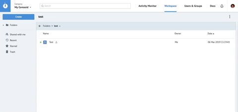
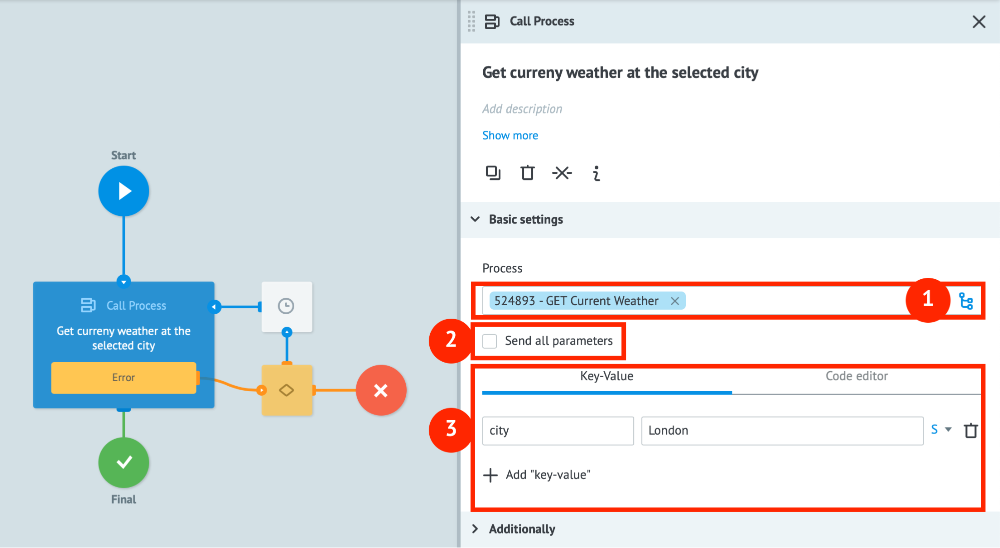

# Quick Start
  

## Content:

1. [Registation](#registation)
2. [Process Browser](#process-browser)
3. [How to create a new process](#how-to-create-a-new-process)
    - ["Edit" mode](#edit-mode)
    - [“View” mode](#view-mode)
    - [“Debug” mode](#debug-mode)
4. [Working with API Call, Condition and Set Parameter nodes](#working-with-api-call-condition-and-set-parameter-nodes)
5. [Working with Call Process and Reply to Process nodes](#working-with-call-process-and-reply-to-process-nodes)
6. [Working with Copy Task and Modify Task nodes](#working-with-copy-task-waiting-for-callback-and-modify-task-nodes)
7. [Working with State Diagrams](#state-diagram)

  
  

---

## Registation


[Register](https://admin.corezoid.com/signup) to start working with Corezoid.
  


---

## Process Browser
  
After completing registration, you are directed to the process browser. It consists of 4 components:


1. **Activity Monitor** - here you will find statistics on computational resources that are consumed by your processes.
2. **Workspace** - the main working environment for process navigation.
3. **Users & Groups** - a place to manage process access rights.
4. **Profile** - find information about your profile, active subscription and payments history.
    

---

## How to create a new process

Make sure you are in the Workspace tab. Now, create a process by clicking on the **“Create”** button in the top left corner and choosing **“Process”** from the dropdown menu.

 

  
In the pop-up window enter a process name and a description (optional) that will help you understand the purpose and function of the process. Click **“Ok”**.
  


**🎉 Congratulations! You created your first Corezoid process.**


---

##  Process Editor

To understand how Corezoid works, you have to understand that every process is a set of nodes.

**A Node** is the basic computing element of Corezoid, and with its help, information processing is executed. All in all, Corezoid has 15 types of nodes, each being responsible for a particular type of information processing logic. By combining nodes, a user makes processes that handle incoming and outgoing tasks.

You can find more details on node types [here](https://doc.corezoid.com/en/interface/nodes/).

A Task is a data object that the process receives for computing. Tasks may be loaded to a process either from an external system or from a Corezoid process.

**By default, each new process consists of 2 nodes:**

- **Blue** - starting node -  receives all the incoming tasks.
- **Red** - final node - receives all the processed tasks.
A green line connecting the nodes shows a task movement direction within a process.

A green line connecting the nodes shows how the task will move through the process.


  

  
**On top there is the process control toolbar:**


1. **View** — mode of observing the process execution in real time;
2. **Edit** — mode of process editing;
3. **Debug** — mode of process debugging to check its performance and to check if vulnerable points are present;
4. **Undo/Redo**  — buttons that allow undoing or redoing the last action;
5. **Process Errors** — informational menu about process errors;
6. **Share** — use to permit other Corezoid users to view, upload data or edit the process.
  

---

### “Edit” mode


Process can be modified by dragging nodes to the process workspace from the list of available nodes (on the left side) or by clicking the “+” icon that appears when you hover the line between processes.
     
All the changes are applied only after clicking the **Deploy** button.

In-between changes are saved automatically every 10 seconds. The last 20 actions can be cycled by the **Undo/Redo** buttons.

  

---

### “View” mode


To track the process’ execution in real time, switch to **View** tab.

If you click on any node in View mode, a side menu with two tabs will show up, the tabs are:

1. **Statistics** - shows amount of processed tasks in a selected period of time.
2. **Archive** - archive of tasks that are currently in the node. This tab shows a list of all the tasks and what they consist of.
      


In this mode you can also create new tasks and see how your process handles them.

---

### Tasks


**Task** contains data in JSON format (“key”:”value”).  

Maximum task size in a process is **128 kb**.  
  

Example of a task in the process:


1. **ID** - a unique id that can be used to find and modify the task in the overall Corezoid system.
2. **Task reference (REF)** - a unique id that can be used to find and modify the task in one process.
3. **Created** - date and time when the task was created.
4. **Changed** - date and time when the task was modified last.
5. **JSON object** that contains task details.
    
---

###  Manually creating a new task


Let’s see how the task is being created on the screenshot, where:


1. **“+ New task”** - creates a new task. Upon clicking this button, a side menu shows up where you can add parameters for the new task.
2. Task creation modes: **create** - creating a unique task that is not in the process yet, **modify** - modifying an existing task inside a process by its REF.
3. **“Key-Value”** - a tab that describes task data in “key-value” format (JSON).
4. **“Code editor”** - an alternative tab that allows inputting JSON data as text.
5. Selecting a data type of the added parameter (see below on available data types)
6. Parameter removal button.
7. **+ Add parameter** - adding a new parameter.
7. **Add task** - adding a new task to the process.

**Data types:**

1. **String** - text. E.g.: John Doe.
2. **Numbe**r - number. E.g: 13, 0.4, 32.
3. **Boolean** - boolean value, either true or false. E.g.: true, false.
4. **Array** - data sequence. E.g.: ```[“Peter”, “Jacob”, 941, {“key”: “value”}, ...]```.
5. **Object** - JSON data object. E.g.: ```{“objectName”: “objectValue”}```.


If a task started in the starting node and reached the final node, the counter in the final node is incremented by 1. It means that the task has successfully been handled by the process.

In order to view any handled task, click the final node. In a sidebar window you will see all the processed tasks and their contents.

---

### “Debug” mode


To test the process in real time switch to **Debug** tab.
  


The testing interface opens up. This mode allows to both work with the existing tasks coming from external systems and emulate creating/adding new tasks just like in **“View”** mode.

If a task got in the red cross node, then by clicking on it you can see the error description and figure out why this has happened.

>**Advice:**
We recommend running a test task after each change in the process to ensure it runs correctly. It helps avoiding crashes when you launch it live.


---  

## Working with API Call, Condition and Set Parameter nodes


You already have a process consisting of starting and ending nodes. Let’s add an **API Call** node.

To add a new node, hover a line between starting and ending nodes, click “+” icon and choose **API Call** from the drop-down list.


---

### API Call


**API Call** logic allows calling API in JSON, XML and SOAP formats.
When you add **API Call** logic, 4 nodes will appear: API Call node + 3 more nodes that are responsible for handling errors relative to the API Call.

  


Now let's set up **API call** parameters. Click the API Call node and in a side menu you’ll see the parameters:


1. **Add title** - name of the node. We strongly recommend adding a name to all the nodes so that users can easily “read” your process and understand what happens there without the need to check each node and see what it does.


2. **Add description** - description of the node. If a node follows base logic, clear enough from the name, then this field can be neglected. Otherwise, we recommend adding a description.
 
3. **URL** - link to the API.

4. **Request format** - there are 2 types: Default - standard HTTP API call; Corezoid - internal [Сorezoid API](https://doc.corezoid.com/en/interface/nodes/api/corezoid.html) call (advanced Corezoid usage).
      
5.  **Methods of the API call** - all the standard HTTP-methods required to work with an API: [GET](https://doc.corezoid.com/en/interface/nodes/api/get.html), [POST](https://doc.corezoid.com/en/interface/nodes/api/post.html), [PUT, DELETE, HEAD, PATCH](https://doc.corezoid.com/en/interface/nodes/api/put__delete__head.html). 
More information related to HTTP methods can be found [here](https://ru.wikipedia.org/wiki/HTTP#%D0%9C%D0%B5%D1%82%D0%BE%D0%B4%D1%8B).
    
6. **Content-Type** - choosing data format type when calling API: application/json, application/x-www-form-urlencoded, application/xml, text/xml, application/soap+xml. More information related to Content-Type can be found [here](https://developer.mozilla.org/en-US/docs/Web/HTTP/Headers/Content-Type).  
7.  **Parameters** - describing parameters that will be passed to the API. Parameters should be input in the “key-value” format, the same as creating a new task.

8. **Additionally** - additional API call parameters that will be studied in other lessons.


Now let’s call the weather API service [OpenWeatherMap](https://openweathermap.org/current), that will tell us about the weather in the selected city today.


**For this we need to:**

1. [Sign up](https://home.openweathermap.org/users/sign_up) at weather service to get API access.

2. Create a new API Key
     
    
Next this URL should be added to **API Call** node:  [http://api.openweathermap.org/data/2.5/weather?q=London&units=metric&APPID={APIKEY](http://api.openweathermap.org/data/2.5/weather?q=London&units=metric&APPID=%7BAPIKEY)}, where {APIKEY} - a key, that you have created.

Also choose **Request method: GET**, since we want to receive data from the API.


Next switch to the **View mode**, create a new empty task by clicking **“+ New task”** and press the button **“Add task”**.

After the task is successfully processed, click **“Final”** node and on the right side menu task parameters description appears, where the API response is presented in JSON.


**🎉 Congratulations! You have successfully called your first API with Corezoid.**

---

###  Condition


Now let’s learn to distribute a stream of tasks in the process based on task data. For this we will use the **Condition** node that is responsible for conditional logic operators “if …, then …”.

To begin with, we need to free up some space to add a new Condition node between the nodes **API Call** and **Final**. For this click on the Final node and drag it downwards.

Next, hover the mouse over the line between **API Call** and **Final**, click on the “+” icon and choose the Condition node from the appeared list.

It should look like on the screenshot below:

 

**Now let's examine what Condition node consists of:**

1. **Condition** - list of eligible conditional operators:
 
    - **==** - equal
    - **=!** - not equal
    - **>** - greater than
    - **<** - lesser than
    - [RegExp](https://ru.wikipedia.org/wiki/%D0%A0%D0%B5%D0%B3%D1%83%D0%BB%D1%8F%D1%80%D0%BD%D1%8B%D0%B5_%D0%B2%D1%8B%D1%80%D0%B0%D0%B6%D0%B5%D0%BD%D0%B8%D1%8F)
    
2. **+ Add parameter** - add new parameter to the condition

3. **+ Add condition** - add new condition

4. List of errors that block process modifications from being applied.

5. **“+”** - adding new node for the task to go to if the condition is satisfied.
      
    
Now let us add such a condition: if the temperature in London is greater than +20 degrees Celsius, we will redirect the task to the final node named “Warm”, if the temperature is between +5 and +20 degrees - to the node “Normal”, and if temperature is less than 5 degrees - to the node “Cold”.

Let’s recall that API gives us response as a JSON object:

```
    "main": {
		    "temp": 9.66,
		    "pressure": 1029,
		    "humidity": 87,
		    "temp_min": 8.89,
		    "temp_max": 10.56
    },
```
where **temp** is current temperature.

**To add such conditions we need to:**

1. Аdd the following query: ```{{main.temp}}```, where:

    - ```{{ }}``` - a format to address task parameters that are inside either nested objects or arrays;
    - `main` - first level of nesting (object name);
    - `temp` - a variable we want to address.
    
    More on how to work with nested objects can be found [here](https://developer.mozilla.org/en-US/docs/Web/JavaScript/Guide/Working_with_Objects).

2. Choose conditional operator greater than **(“>”)**

3. Fill **“value”** field with “20” - this is the temperature

4. Since we are working with numbers, choose data type “N”
     
5. Press button **“+ Add condition”**

6. Add the second condition that consists of 2 parameters:
    
      
To add a second element, press **“+ Add parameter”**.


**Now let us find final nodes where the task will be redirected to depending on current temperature:**


1.  Press **“+”** button next to every condition and choose node **“End: Success”**
     
2.  Let's name our node as **"Warm"** (fill in the "title" field)
3. Repeat step #2 for the **“Normal”** node
4. Rename **“Final”** node to **“Cold”**
    

  
We didn’t add a third condition, because if none of the conditions above is satisfied, then temperature is below 5 degrees and we unconditionally reach the “Cold” node.

**Now let us test added conditions:**

1. Press **“Deploy”** button
2. Switch to **“View”** mode
3. Create an empty task in the process
4. See what node it will reach

When this text was written, it was +8.46 degrees in London and the task reached “Normal” node as expected, because the temperature is between +5 and +20.


  

**🎉 Congratulations! Now you know how to call an API and how to manage tasks with Condition nodes.**


---

### Set Parameter


Set Parameter logic allows to add new and modify existing parameters in tasks as well as to apply various functions to the parameters of the task.

You can find more on functions that can be applied to nodes [here](https://doc.corezoid.com/en/interface/functions/).

Let’s try to find out how to use this node with our weather process.

Weather data is “nested” inside main object that has one extra nesting level. Working with parameters like {{main.temp}} isn’t very convenient. To simplify this statement, we recommend creating a new parameter and setting temperature value to this new parameter by using Set Parameter node, so in the future we access temperature as a parameter of the first nesting level.

**For this we require:**

1. Add **Set Parameter** node to our process, locate it between **API Call** and **Condition** nodes.
2. Add new parameter using button **+ Add “key-value”**.
3. Fill **key** field with **currentTemp**.
4. Fill **value** field with **{{main.temp}}**.
5. Choose **N** (number) as data type.


As a result, we should have the same statement as it is on the screenshot:

  
  

Now let us change **{{main.temp}}** to **currentTemp** in the Condition node:


  
Now press **Deploy**, switch to **View** mode and launch an empty task to check if it all works as intended.


If everything is alright, new parameter **currentTemp** should appear in the task info and the task should still follow the distribution of **Condition** logic.

**🎉 Congratulations! One more Corezoid node has been studied.**


---  

## Working with Call Process and Reply to Process nodes


Corezoid allows to make universal modular processes (subprocesses) that can be re-used in the future by other processes or users.

Modular processes serve as a part of other processes’ logic. Usually such subprocesses solve 1 specific task that can be reused for various business solutions: receiving weather forecast, sending email etc.

To work with modular processes, Corezoid has 2 type of nodes: **Call Process** and **Reply to Process**.


### Call Process


**Call Process** node sends the task to subprocess and stops the main process execution until the task is handled by the subprocess and a result is received.



**Call Process** node consists of such components:

1. **Process** - field of selecting a process, where the task will be sent to.
2. **Send all parameters** - enable this checkbox if you want to send all the task's data to the subprocess.
3. List of parameters that are getting sent to the subprocess. If **Send all parameters** checkbox is enabled, then the list can be expanded with optional parameters that were not present originally.

    
---

### Reply to Process


**Reply to Process** node returns the handled task to the main process.


  

**Reply to Process** node has this kind of components:

1. **Throw exception** - if **Reply to Process** node is used to handle an error, this field has to specify description/error code for its successive handling.

2. List of parameters that are to be returned to the main process.


>**IMPORTANT!** If the subprocess doesn’t have a **Reply to Process** node, your task will get stuck in the **Call Process** node in the main process and it will need to be manually deleted in the **View** mode.

---  

### Creating modular weather process


To make our **GET Current Weather** process modular, we need to:

1. Delete the **Condition** node
2. Delete 2 final nodes that were connected to the **Condition** node
3. Click “+” on the **Set Parameter** node and in the drop-down list add a **Reply to Process** node.
4. Add 2 parameters to **Reply to Process** node:
    - “status”: “success”, type: String
    - **“currentTemp”: “{{currentTemp}}”**, type: **Number**, where: **status** and **currentTemp** are parameters that we will return to the main process.
5. Connect **Reply to Process** node and the final node.
Rename final node to **Success**.

**🎉 Congratulations! A modular process has been successfully created.** 


**Now let us test it:**

1. [Create new process](#how-to-create-a-new-process), call it **“Main Process”**
2. Add a **Call Process** node
3. On the side menu choose the previously created **GET Current Weather** subprocess.
4. Enable **Send all parameters** checkbox.

5. Deploy the process and switch to **View** mode
6. Send new empty task to the process
7. Click the final node and see what is there  

      

If you have followed the instructions thoroughly, you should receive the same as shown above.

**🎉 Congratulations! You have learned how to create and call modular processes.**

---  

## Dynamic parameters in API call


Now let us make the task harder and try to receive current weather in any city we choose.

**For this we have to:**

1. Change the settings of **API Call** node: in the URL field replace the name of the city **“London”** by a variable ```{{city}}```, and the value of this variable will be received from the main process

2.  In the **Reply to Process** node, add a parameter ```city: {{city}}``` so that the main process can match the weather from modular subprocess and the city name.

Now deploy the subprocess, switch to the main process and create in the View mode a new task with parameter ```city: Berlin```.

If everything was done correctly, you should receive a task with the temperature in Berlin as the screenshot demonstrates:
 


---

## Process parameters

To make it easier to work with modular processes, we recommend describing the whole set of input and output parameters in the **Task parameters** menu.


More on the capabilities of the **Task parameters** menu can be found [here](https://doc.corezoid.com/en/interface/tasks/task_parameters.html).

In our **GET Current Weather** process, it will be appropriate to describe one mandatory parameter: ```city (string)```.


---  

## Working with Copy Task, Waiting for Callback and Modify Task nodes


### Copy Task


**Copy Task** node allows to copy a task from one process to another with the original process still running.
  
  
Note that the **Copy Task** node has an additional **Reference** field (what is reference is described in detail in [“Tasks”](#tasks) section), that allows setting a task reference for another process.


At this stage we recommend adding a system construction ```{{root.ref}}``` that allows passing reference value of the current task in order to be able to change tasks by reference in our test case. When studying **Modify Task** node we will dive in deeper to details about principles of task modification by reference.

---  

### Waiting for Callback

**Waiting for Callback** node is used to suspend task handling until a signal is received from an external system or Corezoid process.

If you want to send a task to a subprocess for parallel processing and suspend main process execution until results are received or for some period of time, then after **Copy Task** node you need to add **Waiting for Callback** node.

The anatomy of **Waiting for Callback** node:
  
  

1.  The URL for the modification of the task that is located in the node **Waiting for Callback** from the external system.

2. The URL for the modification of the task from the [Mandrill](https://mandrillapp.com/) service.

3. **Synchronous** is a synchronous task modification. If you try to modify a task from the external system in the synchronous mode, you can fetch a feedback on its modification status. In case of an asynchronous mode, your request on the task modification is accepted for processing as well, but you are unenlightened about the results.

4. **Alert when there is tasks queue** is used to manage the task queue that stacks in the node. If the number of the tasks exceeds the preset limit, you can configure the logic on processing such tasks.

5. **Limit the task in the node** is used to limit the period that tasks await in the node. If tasks aren’t modified within the specified period, you can customize the logic on processing such tasks. 
      
    

---

### Modify Task


The **Modify Task** node allows to change your task according to its reference via another process. Conceptually, the **Modify Task** node is similar to the **Reply to Process** node and is almost always used teamwise with the **Copy Task** and the **Waiting for Callback** nodes to return to the main process the result of the parallel task processing in the subprocess.

The return of the result of your task processing in the subprocess is implemented by modifying the task in the main process according to its reference.

While using the **Modify Task** node, the **Reference** field should be filled so that Corezoid could identify what task is to be modified.


To suit the **Copy Task**, the **Waiting for Callback** and the **Modify Task** nodes’ interaction of the main process with its subprocess by using the template of the earlier-created **Main Process** and **GET Current Weather** processes you need to:


1.  In the process called **Main Process** replace the **Call Process** node with two nodes - **Copy Task** + **Waiting for Callback**.
  
2. Select **GET Current Weather** - in the node **Copy Task** 
3. Insert ```{{root.ref}}``` - into the **Reference** field - that copies your task to the subprocess in accordance with its reference that is the same as the one in the main process. 

   
4. Replace the **Reply to Process** node by the **Modify Task** node in the **GET Current Weather** process. 
5. Select **Main Process** in your list of the raised processes. 
6. Insert the same ```{{root.ref}}``` code - into the **Reference** cell - that allows to return the result of the subprocess finalization to the **Main Process** by updating the task with the same reference there.
    

>IMPORTANT! After modifying the **GET Current Weather** process, it becomes no longer universal, because in the **Modify Task** node, you explicitly indicate the process to which the task should be returned.

>If you desire to make it universal, you should insert in the **Process** field a variable of the type ```{{callback_process_id}}``` that contains the ID of the process to which the task is to be returned. This variable moves from the main process to the subprocess in your task’s body.


  
  
---


### State Diagram


Besides processes, Corezoid allows you to create state diagrams.

In practice, state diagrams are used for:

1. Scoring object states
2. Data storage

Let’s assume that the data storage is a collateral function of the state diagram and that it’s not recommended to store significant amounts of tasks and data in state diagrams.

**The maximum task size in the state diagram is 5 KB.**

### Scoring object states

The Corezoid concept declares that processes generate states, and states respectively generate processes.

From a business point of view, the state diagram can be used to describe all aspects of customer life cycle and reactions via changes or non-changes of states

For example, let's take a classic case of a customer reactivation: a company monitors customer activities and, if a customer doesn’t use the company's services for 30 days, he/she is transferred to the “inactive” state and is communicated via a reminder invitation to use the services at discount tariffs. If the customer resumes buying services, then he/she is transferred to the “active” state again.

According to the state diagram, the logic described above works with two customer states (“active” and “inactive”) and it launches the subprocess that sends notifications in case of non-changes of the “active” state within 30 days.

In practice, this logic has the following fairly simple implementation:


  

1. **Active users** is the **[Set State](https://doc.corezoid.com/en/interface/nodes/setstate.html)** node that is responsible for the scoring of customers in the “active” state. The condition of a customer exit from the “active” state is his/her inactivity for 30 days.

2. **Send reactivation notification** is the **Copy Task** node that calls the subprocess that sends notifications inviting customers to use the company's services.

3. **Inactive users** - the **[Set State](https://doc.corezoid.com/en/interface/nodes/setstate.html)** node that is responsible for the scoring of customers in the “inactive” state. In case a customer state updates, he/she is transferred to the “active” state.
    

---

#### Data storage

Quite often, for project implementations you need to store operational information to ensure your process working. For such cases, Corezoid allows you to use the state diagram for storing your operational and configuration data.

For example, Bot Platform 2.0 (our tool for promptly creating bots in all popular messengers) uses state diagrams to store user profiles: keys to messenger APIs; texts, keyboards and buttons of bots; links between tasks and nodes; etc.


You can read more about the functions of the Set State logic [here](https://doc.corezoid.com/en/interface/nodes/setstate.html).

---
  
### State Diagram in practice


Now let's utilize the above knowledge for the weather process and store the key for calling your weather API in the state diagram.

**For storing the OpenWeatherMap API keys in the state diagram, you need to:**

1. Create a new state diagram similarly to process creating: by means of the **Create** button and selecting **The state diagram** in the drop-down list.
2. Name your state diagram as **Config**.

3. Remove the node **Inactive users**
4. Rename the node **Config**
5. In the sidebar, select the **Advanced** option and remove the checkbox from the **Limit the time of the task in the node** line 

6. Click the **Deploy** button
7. Switch to **View** mode
8. Create the new task with the ```REF: weather_api``` and add the following parameter - ```secret_key: {{secret key-value for accessing the API from the OpenWeatherMap control panel}}```

9. Click **Add task** button


** 🎉Congratulations! You have created your first configuration state diagram.** 

#### Let's apply it in your **GET Current Weather** process.

**To do this, the GET Current Weather process is to be modified:**

1. Add a **Set Parameter** node between the **Start** node and the **Call API** node.
2. Name it **Config**.
3. Add the ```secret_key``` parameter
4. Add a function of receiving the task data from the state diagram using
```{{conv[{{process_id}}].ref[{{ref}}].{{parameter_name}}}}```, in which:
    - ```{{process_id}}``` - is the ID of your Config state diagram;
    - ```{{ref}}``` - are your task references in the state diagram;
    - ```{{parameter_name}}``` - is the name of the parameter to be read.
    - In our case of the tutorial author, the construction looks like this: 
```{{conv[530236].ref[weather_api].secret_key}}```.
  
2.  Instead of the explicitly specified the **APPID** value, you should add to the **API Key** node the ```{{secret_key}}``` variable that is dynamically substituted when the API is called, as well as the parameter ```{{city}}``` is substituted.  
  

**🎉 Congratulations! You learned to create configuration state diagrams and use them for API calls.**

We recommend you to start the next stage of your training from studying Corezoid built-in [online dashboards](https://doc.corezoid.com/en/interface/dashboard.html), then go through a few [tutorials](https://corezoid.com/tutorials/) and deep dine into the Corezoid [documentation](https://doc.corezoid.com/en/).