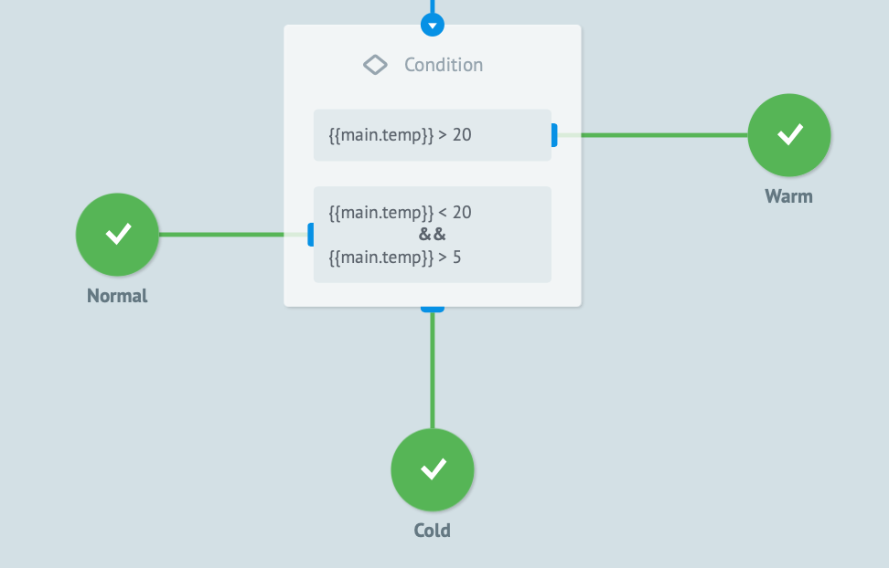
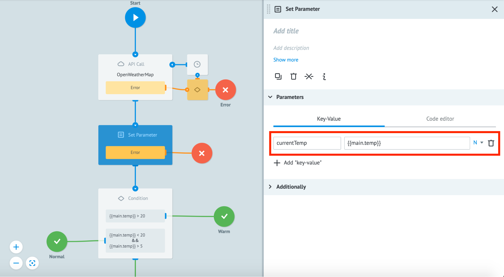
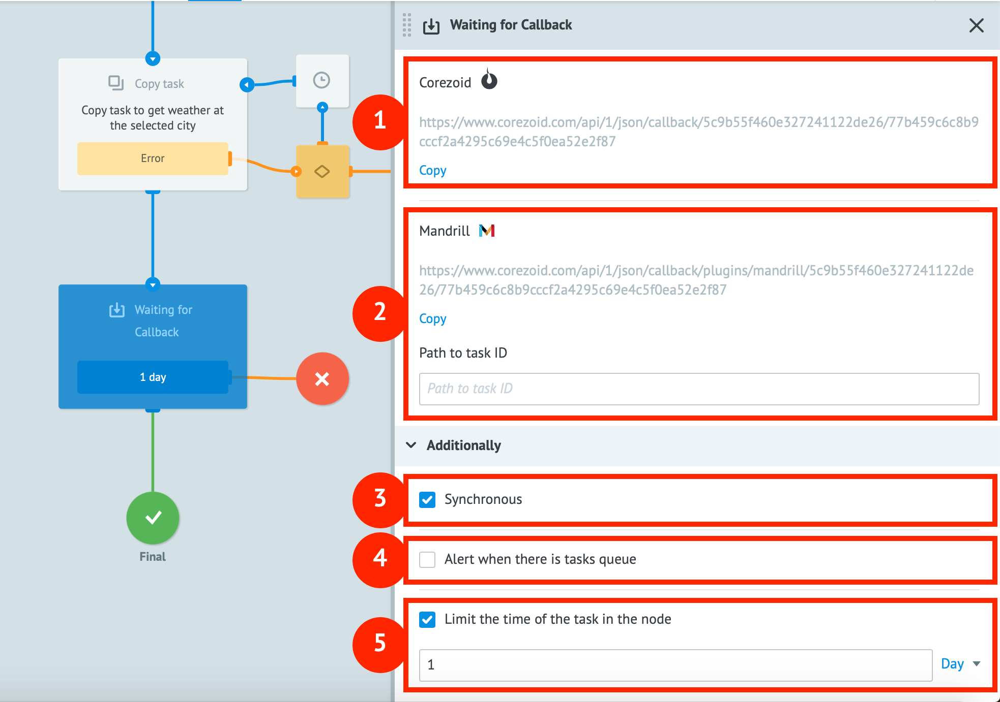

# Quick Start

---

## Content:

1. [Registration](#registation)
2. [The Process Browser](#the-process-browser)
3. [How to create a new process](#process-creation)
4. [Working with API Call, Condition and Set Parameter nodes](#working-with-api-call-condition-and-set-parameter-nodes)
5. [Working with Call Process and Reply to Process nodes](#working-with-call-process-and-reply-to-process-nodes)
6. [Working with Copy Task and Modify Task nodes](#working-with-copy-task-waiting-for-callback-and-modify-task-nodes)
7. [Working with State Diagrams](#state-diagram)

  
  

---

## Registration


[Register](https://admin.corezoid.com/signup) to start working with Corezoid.
  


---

## The Process Browser
  
After registering you will be directed to the process browser. It consists of 4 components:


1. **Activity Monitor** - here you will find statistics on computational resources that are consumed by your processes.
2. **Workspace** - the main working environment for process navigation.
3. **Users & Groups** - a place to manage process access rights.
4. **Profile** - information about your profile, active subscriptions and payment history.
    

---

## Process creation

Make sure you are in the **Workspace** tab. Now create a process by clicking on the **“Create”** button in the top left corner and choosing **“Process”** from the dropdown menu.

 

  
In the pop-up window enter the process name and description (optional) that will help you understand the purpose and function of the process. Click **“Ok”**.
  


**🎉 Congratulations! You created your first Corezoid process.**


---

##  Process Editor

To understand how Corezoid works you have to understand that every process is a set of nodes.

A **Node** is the basic computing element of Corezoid, and with its help, information processing is executed. All in all, Corezoid has 15 types of nodes, each being responsible for a particular type of information processing logic. By combining nodes, a user makes processes that handle incoming and outgoing tasks.

You can find more details on node types [here](https://doc.corezoid.com/en/interface/nodes/).

A **Task** is a data object that a process receives for computing. Tasks may be loaded to a process either from an external system or from a Corezoid process.

**By default, each new process consists of 2 nodes:**

1. Blue - **starting node** -  receives all the incoming tasks.
2. Green - **final node** - receives all the processed tasks.

The green line connecting the nodes shows how the task will move through the process.


  

  
**On top of the process editor is the process control toolbar:**


1. **View** — a mode for observing process execution in real time;
2. **Edit** — a mode for process editing;
3. **Debug** — a mode for process debugging, performance checks, and to check if vulnerable points are present;
4. **Undo/Redo**  — buttons that allow undoing or redoing of the last action;
5. **Process Errors** — notifications about process errors;
6. **Share** — give permission to other Corezoid users to view, upload data or edit the process.
  

---

### “Edit” mode


A process can be modified by dragging nodes to the process workspace from the list of available nodes (on the left side) or by clicking the **“+”** icon that appears when you hover over the green line connecting the nodes.
     
Сhanges will be applied only after clicking the **Deploy** button.

Intermediate changes will be saved automatically every 10 seconds. The last 20 actions can be cycled through by the **Undo/Redo** buttons.


  

---

### “View” mode


To track the process’ execution in real time, switch to the View tab.

If you click on any node in **View** mode, a side menu with two tabs will show up, the tabs are:

1. **Statistics** - shows the number of processed tasks in a selected period of time.
2. **Archive** - an archive of tasks that are currently in the node. This tab shows a list of all the tasks and what they consist of.
      


In this mode you can also create new tasks and see how your process handles them.

---

### Tasks


A Task contains data in the JSON format (“key”:”value”).  
The maximum task size in a process is **128 kb**.

**Example of a task in the process:**


1. **ID** - a unique identifier that can be used to find and modify a task in the overall Corezoid system.
2. **Task reference (REF)** - a unique id that can be used to find and modify a task within a single process.
3. **Created** - date and time when the task was created.
4. **Changed** - date and time when the task was last modified.
5. **JSON object** that contains task parameters.

---

###  Manually creating a new task


**Let’s see how the task is being created here, where:**

1. **“+ New task”** - creates a new task. Upon clicking this button, a side menu pops up where you can add parameters to the new task.
2. Task creation modes: **create** - creating a unique task that is not yet in the process, **modify** - modify an existing task inside a process by its REF.
3. **“Key-Value”** - a tab that shows task data in “key-value” format (JSON).
4. **“Code editor”** - an alternative tab that allows you to enter JSON data as text.
5. Selection of a data type of the parameter (see available data types below)
6. Parameter removal button.
7. **+ Add parameter** - add a new parameter.
8. **Add task** - add a new task to the process.

**Data types:**

1. **String** - text. E.g.: John Doe.
2. **Number** - number. E.g: 13, 0.4, 32.
3. **Boolean** - boolean value, either true or false.
4. **Array** - data sequence. E.g.: ```[“Peter”, “Jacob”, 941, {“key”: “value”}, ...]```.
5. **Object** - JSON data object. E.g.: ```{“objectName”: “objectValue”}```.


If a task started in the Start node and reached the Final node, the counter in the Final node is incremented by 1. It means that the task has successfully been handled by the process.

In order to view any handled task, click on the Final node. In the sidebar window you will see all the processed tasks and their contents.


---

### “Debug” mode


To test a process in real time switch to the **Debug** tab.
  


The testing interface opens up. This mode allows to work with existing tasks from external systems as well as emulate the creation/addition of new tasks like you would in the “View” mode.

If a task got into a red cross node, you can see the error description and figure out why this happened by clicking on it.


>**Advice:**
We recommend running a test task after each change in the process to ensure that it runs correctly. It helps avoid crashes when you make it live.


---  

## Working with API Call, Condition and Set Parameter nodes


You already have a process consisting of Start and Final nodes. Let’s add an API Call node.

To add a new node, hover over the green line between Start and Final nodes, click on the “+” icon and choose **API Call** from the drop-down list.


---

### API Call


**API Call** logic allows calling an API in JSON, XML and SOAP formats.

When you add **API Call** logic, 4 nodes will appear: an API Call node + 3 additional nodes that are responsible for handling errors related to the API Call.

  


Now let's set up the API call parameters. Click on the **API Call** node and in the side menu you will see the following parameters:


1. **Add title** - name of the node. We strongly recommend adding a name to every node so that the users can easily “read” your process and understand what happens there without the need to check each node to see what it does.

2. **Add description** - description of the node. If a node follows basic logic that is clear enough from the name, this field can be neglected. Otherwise we recommend adding a description.
 
3. **URL** - link to the API.

4. **Request format** - there are 2 types: Default - standard HTTP API call; Corezoid - internal [Сorezoid API](https://doc.corezoid.com/en/interface/nodes/api/corezoid.html) call (advanced Corezoid usage).
      
5. **Request method** - all the standard HTTP-methods required to work with an API: [GET](https://doc.corezoid.com/en/interface/nodes/api/get.html), [POST](https://doc.corezoid.com/en/interface/nodes/api/post.html), [PUT, DELETE, HEAD, PATCH](https://doc.corezoid.com/en/interface/nodes/api/put__delete__head.html). More information related to HTTP methods can be found [here](https://en.wikipedia.org/wiki/Hypertext_Transfer_Protocol#Request_methods).
    
6. **Content-Type** - choose the data format type when calling an API: application/json, application/x-www-form-urlencoded, application/xml, text/xml, application/soap+xml. More information related to Content-Type can be found [here](https://developer.mozilla.org/en-US/docs/Web/HTTP/Headers/Content-Type).  

7. **Parameters** - description of the parameters that will be passed to the API. Parameters should be entered in the “key-value” format, same as when creating a new task.

8. **Additionally** - additional API call parameters that will be described in other lessons.


Now let’s call the weather API service [OpenWeatherMap](https://openweathermap.org/current) that will tell us about the weather in the selected city today.


**For this we need to:**

1. [Sign up](https://home.openweathermap.org/users/sign_up) at weather service to get API access.

2. Create a new API Key
     
    
Next, this URL should be added to **API Call** node:  [http://api.openweathermap.org/data/2.5/weather?q=London&units=metric&APPID={APIKEY](http://api.openweathermap.org/data/2.5/weather?q=London&units=metric&APPID=%7BAPIKEY)}, where ```{APIKEY}``` is the key that you just created.

Choose ```Request method: GET``` since we want to receive data from the API.


Next, switch to **View mode**. There, create a new empty task by clicking on **“+ New task”** and pressing the **“Add task”** button.

After the task is successfully processed, click on the **Final** node. Task parameters description will appear on the right side menu. There you can find the API response in JSON format.


**🎉 Congratulations! You have successfully made your first API call with Corezoid.**

---

###  Condition


Now let’s learn how to distribute a stream of tasks in the process based on task data. For this we will use the **Condition** node: it is responsible for conditional logic operators “if …, then …”.

To start, we need to free up some space to add a new **Condition** node between the nodes **API Call** and **Final**. To do this, go back to **Edit** mode, click on the **Final** node and drag it down.

Next, hover the mouse over the line between **API Call** and **Final** nodes, click on the **“+”** button, and choose the **Condition** node from the list.

It should look like this:

 

**Now let's examine what the Condition node consists of:**

1. **Condition** - list of conditional operators:
 
    - **==** - equal
    - **=!** - not equal
    - **>** - greater than
    - **<** - lesser than
    - [RegExp](https://en.wikipedia.org/wiki/Regular_expression)
    
2. **+ Add parameter** - add a new parameter to the condition.
3. **+ Add condition** - add a new condition.
4. List of errors that block process modifications from being applied.
5. **“+”** - add a new node for the task to go to if the condition is satisfied.
      
    
Now let’s add a condition to our process: if the temperature in London is greater than +20 degrees Celsius, we will redirect the task to the final node called **“Warm”**, if the temperature is between +5 and +20 degrees - to the node **“Normal”**, and if the temperature is less than 5 degrees - to the node **Cold”**.

Let’s recall that API gives us response as a JSON object:

```
    "main": {
		    "temp": 9.66,
		    "pressure": 1029,
		    "humidity": 87,
		    "temp_min": 8.89,
		    "temp_max": 10.56
    },
```
where **temp** is current temperature.

**To add such conditions we need to:**

1. Аdd the following query: ```{{main.temp}}```, where:

    - ```{{ }}``` - a format to address task parameters that are inside either nested objects or arrays;
    - `main` - first level of nesting (object name);
    - `temp` - a variable we want to address.
    More information on how to work with nested objects can be found [here](https://developer.mozilla.org/en-US/docs/Web/JavaScript/Guide/Working_with_Objects).

2. Choose conditional operator greater than **(“>”)**

3. Fill **“value”** field with “20” - this is the temperature

4. Since we are working with numbers, choose data type **“N”**
     
5. Now set the **“Normal”** condition similarly. **You should have the following:**
       
6. Press button **“+ Add condition”**
7. Add the second condition that consists of 2 parameters:
    
    
    To add a second element, press **“+ Add parameter”** button.

**Now let us find final nodes where the task will be redirected to depending on current temperature:**

1.  Press **“+”** button next to every condition and choose node **“End: Success”**
     
2.  Let's name our node as **"Warm"** (fill in the "title" field)
3. Repeat step #2 for the **“Normal”** node
4. Rename **“Final”** node to **“Cold”**
    

  
We didn’t add a third condition because if none of the conditions above are satisfied, then we know that the temperature is below 5 degrees and we unconditionally transit to the “Cold” node.

**Now let's test the added conditions:**

1. Press **“Deploy”** button
2. Switch to **“View”** mode
3. Create a new empty task for the process
4. See what node it will reach

When this text was written it was +8.46 degrees in London and the task reached the **“Normal”** node as expected because the temperature was between +5 and +20.


  

**🎉 Congratulations! Now you know how to call an API and how to manage tasks with Condition node.**


---

### Set Parameter


The **Set Parameter** node allows you to add new and modify existing parameters in tasks. It also allows you to apply various functions to the parameters.

You can find more on functions that can be applied to nodes [here](https://doc.corezoid.com/en/interface/functions/).

Let’s find out how to use this node in our weather process.

Weather data is “nested” inside the main object which has one extra nesting level. Working with parameters like ```{{main.temp}}``` isn’t very convenient. To simplify this statement, we can create a new parameter and set the temperature value to this new parameter by using the **Set Parameter** node. This will allow us to access temperature as a parameter of the first nesting level in the future.

**For this we require:**
	
1. Go to **Edit** mode.
2. Add a **Set Parameter** node to our process. Place it between **API Call** and **Condition** nodes.
3. Add a new parameter using the **+ Add “key-value”** button.
4. Fill the **key** field with ``currentTemp``
5. Fill the **value** field with ```{{main.temp}}```
6. Choose **N** (number) as the data type.


As a result, we should have the same statement as below:


  
  

Change `````{{main.temp}}````` to ```currentTemp``` in the **Condition** node:


  
Press **Deploy**, switch to **View** mode and launch an empty task to check if it all works as intended.


If you did everything correctly, the new parameter, ```currentTemp```, should appear in the task info. The task should still follow the rules of **Condition** logic.

**🎉 Congratulations! One more Corezoid node has been conquered!**


---  

## Working with Call Process and Reply to Process Nodes


Corezoid allows you to make universal modular processes (subprocesses) that can be reused in the future by other processes or users.

Modular processes serve as a part of other processes’ logic. Usually, such subprocesses solve one specific task that can be reused in various other solutions such as receiving a weather forecast, sending an email, etc.

Corezoid has 2 types of nodes to work with modular processes: **Call Process** and **Reply to Process**.


### Call Process


The **Call Process** node sends a task to a subprocess. It stops the execution of the main process until the task is handled by the subprocess and a result is received.


**Call Process node consists of several components:**

1. **Process** - process selection field. Indicates which process the task will be sent to.
2. **Send all parameters** - enable this checkbox if you want to send all the task's data to the subprocess.
3. List of parameters that are getting sent to the subprocess. If **Send all parameters** checkbox is enabled, the list can be expanded with optional parameters that were not present originally.

    
---

### Reply to Process


**Reply to Process** node returns the handled task to the main process.


**Reply to Process node has the following components:**

1. **Throw exception** - if a **Reply to Process** node is used to handle an error this field should specify the description/error code for its successive handling.
2. List of parameters that are to be returned to the main process.


>**IMPORTANT!** If the subprocess doesn’t have a **Reply to Process** node, your task will get stuck in the **Call Process** node in the main process and you will need to manually delete it in the **View** mode.

---  

### Creating a weather modular process


**To make our GET Current Weather process modular, we need to:**

1. Delete the **Condition** node.
2. Delete 2 of the **Final** nodes that were connected to the **Condition** node.
3. Click **“+”** on the **Set Parameter** node and in the drop-down menu select the **Reply to Process** node.
4. Add 2 parameters to the **Reply to Process** node:
    - ```“status”: “success”```, type: String
    - ```“currentTemp”: “{{currentTemp}}”```, type: Number,
   
   where ```status``` and ```currentTemp``` are the parameters that we will return to the main process.
5. Connect the **Reply to Process** node to the **Final** node.
6. Rename **Final** node to **Success**
77. Don’t forget to rename the process to **GET Current Weather**.

**🎉 Congratulations! A modular process has been successfully created.** 


**Now let's test it:**

1. [Create a new process](#process-creation), call it **“Main Process”**.
2. Add a **Call Process** node between the **Start** and **Final** nodes.
3. In the **Call Process** node menu, select the previously created **GET Current Weather** subprocess.
4. Enable the **Send all parameters** checkbox.
    
5. Deploy the process and switch to **View** mode
6. Send а new empty task to the process.
7. Click on the Final node to see what's there.
    
      
If you followed the instructions thoroughly, you should receive an answer similar to the one above.

**🎉 Congratulations! You learned how to create and call a modular process.**

---  

## Dynamic parameters in API call


Now let's make the task harder and try to receive the current weather for any city we choose.

**To do this, we have to:**

1. Change the settings of the **API Call** node: in the **URL** field, replace the name of our city, **“London”**, with a variable ```{city}}``` and the value of this variable will be given in the main process.

2. In the **Reply to Process** node, add a parameter ```city: {{city}}``` so that the main process can match the weather from the modular subprocess and the city name.

Now deploy the subprocess, switch to **Main Process** and create a new task with a parameter ```city: Berlin```.

If everything was done correctly, you should receive a task with the temperature in **Berlin**, as is demonstrated below:
 


---

## Process parameters

To make it easier to work with modular processes, we recommend describing the whole set of input and output parameters in the **Task parameters** menu.


More on the capabilities of **Task parameters** can be found [here](https://doc.corezoid.com/en/interface/tasks/task_parameters.html).

In our **GET Current Weather** process, it makes sense to describe one mandatory parameter: ```city (string)```.


---  

## Working with Copy Task, Waiting for Callback and Modify Task nodes


### Copy Task


The **Copy Task** node allows us to copy a task from one process to another while the original process is still running and without interrupting it.
  
  
Note that **Copy Task** node has an additional **Reference** field (more information on references can be found in the [“Tasks”](#tasks) section) that allows you to reference a task in another process.


At this stage we recommend adding a ```{{root.ref}}``` system construction. It allows you to pass a reference value of the current task and have the ability to modify it by reference in our test case. We will dive deeper into the details of modifying tasks by reference in the **Modify Task** section.

---  

### Waiting for Callback

The **Waiting for Callback** node is used to suspend task handling until a signal is received from an external system or from a Corezoid process.

If you want to send a task to a subprocess for parallel processing and would like to temporarily suspend the execution of the main process until it receives the results or simply for some period of time, you need to add a **Waiting for Callback** node after a **Copy Task** node.

The anatomy of a **Waiting for Callback** node:
  
  
1. The URL for task modification that is located in the **Waiting for Callback** node from the external system.

2. The URL for task modification from the [Mandrill](https://mandrillapp.com/) service.

3. **Synchronous** refers to synchronous task modification. If you try to modify a task from an external system in synchronous mode, you can fetch feedback on its modification status. If instead you choose the asynchronous mode, your task modification request will still be accepted for processing, but you will not be notified about the results.


4. **Alert when there is task queue** is used to manage the task queue that stacks in the node. If the number of tasks exceeds the preset limit, you can configure the logic on processing such tasks.

5. **Limit the time of the task in the node** is used to limit the time that tasks can wait in the node. You can customize the processing logic for tasks that were not modified within the specified period of time.
      
    

---

### Modify Task


The **Modify Task** node allows you to modify a task in another process by reference. Conceptually, **Modify Task** node is similar to the **Reply to Process** node and is almost always used together with **Copy Task** and **Waiting for Callback** nodes to return the result of the parallel task processing in the subprocess to the main process.

The result of your task in the subprocess is returned by modifying the task in the main process by its reference.

The **Reference** field must be filled when using the **Modify Task** node so that Corezoid knows which task it should modify.

In order to use **Copy Task**, **Waiting for Callback**, and **Modify Task** nodes to organize the interactions between the **Main Process** and the **GET Current Weather** process in our example, we should do the following:


1. In our **Main Process** replace the **Call Process** node with two new nodes: **Copy Task** and **Waiting for Callback**.
2. Go to the **Copy Task** node and select **GET Current Weather** as the Process.
3. Select ```{{root.ref}}``` in the **Reference**. ```{{root.ref}}``` copies the task with it’s reference to the subprocess. This reference is the same as the one in the main process.

    
  
4. Go to **GET Current Weather** process. Replace the **Reply to Process** node with a **Modify Task** node. 
5. Select **Main Process** as the Processes. 
6. Again, select ```{{root.ref}}``` in the **Reference**. This allows us to return the result of the subprocess to the **Main Process** by updating the task with the same reference.
    

>IMPORTANT: After modifying the **GET Current Weather** process it is no longer universal because you explicitly indicate the process to which the task will be returned in the **Modify Task** node.

>If you wish to make it universal, you should select a variable of the type ```{{callback_process_id}}``` in the **Process** field. It contains the **ID** of the process to which the task will be returned. This variable moves from the main process to the subprocess in your task’s body.


  
  
---


### State Diagram


I addition to processes, Corezoid allows you to create **State diagrams**.

**In practice, state diagrams are used for:**

1. Accounting of object states
2. Data storage

We would like to note that data storage is a secondary function of state diagrams, and you should not use it to store significant amounts of tasks or data.

The maximum allowed task size in the state diagram is **5 KB**.


### Accounting of object states

The Corezoid paradigm states that processes generate states, and states generate processes.

From a business perspective, the state diagram can be used to describe all states of the customer life cycle, as well as their reactions to change - or absence of change - of state.

For example, let's take the classic case of customer reactivation: a company monitors customer activities and if a customer doesn’t use the company's services for 30 days, they are transferred to the “inactive” state and are sent a reminder with a discount offer. The client is transferred back to the “active” state if they use the service again.

According to the state diagram, the logic described above works with two customer states (“active” and “inactive”) and it launches the subprocess that sends notifications in case of non-changes of the “active” state within 30 days.

In practice, this logic has the following fairly simple implementation:


  

1. **Active users** is the **[Set State](https://doc.corezoid.com/en/interface/nodes/setstate.html)** node that is responsible for the accounting of customers in the “active” state. The condition of a customer exit from the “active” state is his/her inactivity for 30 days.

2. **Send reactivation notification** is the **Copy Task** node that calls the subprocess that sends notifications inviting customers to use the company's services.

3. **Inactive users** - the **[Set State](https://doc.corezoid.com/en/interface/nodes/setstate.html)** node that is responsible for the accounting of customers in the “inactive” state. In case a customer state updates, he/she is transferred to the “active” state.
    

---

#### Data storage

Quite often, for project implementations you need to store operational information to ensure your process working. For such cases, Corezoid allows you to use the state diagram for storing your operational and configuration data.

For example, Bot Platform 2.0 (our tool for promptly creating bots in all popular messengers) uses state diagrams to store user profiles: keys to messenger APIs; texts, keyboards and buttons of bots; links between tasks and nodes; etc.


You can read more about the functions of the Set State logic  [here](https://doc.corezoid.com/en/interface/nodes/setstate.html).

---
  
### State Diagram in practice


Now let's utilize the above knowledge for the weather process and store the key for calling your weather API in the state diagram.

**For storing the OpenWeatherMap API keys in the state diagram, you need to:**

1. Create a new state diagram similarly to process creating: by means of the **Create** button and selecting **The state diagram** in the drop-down list.
2. Name your state diagram as **Config**.

    
    
3. Remove the node **Inactive users**.
4. Rename the **Active users** node to **Config**.
5. In the sidebar, select the **Advanced** option and remove the checkbox from the **Limit the time of the task in the node** line.
 
    
    
6. Click the **Deploy** button.
7. Switch to **View** mode.
8. Create the new task with the ```REF: weather_api``` and add the following parameter - ```secret_key: {{secret key for accessing the API from the OpenWeatherMap control panel}}```

9. Click **"Add task"** button


**🎉 Congratulations! You have created your first state diagram as Config.** 

#### Let's apply it in your GET Current Weather process

**To do this, we need to modify the GET Current Weather process:**

1. Add a **Set Parameter** node between the **Start** node and the **Call API** node.

2. Name it **Config**.

3. Add a new key-value with the following function to receive the task data from the state diagram: ```{{ conv[{{process_id}}].ref[{{ref}}].{{parameter_name}} }}```, where:
    - ```{{process_id}}``` - is the ID of your Config state diagram;
    - ```{{ref}}``` - is the reference of the task in the state diagram that is stored our configuration data;
    - ```{{parameter_name}}``` - is the name of the parameter to be read.    
    In our case of the tutorial author, the construction looks like this: ```{{conv[530236].ref[weather_api].secret_key}}```.
     
4.  Instead of the explicitly specifiy the **APPID** value, you should add to the **API Call** node the ```{{secret_key}}``` variable that will be dynamically passed to the API.

      

**🎉 Congratulations! You learned how to create configuration state diagrams and use them for API calls.**

We recommend you to start the next stage of your training from studying Corezoid built-in [online dashboards](https://doc.corezoid.com/en/interface/dashboard.html), then go through a few [tutorials](https://corezoid.com/tutorials/) and deep dive into the Corezoid [documentation](https://doc.corezoid.com/en/).