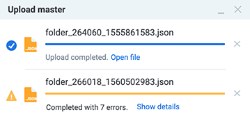
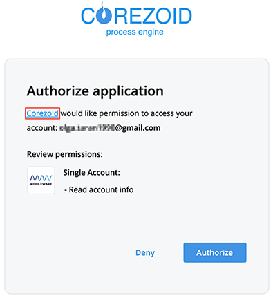
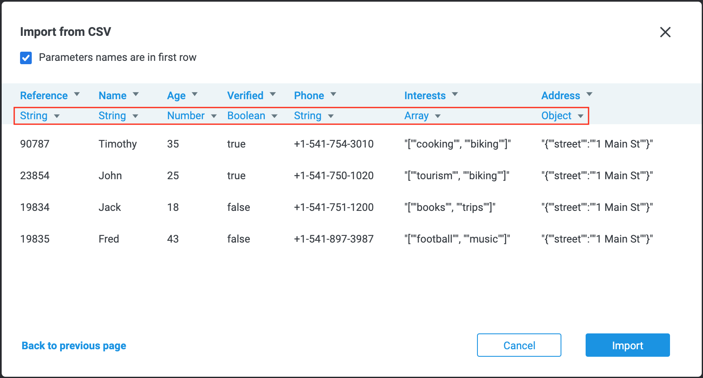
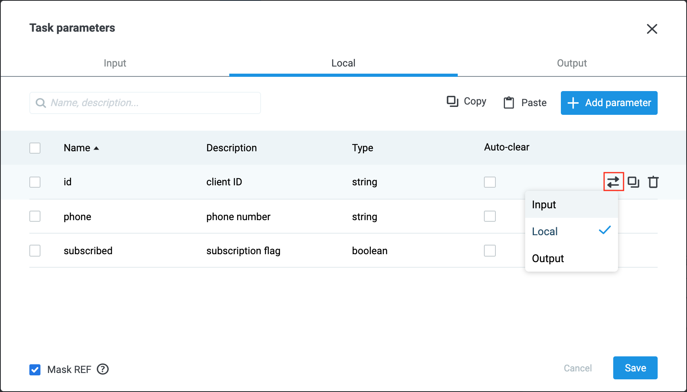
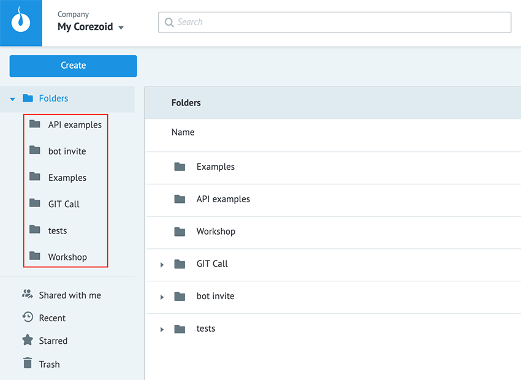
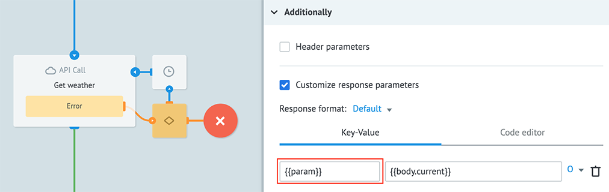
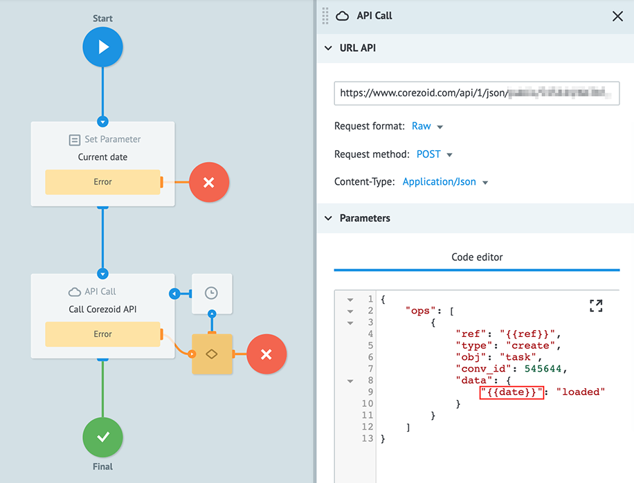
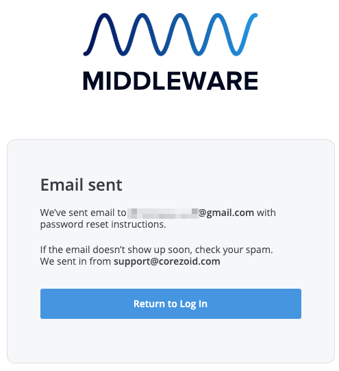
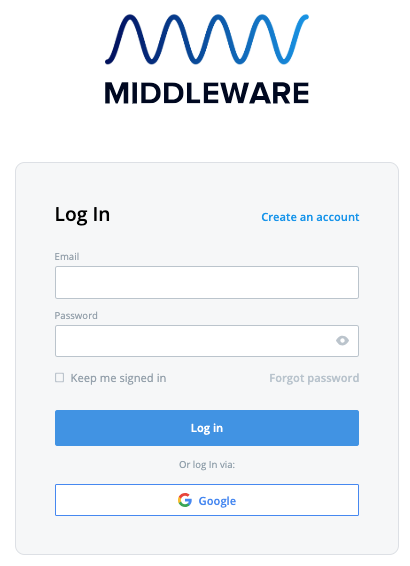
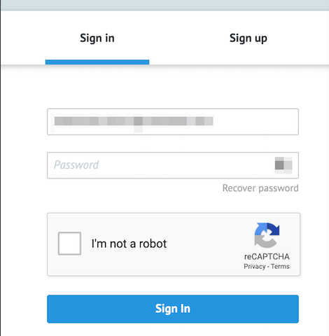

# Release Notes


**Attention!** We plan some changes:

1. In v 4.3 (scheduled for July 2019) string with JSON-data won’t be accepted as JSON-object, if you call object properties, while working with data.<br>
For example, from the string with JSON data<br>
```
{
"obj":"{\"key\":\"value\"}" //String
}
```
it won’t be possible to get the value of the parameter `key` (`{{obj.key}}`) or process this parameter.<br>
2. In v 4.4 (scheduled for August 2019) we stop the support of the request of Corezoid API for copying objects:<br>
https://admin.corezoid.com/api/2/json
```
{
  "ops": [
      "type": "create",
      "obj": "obj_copy",
      "obj_type": "folder",
      "obj_id": {{copy_folder_id}},
      "folder_id": {{to_folder_id}},
      "title": "{{folder_new_name}}",
      "company_id": "{{company_id}}"
}
```
Please, replace the URL to the following:<br>
https://admin.corezoid.com/api/2/copy

## v 4.2 - 02 July 2019

**New:**

1. We optimized download and upload of the objects from file (Create → From file).
2. We improved the work of **Upload master**:<br>
    * display of the result of objects upload from the file:<br>
    <br>
    * detailed report on the upload errors: **Show details**<br>
    <br>
    * option to interrupt upload:<br>
    <br>
3. We have added the feature of exporting tasks for the specified period to **CSV** file:<br>
    <br>

**Fixes:**

1. Issue with the incorrect display of the object added to **Favorites** section after moving to another folder.
2. Mismatch of data on the dashboard after selection of **Previous month** and **Custom Range** (same period).
3. Incorrect work of **Sign In\Sign Up** on [Corezoid Marketplace](https://market.corezoid.com/).
4. We have added information about application, that requests access to the account:<br>

5. And other minor boring bugs :)


## v4.1 - 22 May 2019

**New:**

1. We added the possibility to specify [data type](https://doc.corezoid.com/en/interface/tasks/task_parameters.html#parameter-type)  for every parameter, when you do [task import](https://doc.corezoid.com/en/interface/tasks/import_from_csv.html) from CSV file:<br/>

2. In the **Task parameters** section we’ve added the button, that allows to move parameter from one tab to another:<br/>
<br/>
3. In the **Code** logic we’ve added th support of libraries `moment-timezone.js` and `sha512.js`.

Examples:

```
require("libs/moment-timezone.js");
data.date = moment().tz('Europe/Kiev').format("DD-MM-YYYY HH:mm:ss");

require("libs/sha512.js");
data.sha512 = CryptoJS.SHA512("test").toString();
```

**Fixes:**

1. We’ve fixed the bug, that allowed to move parameters from one tab to another without using the **Save** button.
2. We’ve fixed the error with the proper display of the Task parameters tab in **Safari** browser.
3. We’ve fixed the error with an empty list of nodes in the **Get from Queue** logic, if there are more than 30 nodes in the selected process.


## v4.0  - May 14 2019

**New:**

1. Folders in the Workspace are now sorted in **alphabetical order** by default.<br/>
<br/>
2. In [Customize response parameters](https://doc.corezoid.com/en/interface/nodes/api/#customize-the-response-parameters) block of **API Call** node we’ve added the possibility to specify **key** (name) of the parameter in a dynamic way.<br/>
Example: `{{param}}`<br/>
<br/>
After API call, the task will contain a new object with a name `{{param}}`, meaning the value of `param` parameter:<br/>
<br/>
**Important!** The name of the parameter (**key**) will be formed according to those parameters of the task, that existed before the API call. Parameters, that were received after API call, will not be substituted automatically. If the specified parameter is missing from the task or it has an empty value before the API call, then the name of the parameter will also contain an empty value.<br/>
3. In API Call node we’ve added a new format for the requests (Request format) – **Raw**. In the **Сode editor** tab, you can now specify as request body data in the following formats: string, number, array, object<br/>
Example of the request body with an array:<br/>
<br/>
Example of Corezoid API request with a dynamic substitution of the parameter name:<br/>
<br/>
Now a part of the request in XML format can be substituted with a help of dynamic parameter, the value of which will be taken from the body of the task:<br/>
<br/>
where<br/>
`{ "program": "<program><loadname>APP1LMD1</loadname><pgmname>APP1PGM1</pgmname></program>" }`<br/>
Also in the **Code editor** we support the **conversion** of values to string, number, object, array using the following expressions:<br/>
`$.to_object()`<br/>
`$.to_number()`<br/>
`$.to_array()`<br/>
`$.to_string()`<br/>
In order to convert the string parameter `"str": "{\"obj\": {\"key\": \"value\"}}"` into object, the expression will be the following: `$.to_object({{str}})`
4. We’ve added new features to **Task Parameters** menu:
    * bulk operations: move, copy, delete selected parameters;
    * automatic check for the presence of identical parameters names.


**Fixes:**

1. We’ve fixed the issue with a wrong API Call behavior. In a case, when API returned empty array, parameter `_conveyor_api_array_` wasn’t displayed properly in the task body.
2. **Log out** function didn’t work properly in the Dashboard view mode.
3. E-mail address to which we send a letter with instructions for password recovery wasn’t displayed properly.<br/>

4. We’ve fixed the bug with adding a new node using **"+"** control.
5. We’ve fixed the bug with expiration of the direct link to the process, when users logged in without authorisation.
6. Minor boring bugs fixed as well :)


## v3.5.1 - April 24 2019

**New:**

1. New design of the registration landing page and single sign-on for all accounts of **Middleware** software. This new approach will allow Corezoid users to get access to all Middleware products depending on the business needs.<br/>

2. We have added visualization to the process of a new password validation.<br/>

3. We have added text highlighting to display long names of folders and processes:<br/>

4. For those clients, who are using Corezoid dedicated environments, we created the feature of transferring objects from user to user globally within the system.
5. We have added a new version of the **Bot Platform (v 2.0)** – a set of universal Corezoid processes, that let manage bots in the most popular messengers:
   * Facebook Messenger;
   * Viber;
   * Telegram.

We recommend all users to switch to a new version of the Bot Platform. Starting from 01.06.2019 we plan to cease the support of the old Bot Platform v. 1.0.<br/>
You can create universal business-processes, that can be accessed in all the messengers, instead of designing business-logic separately for every messenger:<br/>


**Fixes:**

1. Sorting data and moving metrics when selecting the **Table chart** view mode in **Dashboard** menu.
2. We've fixed the bug with rounding the value of the float number (floating point number). Rounding of float number will be done up to 6 symbols after comma.
3. We've fixed the bugs with with **moment.js** in Usercode.


## v3.5 - April 03 2019

**New Features**

1.  We improved processes search experience, when users search by part of the process name. Now instead of 20 items you can see 30 processes names in the drop-down list. If there’s more than 30 variants of processes names in the search results, user will be recommended to repeat the search better specifying the name of the process.

2.  **Google reCaptcha** was added to the authorisation page and displayed when user enters invalid password for 5 times:


  

**Fixes:**

1.  We have fixed the issue with the speed of upload of large files.We accelerated the creation of processes from a file. Now json folder structure loads much faster.

2.  We’ve fixed the issue with access sharing for the group owner. When members of the group share objects, the access is granted for the group owner as well.
    
3.  We’ve fixed the issue with debug mode, when users view the history of the task in the final node after successfully executing the request (TypeError: Cannot read property `toString` of null)

4.  We’ve fixed the issue with a display of “Throw exception” input field. Now when users widen **Reply to Process** field, the field “Throw exception” widens as well:

5.  We’ve updated the display of the **Git Call** data in terminal. Now terminal saves the state of the latest build. When user makes any changes into dependencies, the “build” indicator will be active until user starts assembling the build. The rebuild function was also added to rewrite a dependency if it was updated in Git.
    
6.  We’ve fixed the bug with tasks upload in the `View mode` of the node.

## 23.01.2019

**New Features:**

1. Added new logic GIT Call. Now you could build additional logic for tasks processing with using external libraries. More information about using GIT Call you could read in documentation.
Example with using [moment library](https://github.com/moment/moment/) from GitHub:

2. Now **CONV** function allows you to get any inclusions of the task parameters from State Diagram, also array elements. Example: `{{conv[12345].ref[template].message.attachment.payload.buttons[0]}}`
3. Added UUID и Crypto support in Erlang language in logic **Code**.

**Fixes:**

1. Increased input field for error message (check-box Throw exception) in logic **Reply to Process**.
2. Bug with connecting accounts Corezoid and Sender after creating company in Sender.
3. Bug with reading tasks from the deleted state diagram.
4. Bug with checking rights for **Copy task**/**Modify task**/**Call Process** after moving object from/to shared folder.
5. Incorrect work of logic **Condition** when checking conditions for an empty object or array.


## 13.12.2018

**New Features:**
- Added file upload master. Now you can observe status of download:


**Fixes:**
- Fixed validation of email with using letters in different registers. While adding email with letters in different registers - email would be reduced to lower case.
- Fixed error in incorrect download tasks in **csv** file from processes.


## 04.10.2018

**New Features:**
- If there are any errors in the process after creating from file - it would be loaded in state **Paused**. To **Deploy** this process, you must fix all errors.
- Now you can use construction:

```
  {{conv[{{proc_id}}].ref[{{ref}}]}}
```
to specify a value in logics **API Call** and **Sender Action**:


**Fixes:**
- Displaying of metrics from deleted processes on dashboard.
- Access to the object for group owner when sharing for the [**User group**](https://doc.corezoid.com/en/interface/users_groups.html#groups).
- Validation of required input parameters when copying tasks to the process using logics.
- Validation of data type for input parameters when copying tasks to the process using logics or loading via [**Direct url**](https://doc.corezoid.com/en/interface/tasks/direct_url.html).


## 09.08.2018

**New Features:**
- Now you can search processes and state diagrams:
    - by ID;
    - by name;
    - by URL which is used in API Call logic;
    - by node ID.


- The same search is available in **Process** field for logics Copy task, Modify task, Call Process, Get from queue.
- Now deleted objects are stored in the **Trash for 90 days**. After 90 days deleted objects from Trash will be deleted forever.
- In Sharing settings you can search users:
    - by login
    - by email
    - by phone
- Now you can get full task (object with all task parameters) using construction:
conv[{{proc_id}}].ref[{{ref}}]


- Now you can cancel masking values of two-dimensional array specifying it as in Task Parameters:


**Fixes:**

- Displaying of tooltip with cropped user code from logic Code in Edit and View mode.

## 11.07.2018

**New Features:**
- Corezoid interface now includes the option to switch on a **dark mode**:


## 20.06.2018

**New Features:**
- Users and API keys can only be deleted by the owner of the company
- If there is no access rights to the process which is specified in the logics, an error is displayed and it contains Account ID and email of process owner:


- In case you need to change process owner and the process calls other one without access rights an error is displayed. This error contains process ID and it's owner Account ID and email:


- If the process is created from a file or by copying and there are some errors of Deploy in it, process' status will be paused.
- Continue processing of the task after the process status returns to active.

**Fixes:**

- If status of the process which is specified in logics Copy task, Modify task, Call Process, Get from queue is **debug**, **paused** or **blocked** an error *"Only active process can be used"* is displayed.
- The name of the parameters can now contain the symbol `":"` when added to [**Task parameters**](https://doc.corezoid.com/en/interface/tasks/task_parameters.html).


## 22.05.2018

**New Features:**
- Task from Task archive can now be expanded to see in **Code editor**.


**Fixes:**

- Offset of connecting line between nodes after node renaming
- Some fixes to work correctly in **Mozilla Firefox**:
    - displaying of long object names in **Workspace**;
    - displaying of long groups and api keys names in **Users&Groups**;
    - displaying of Delete button in **Sharing settings** window;
    - incorrect moving of multiple objects to folder.

## 04.04.2018

**New Features:**
- Displaying error text *"called process doesn't found"*, when deleted process or process from other company is specified in logic.

- The response to the request `"type":"create","obj":"obj_copy"` now contains old and new object identifiers (`obj_id`) of nested objects

**Fixes:**

- Incorrect date (e.g., `"03.04.2018 24:67:31"`) as a result of arithmetic operations with the arguments in the function `$.date()`
- Displaying **Deploy** button when you switch **Edit ↔ View** without without changing the process
- Missing node identifier right after the creation
- User group search in **Sharing settings**, if user is added to someone's group 
- Error *"not_found_main_node"* when copying tasks to the process which was created from file and has no deployed version (before **Deploy** new tasks will stop at the start node)
- The ability to copy or create from file process with logics **Sender Form** and **Sender Action** in My Corezoid.


## 21.03.2018

**New Features:**

- Now you can cancel delete action by pressing the button **undo**. In the **Trash**, when you restore objects, you can use buttons:
    - **locate** - go to the folder with the restored object
    - **undo** recovery
Now ask for confirmation when you click Delete forever button
- The response to the request `"type":"create","obj":"obj_copy"` contains old and new object identifiers (`obj_id`)
- The window for selecting key and value in the logics was updated:
To select a key, the window is called Select parameter and selection is available from the tabs:
    - **Task** - [described parameters](https://doc.corezoid.com/en/interface/tasks/task_parameters.html)
    - **Global** - system task parameters
To select a value, the window is called **Select value** and selection is available from the tabs:
    - **Task** - [described parameters](https://doc.corezoid.com/en/interface/tasks/task_parameters.html)
    - **Global** - system task parameters
    - [**Functions**](https://doc.corezoid.com/en/interface/functions/)
- When adding a user in the **Sharing settings** the **View access** is automatically checked.

**Fixes:**

- Adding a description of parameters from the **Task archive** without escaping (`'\'`) special characters in the name.
- When the node was deleted, the tasks in it were not deleted
- Search for a user in the **Sharing settings**, if you just paste the e-mail
- No error when copying a process, in which there is a node with the logic **Code** without filling code
- No error when trying to copy a deleted folder
- Displaying the value of the parameter of **Boolean** type in the **Code editor** as false if it is not set by a constant (e.g., `{{param}}`).
- The occurrence of errors *"Value 'null' is not valid for key 'err_node_id'”* и *“Value 'null' is not allowed for key 'err_node_id'”* after the recovery of escalation nodes
- Masking values in the array (even after the parameter description) if it has the form like:
```
  "arr": [
    "123",
    "456"
  ]
```
To cancel masking specify it as follows:


## 02.03.2018

**New Features:**

- Changeover to **SSL TLS protocol version 1.2**. Check your APIs.

**Fixes:**

- An error occurred while selecting the archive in the statistics of the **Custom range** period for more than a month

- Adding parameters via **Add parameter** in logics.

## 22.02.2018

**New Features:**
- Window **Task Parameters** now is divided for parameters tabs **Input**, **Local** and **Output**. Also added buttons **Copy** and **Paste** for parameters value.


- The button for creating escalation nodes was moved from the settings panel to the error notification:


- Design updates:
    - the offset of focus when switching mode **Edit ↔ View** was fixed
    - new buttons **History** and **Info** in **Edit** mode of process


**Fixes:**

- Incorrect selection of the company when copying objects via the **Make a copy**
- Empty task reference after specifying the reference from the last column during the **import from CSV**
- When you add a node by clicking on the logics panel, the logic settings panel opens immediately
- Displaying value `false` (Boolean) instead of `0` (Number) in **Table** display mode of Task Archive
- Rare cases of error in 1 second when using functions `$.date()` and `$.unixtime() in logics several times, e.g.:
```
{
 "start": "$.date(%y%m%d%h%i%s)",
 "stop": "$.date(%y%m%d%h%i%s)"
}
```


## 17.01.2018

**New Features:**
- New design and features of **Task parameters**:
    - added new tab - **Code Editor** (in order to copy parameters in JSON format between processes)
    - button **+ Add parameter** is now placed under the parameters
    - new buttons **Save** (save all changes) and **Cancel** (close without saving)
    - button **+ Add parameter** can now add multiple empty fields for new parameters
    - **Description** now is optional field
    - Checkbox `Output` was deleted
- **Activity Monitor** tab improvements:
    - charts' size and location can now be changed
    - displaying preloaders after settings for the statistic have been changed
    - dynamic charts are resizing when the browser window is changing size
- Saving focus and zoom when switching mode **Edit ↔ View**. After opening or reloading the page focus moves to the start node


- Improved the selection of the range in **Custom range** (dashboards, nodes and process statistics):
    - ability to enter manually hours and minutes
    - the default time for `Start` is 00:00 and for `End` is 23:59.


- [URL API callback](https://doc.corezoid.com/en/interface/nodes/callback.html) in the node with logic **Waiting for Callback** can now be copied  directly after creation (before pressing Deploy)


**Fixes:**
- Display an error on the node after it has been fixed
- The absence of the object after moving it through the folders via Drag'n'Drop without reloading page


## 27.12.2017

**New Features:**
- Save focus (zoom and coordinates) when switching between **Edit** → **View** → **Edit** modes

- Added hot keys in **Edit**, **View** and **Debug** modes:
    - Delete selected nodes - `backspace/delete`
    - Copy selected nodes - `Ctrl + c`
    - Insert nodes - `Ctrl + v`
    - Deploy process - `Ctrl + s`
    - Undo - `Ctrl + z`
    - Redo - `Ctrl + y`
    - Collapse/expand node - `Ctrl + m`
    - Select all nodes - `Ctrl + a`
    - Full-screen mode `F10` (tabs **View**/**Edit** with focus on the canvas)
    - Switch to the tab **View** - `Ctrl+Shift+W`
    - Switch to the tab **Edit** - `Ctrl+Shift+E`
    - Switch to the tab **Debug** - `Ctrl+Shift+D`
- Added possibility to send all parameters **Send to all** in logic **Call Process**

- Implemented the ability to remove a selection from one node with multiple selection

- Added **Account ID**

- History module updated and added new statuses

- Display a list of errors with links to nodes. When you click on an error in the list, a node with an error opens


**Fixes:**
- Fixed response format from the service in NVP format from numeric to string

## 06.12.2017

**New Features:**
- Unmasking the task reference with checkbox **Mask REF** in process parameters:


- Array name (without index) and key name can now be specified in process parameters to disable masking key values for a whole array: `arr[].key`
- Option for displaying task [system parameters](https://doc.corezoid.com/ru/interface/tasks/task_archive.html#system-parameters):


- Task system parameters can now be selected for [export to CSV](https://doc.corezoid.com/ru/interface/tasks/export_to_csv.html):


- When you add a new node, the edit panel is automatically opened, the focus is on the title field (button **Delete** doesn't delete node).

**Fixes:**
- Incorrect display of several charts of the dashboard when the window is resized. Now the charts are moved down and scrolling is available
- The availability of the **Modify** and **Delete** buttons in **Task archive**, if user has only **View** access rights
- The opportunity to **Deploy** process after downloading from a file if it has links to processes from other company
- Closing the information panel when page with processes is refreshed
- Parameter with escaping square brackets can now be specified in value

**For example:**
Parameter name contains square brackets: `"task[update][date]": "04.12.2017`

To get this parameter value escape square brackets with a backslash:


## 23.11.2017

**New Features:**
- Updated Corezoid interface:
    - tabs of the environment were renamed as follows: Monitor → Activity Monitor, Files → Workspace, Users → Users & Groups)
    - on tab Users&Groups, in section **Users/API keys**, all users/API keys are displayed including those that belong to the groups (when deleted from the list, they are also deleted from the group)
    - the drop-down list for selection a company (and creating) is a separate block and is common to all tabs
    - displaying the folder tree with processes


- Nested objects and array elements can now be declared in process parameters with enabled check-box Auto-clear. If parameter name contains a full stop, you must escape it with a backslash.


- The name of the parameters can now contain the symbols `"#"`, `"@"`
- When the node is copied, the focus moves to the copy and the editing panel opens for the new node
- Parameter URL in **API Call** logic is now validated: a value  which starts with `http` or `https`  is allowed, and it could be set dynamically by task parameters.
- New request format for API Corezoid `"type":"list","obj":"company_users"`. Requests `"type":"list","obj":"company_members"` and `"type":"list","obj":"groups_users"` are not supported.

**Fixes:**
- No **Modify** button for the task, if it was found by `ref/id` search
- No processes in **Favorites** panel (Edit mode) if the process is in the company


- Error when a float number for a value of a Number type parameter was entered in **Add task**
- Access error with process in folder,  in case only the folder is shared
- The opportunity to **Deploy** process after downloading from a file if it has links to non-existent processes


## 18.10.2017

**New Features:**
- New calendar for specifying **Custom Range** for [dashboards](https://doc.corezoid.com/en/interface/dashboard.html#range), for data display in tab "Monitor" and for node [Statistics](https://doc.corezoid.com/en/interface/tasks/task_archive.html#statistics-mode)


- Symbol `"."` can now be used in parameter name, you only need to put a backslash `"\"` previous to it.
For example, to make a condition for parameter `"ab.new"` (not object `"ab"` with property `"new"`) it'll look like this:


**Fixes:**
- Error "Process not found" while searching in the logics (`Copy task`, `Modify task`, etc.) by the name of the process and it's in shared folder
- No error when deleted object id added to favorites
- Displaying old name of `Start` node after renaming
- Problems with displaying the new entered password in the recovery procedure


## 04.10.2017

**New Features:**
- Clicking the **Modify** button in the Task Archive now opens Add new panel with the task params for editing:


- Dashboard for adding linked chart can now be searched by name:


- One time export for a preset period of time now can't exceed **50 000 tasks**.

**Fixes:**
- Masking of three-digit numbers when the parameter is declared in Task Parameters
- Incorrect displaying of Start and End nodes after double-click in View mode


## 20.09.2017

**New Features:**
- In case of errors of [import from CSV](https://doc.corezoid.com/en/interface/tasks/import_from_csv.html) user can now get error reports in email.
- Task import from CSV can now be canceled:


User will receive email and report with tasks which are not imported.
- A preset period of time for export to CSV can now be specified:


- In case of an error `"_conveyor_api_return_description_": "no_scheme"` in logic API Call task now goes to final node.
- Button **Clear values** is now added for clearing parameter values when adding task:


- Request `"type":"modify","obj":"node"` in API Corezoid now can't change node type.

**Fixes:**
- Clearing parameters of a previously added task via **Add Task**
- Incorrect display of the drop-down list for switching the parameter name to reference in import from CSV
- Incorrect display of **Custom range** for **Statistics** mode in **Task Archive**
- Inactive button "Add task" when adding required input parameters via Code editor
- Displaying objects from My Corezoid in tree view for new company without folders


## 06.09.2017

**New Features:**
- Secret key in logic `API Call` settings now can be specified by dynamic key:


- New parameter `http_res_code` (HTTP status code) is now added to the answer when flag **Debug info** is enabled in `API Call` settings:


**Fixes:**
- Error loading from CSV file in Windows-1251 encoding
- An empty response when calling a process using `Call Process` in **Keys** mode with the enabled flag **Throw exception**
- Incorrect processing of JSON standard RFC 7159 in logic `API Call`
- Displaying task parameter of String type as a Number type, if it contains a number


## 09.08.2017

**New Features:**
- Function selection was added to specify value for param:

- Custom range of task export to CSV now can be filled with the number of tasks in node by default
- System parameter with source information (IP address, filename) can now be added after import from CSV

- Option **"Sort automatically"** (`"sort" = true|false`) was added in settings of **Funnel chart** in dashboards. Enabling it allows to sort metrics automatically in descending order.


**Fixes:**
- Display the active button **Add task** if the required process parameters are not filled in
- Incorrect display of long task reference in `Task Archive` for horizontal scrolling
- Display empty metrics name on dashboard if node doesn't have a custom name


## 26.07.2017

**New Features:**
- Processes which are specified in logics  `Reply to Process`, `Copy task`, `Modify task` can now be opened from **View** mode 

- Nodes with logic `Code` can now be copied with content
- Nodes which are specified in logic `Condition` can now be selected

- User code can now be formatted in `Code editor` of logic `Code`

- In Corezoid API v2 Parameter `conv_id` was renamed to `obj_id` in requests with "type":"list" and "type":"modify":
```
{"ops":[{"obj_id":<conv_id>, "type":"modify", "obj":"conv_params", "params":[...]}]}
{"ops":[{"obj_id":<conv_id>, "type":"list", "obj":"conv_params", ...}]}
```
  
**Fixes:**
- Fixed incorrect operation of logic  `Modify task` with enabled option `Synchronous callback`
- Fixed errors in XML conversion


  
## 12.07.2017

**New Features:**
- Node to go from minimized node (only exit) now can be specified by clicking `+`.
- Escalation nodes now can be created if they are missed or accidentally deleted

- The condition for the transition to the node now can be displayed in tooltips when user hovers mouse over the link arc in **View** mode
- The escalation node of logic `Modify Task`now contains new condition for `"duplicate_callback"`
- Node (or set of nodes) now can be minimized/maximized using **hotkey** "ctrl+m" ( cmd+m")
- Logic `Waiting for callback` now contains new option `Synchronous` (`is_sync = true`) for checking modified task. Enable this option is checking - whether current node is appropriated to the specified CallbackURL (not in other node with another callback)
- When you create `BotPlatform` a link to [documentation](https://doc.corezoid.com/en/plugins/bot_platform/) is shown.


  
## 22.05.2017

**New Features:**
- `CallbackURL` of node now can be received using [structure](https://doc.corezoid.com/ru/interface/functions/getParamFromCount.html)
- Module for import/export tasks in CSV files
- `DirectURL` of processes from folder specified in logics now can be automatically changed while creating folder from file
- New interface for [dashboard](https://doc.corezoid.com/ru/interface/dashboard.html)
- Validation during the construction of the logic through [Corezoid API v2](https://doc.corezoid.com/ru/api/README_v2.html) (logic “go” always going after main logic “API, RPC, etc... )
- Parameter `X-Corezoid-TaskID` (= `task_id` of current task) now can be transmitted in request header using logic `API Call` for calling third-party API
- New version of `BotPlatform` processes with new features:
    - functionality for operator connection
    - process template **`Сommand Lang`** for setting Bot's communication language
    - state diagram **`Texts`** with tasks for specification of buttons in Viber, Telegram, Facebook


