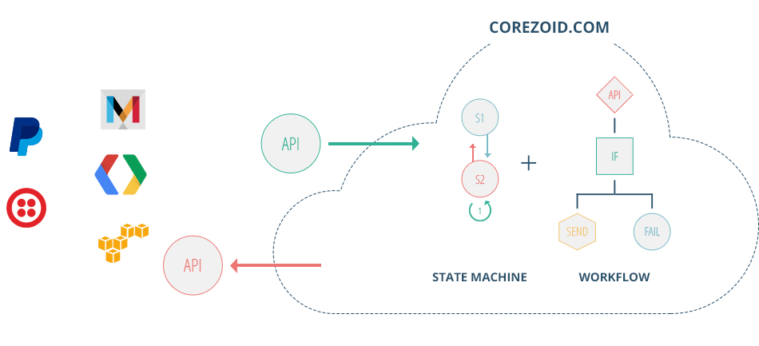

#Введение

**Corezoid** - это облачная операционная система для создания ИТ-решений с использованием методов автоматного программирования с явным выделением состояний.

Corezoid позволяет создавать и выполнять ЛЮБЫЕ алгоритмы и процессы, а также управлять техникой и программным обеспечением любой сложности.
На Corezoid можно строить процессы с вызовом любых внешних API.

---

поможет легко и быстро создать Ваш первый процесс, открыть к нему доступ для API и загрузить данные для обработки.

---

Мы выделили основные разделы, которые были бы Вам интересны:

##Интерфейс
1. [Процессы и состояния](interface/process_and_state/processes.md)
1. [Узлы и доступная логика процессов](interface/nodes/README.md)
1. [Дашбоарды](interface/dashboard.md)
1. [Пользователи](interface/users_groups.md)

## [API Corezoid](api/README.md)
Описаны как основные методы, которые понадобятся Вам для работы с Corezoid, так и дополнительные системные API.

## [Примеры процессов](plugins/README.md)
Мы собрали различные примеры использования Corezoid для интеграции с сервисами email, sms, facebook, twitter и другими. Перейдите в раздел чтобы увидеть полный список.

