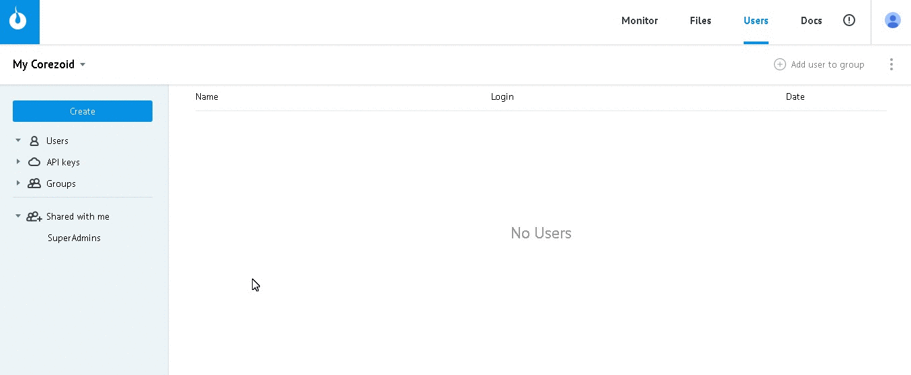

# API v2

*   [Описание протокола](#описание-протокола)
*   [Создание объектов (процесс / папка / дашборд)](#создание-объектов)
*   [Создание узла процесса](#создание-узла-процесса)
*   [Установка координат узла](#установка-координат-узла)
*   [Создание узлов для добавления логик API Call, Code, Copy task, Modify Task, Call Process, Get from Queue](#создание-узлов-для-добавления-логик-api-call-code-copy-task-modify-task-call-process-get-from-queue)
*   [Добавление Логики API Call](#добавление-логики-api-call)
*   [Добавление Логики Condition](#добавление-логики-condition)
*   [Добавление Логики Sum](#добавление-логики-sum)
*   [Deploy процесса](#deploy-процесса)
*   [Получение объектов](#получение-объектов)

## Описание протокола


Чтобы сформировать запрос, создайте `API keys` и получите **логин авторизации** и **секретный ключ** для работы с объектами Corezoid через API

`Users -> Create -> API key -> Введите название -> OK`




**URL**

```
https://api.corezoid.com/api/2/json/{API_LOGIN}/{GMT_UNIXTIME}/{SIGNATURE}
```

*   **{API_LOGIN}** - логин авторизации

*   **{GMT_UNIXTIME}** - время запроса, в формате unix time в секундах (epoch time), по Гринвичу (GMT+0).

*   **{SIGNATURE}** - подпись запроса.

Подпись запроса Cчитается по формуле:

`hex( sha1({GMT_UNIXTIME} + {API_SECRET} + {CONTENT} + {API_SECRET}) )`, где


    *   `hex()` - функция, которая приводит бинарные данные к шестнадцатеричному формату
    *   `sha1()` - стандартная хеш-функция SHA-1, должна возвращать бинарные данные
    *   `{GMT_UNIXTIME}` - время запроса, в формате unix time в секундах (epoch time), по Гринвичу (GMT+0)
    *   `+` -  конкатенация текстовой строки
    *   `{API_SECRET}` - секретный ключ который выдается вместе с логином `{API_LOGIN}`
    *   `{CONTENT}` - тело запроса

Весь запрос находится в http-теле (он же `{CONTENT}` в формуле подписи).

Кодировка текста `utf-8`. Это полностью соответствует стандарту, и посылается вместе со следующим http заголовком в json формате:

`Content-type: application/json; charset=utf8`

**Запрос**

Отправляется массив **ops**, который содержит список операций. Например:
```json
{
  "ops": [
    {
      "type": "create",
      "obj": "conv"
    },
    {
      "type": "modify",
      "obj": "node",
      "obj_id": "n1234"
    }
  ]
}
```

**Ответ**

```json
{
  "request_proc": "ok",
  "ops": [
    {
      "obj": "conv",
      "obj_id": "1234",
      "proc": "ok"
    },
    {
      "obj": "node",
      "obj_id": "n1234",
      "proc": "obj_id_not_found"
    }
  ]
}
```

| parameter | value | description |
| -- | -- | -- |
| request_proc | "ok" в случае успешного выполнения, иначе - ошибка | глобальный статус обработки всего пакета |
| ops | [] | список операций, соответствующий списку операций запроса |
| ops[n].proc | "ok" в случае успешного выполнения, иначе - ошибка | статус обработки конкретной операции |


Пример ошибки всего пакета:
```json
{
  "request_proc": "format_error",
  "ops": [

  ]
}
```

В этом случае список операций в ответе пуст поскольку ни одна из операций запроса не была выполнена.

## Создание объектов

**Запрос**
```json
{
  "ops": [
    {
      "id": "{{request_id}}",
      "title": "{{title}}",
      "description": "{{description}}",
      "folder_id": "{{folder_id}}",
      "company_id": "{{company_id}}",
      "obj": "{{obj}}",
      "type": "create",
      "obj_type": 0,
      "conv_type": "{{conv_type}}",
      "create_mode": "without_nodes",
      "status": "{{status}}"
    }
  ]
}
```

| parameter | accept type | description | required |
| -- | -- | -- | -- |
| request_id | string | id запроса | - |
| title | string | Название объекта | + |
| description | string  / null | Текстовое описание объекта | + |
| folder_id | string / number | Идентификатор папки, в которой будет создан объект | - |
| company_id | string  / null | Идентификатор компании, в которой будет создан объект (если нет компании, параметр не передается или имеет значение null) | - |
| obj | string | Тип объекта. Принимаются значения `conv / folder / dashboard` | + |
| conv_type | string | Принимаются значения `process` - процесс / `state` - диаграмма состояний | `+` только для "obj": "conv" |
| status | string | Статус процесса. Принимает значения `actived / paused / debugged` | + |

**Пример запроса** создания активного процесса с названием "Corezoid" в папке 11456 компании i7856235891

```json
{
  "ops": [
    {
      "id": "147",
      "title": "Corezoid",
      "description": null,
      "folder_id": 11456,
      "company_id": "i7856235891",
      "obj": "conv",
      "type": "create",
      "obj_type": 0,
      "conv_type": "process",
      "create_mode": "without_nodes",
      "status": "actived"
    }
  ]
}
```

**Ответ**
```json
{
  "request_proc": "ok",
  "ops": [
    {
      "id": "147",
      "proc": "ok",
      "obj": "conv",
      "obj_id": 24545,
      "folder_id": 11456,
      "hash": "ce48cf53644b20ee6ce6e936f271a4f893a29298"
    }
  ]
}
```

| parameter | description |
| -- | -- |
| id | id запроса |
| obj | Тип созданного объекта `conv / folder / dashboard` |
| obj_id | Идентификатор созданного объекта |
| folder_id | Идентификатор папки, в которой создан объект |
| hash | Ключ объекта для формирования "Direct url for tasks upload" |

## Создание узла процесса

**Запрос**
```json
{
  "ops": [
    {
      "id": "{{request_id}}",
      "type": "create",
      "obj": "node",
      "conv_id": {{conv_id}},
      "title": "{{title}}",
      "description": "{{description}}",
      "obj_type": {{obj_type}},
      "version": {{version}}
    }
  ]
}
```

| parameter | accept type | description | required |
| -- | -- | -- | -- |
| request_id | string | id запроса на создание узла | - |
| conv_id | string / number | id процесса | + |
| obj_type | number | Тип узла | + |
| version | number | Версия (идентификатор) изменений для промежуточных сохранений в БД. Используется для сохранения процесса в боевой режим (Deploy). Рекомендуется использовать значение текущего времени в UNIXTIME. Должно быть одинаковым для каждого пакета создания узлов процесса | + |
| title | string (240) | Заголовок создаваемого узла | - |
| description | string (2000) | Описание создаваемого узла | - |

Типы узлов (obj_type):

* **0** - обычный (normal). Предназначен для добавления любой логики. В других типах узлов создание логики запрещено.
* **1** - стартовый (start). Создается в одном экземпляре для каждого процесса. Узел, с которого начинается старт заявки. Без него работа процесса невозможна. 
* **2** - финальный или архивный (final). 
* **3** - эскалационный (escalation). Предназначен для логики Condition, необходимой чтобы обрабатывать ошибоки выполнения других логик.

**Пример запроса** создания стартового узла в процессе 125892

```json
{
  "ops": [
    {
      "id": "12345",
      "type": "create",
      "obj": "node",
      "conv_id": 125892,
      "title": "START",
      "description": "",
      "obj_type": 1,
      "version": 1487321422
    }
  ]
}
```

**Ответ**
```json
{
  "request_proc": "ok",
  "ops": [
    {
      "id": "12345",
      "proc": "ok",
      "obj": "node",
      "obj_id": "67890",
      "version": 1487321422
    }
  ]
}
```

| parameter | description |
| -- | -- |
| obj_id | id созданного узла |
| id | id запроса |
| version | Версия изменений (из запроса) |

## Установка координат узла

**Запрос**
```json
{
  "ops": [
    {
      "type": "modify",
      "obj": "node",
      "obj_id": "{{node_id}}",
      "conv_id": {{conv_id}},
      "title": "{{title}}",
      "obj_type": {{obj_type}},
      "description": "{{description}}",
      "logics": [
        
      ],
      "semaphors": [
        
      ],
      "position": [
        {{position_X}},
        {{position_Y}}
      ],
      "extra": {
        "modeForm": "{{modeForm}}",
        "icon": "{{icon}}"
      },
      "version": {{version}}
    }
  ]
}
```

| parameter | accept type | description | required |
| -- | -- | -- | -- |
| node_id | string | id созданного узла | + |
| conv_id | string / number | id процесса | + |
| title | string (240) | Заголовок создаваемого узла | - |
| obj_type | number | Тип узла | + |
| description | string (2000) | Описание создаваемого узла | - |
| position_X | number | Координаты левого верхнего угла узла по оси X, относительно условной точки 0:0 координат поля процесса | + |
| position_Y | number | Координаты левого верхнего угла узла по оси Y, относительно условной точки 0:0 координат поля процесса | + |
| modeForm | string | Режим узла `collapse` (свернут) / `expand` (развернут) | + |
| icon | string | Для финального узла `success` (зеленый) / `error` (красный). Для всех остальных - "icon":"" | + |
| version | number | Версия (идентификатор) изменений | + |

**Пример запроса** установки координат финального узла в процессе 125892

```json
{
  "ops": [
    {
      "type": "modify",
      "obj": "node",
      "obj_id": "741852963",
      "conv_id": 125892,
      "title": "Final",
      "obj_type": 2,
      "description": "",
      "logics": [
        
      ],
      "semaphors": [
        
      ],
      "position": [
        -1580,
        160
      ],
      "extra": {
        "modeForm": "collapse",
        "icon": "success"
      },
      "version": 1487321422
    }
  ]
}
```

**Ответ**
```json
{
  "request_proc": "ok",
  "ops": [
    {
      "id": "",
      "proc": "ok",
      "conv_id": 125892,
      "obj_id": "741852963"
    }
  ]
}
```

## Создание узлов для добавления логик API Call, Code, Copy task, Modify Task, Call Process, Get from Queue

Для добавления указанных логик необходимо создать сразу 4 узла:

* **обычный узел** (тип 0) - для основной логики 
* **эскалационный узел** (тип 3) - для Логики Condition, чтобы распределить ошибки основной логики по процессу - в финальный узел или на повтор обработки
* **обычный узел** (тип 0) - для Логики Delay, чтобы обрабатывать ошибки основной логики, которые можно повторить через 30 сек 
* **финальный узел** (тип 2) - для ошибок основной логики, которые нельзя обработать повторно

**Пример запроса** создания узлов для добавления Логики API Call в процесс 125892

```json
{
  "ops": [
    {
      "id": "1",
      "type": "create",
      "obj": "node",
      "conv_id": 125892,
      "title": "API Call",
      "description": "",
      "obj_type": 0,
      "version": 1487321422
    },
    {
      "id": "2",
      "type": "create",
      "obj": "node",
      "conv_id": 125892,
      "title": "Escalation node for API Call",
      "description": "",
      "obj_type": 3,
      "version": 1487321422
    },
    {
      "id": "3",
      "type": "create",
      "obj": "node",
      "conv_id": 125892,
      "title": "Delay for API Call",
      "description": "",
      "obj_type": 0,
      "version": 1487321422
    },
    {
      "id": "4",
      "type": "create",
      "obj": "node",
      "conv_id": 125892,
      "title": "Final errors for API Call",
      "description": "",
      "obj_type": 2,
      "version": 1487321422
    }
  ]
}
```

**Ответ**
```json
{
  "request_proc": "ok",
  "ops": [
    {
      "id": "1",
      "proc": "ok",
      "obj": "node",
      "obj_id": "963852",
      "version": 1487321422
    },
    {
      "id": "2",
      "proc": "ok",
      "obj": "node",
      "obj_id": "741852",
      "version": 1487321422
    },
    {
      "id": "3",
      "proc": "ok",
      "obj": "node",
      "obj_id": "852123",
      "version": 1487321422
    },
    {
      "id": "4",
      "proc": "ok",
      "obj": "node",
      "obj_id": "632547",
      "version": 1487321422
    }
  ]
}
```
## Добавление Логики API Call

**Пример запроса** добавления Логики API Call в процесс 125892

С параметрами вызываемого API:

* тип запроса - POST
* URL API - https://test.com
* входящие параметры - {"key1": "value1", "key2": "2"} 
* Content-Type - Application/Json

```json
{
  "ops": [
    {
      "type": "modify",
      "obj": "node",
      "obj_id": "{{logic_node_id}}",
      "conv_id": 125892,
      "title": "",
      "description": "",
      "obj_type": 0,
      "logics": [
        {
          "type": "api",
          "err_node_id": "{{escalation_node_id}}",
          "format": "",
          "method": "POST",
          "url": "https:\/\/test.com",
          "extra": {
            "key1": "value1",
            "key2": "2"
          },
          "extra_type": {
            "key1": "string",
            "key2": "number"
          },
          "max_threads": 5,
          "debug_info": false,
          "customize_response": false,
          "response": {
            "header": "{{header}}",
            "body": "{{body}}"
          },
          "response_type": {
            "header": "object",
            "body": "object"
          },
          "extra_headers": {
            
          },
          "send_sys": true,
          "cert_pem": "",
          "content_type": "application\/json"
        },
        {
          "type": "go",
          "to_node_id": "{{final_node_id}}"
        }
      ],
      "semaphors": [
        
      ],
      "position": [
        -1680,
        -100
      ],
      "extra": {
        "modeForm": "expand",
        "icon": ""
      },
      "version": 1487321422
    },
    {
      "type": "modify",
      "obj": "node",
      "obj_id": "{{escalation_node_id}}",
      "conv_id": 125892,
      "title": "",
      "description": "",
      "obj_type": 3,
      "logics": [
        {
          "type": "go_if_const",
          "to_node_id": "{{delay_node_id}}",
          "conditions": [
            {
              "fun": "eq",
              "const": "hardware",
              "param": "__conveyor_api_return_type_error__",
              "cast": "string"
            }
          ]
        },
        {
          "type": "go_if_const",
          "to_node_id": "{{delay_node_id}}",
          "conditions": [
            {
              "fun": "eq",
              "const": "software",
              "param": "__conveyor_api_return_type_error__",
              "cast": "string"
            },
            {
              "fun": "eq",
              "const": "api_bad_answer",
              "param": "__conveyor_api_return_type_tag__",
              "cast": "string"
            }
          ]
        },
        {
          "type": "go",
          "to_node_id": "{{final_node_id}}"
        }
      ],
      "semaphors": [
        
      ],
      "position": [
        -1428,
        -8
      ],
      "extra": {
        "modeForm": "collapse",
        "icon": ""
      },
      "version": 1487321422
    },
    {
      "type": "modify",
      "obj": "node",
      "obj_id": "{{delay_node_id}}",
      "conv_id": 125892,
      "title": "",
      "description": "",
      "obj_type": 0,
      "logics": [
        
      ],
      "semaphors": [
        {
          "type": "time",
          "value": 30,
          "dimension": "sec",
          "to_node_id": "{{logic_node_id}}"
        }
      ],
      "position": [
        -1428,
        -100
      ],
      "extra": {
        "modeForm": "collapse",
        "icon": ""
      },
      "version": 1487321422
    },
    {
      "type": "modify",
      "obj": "node",
      "obj_id": "{{final_node_id}}",
      "conv_id": 125892,
      "title": "",
      "description": "",
      "obj_type": 2,
      "logics": [
        
      ],
      "semaphors": [
        
      ],
      "position": [
        -1296,
        20
      ],
      "extra": {
        "modeForm": "collapse",
        "icon": "error"
      },
      "version": 1487321422
    }
  ]
}
```

| parameter | accept type | description | required |
| -- | -- | -- | -- |
| logic_node_id | string | id узла, созданного для Логики API Call | + |
| escalation_node_id | string | id эскалационного узла Логики API Call | + |
| delay_node_id | string | id узла, созданного для Логики Delay | + |
| final_node_id | string | id финального узла, созданного для архива ошибок Логики API Call | + |


**Ответ**
```json
{
  "request_proc": "ok",
  "ops": [
    {
      "id": "",
      "proc": "ok",
      "conv_id": 125892,
      "obj_id": "{{logic_node_id}}"
    },
    {
      "id": "",
      "proc": "ok",
      "conv_id": 125892,
      "obj_id": "{{escalation_node_id}}"
    },
    {
      "id": "",
      "proc": "ok",
      "conv_id": 125892,
      "obj_id": "{{delay_node_id}}"
    },
    {
      "id": "",
      "proc": "ok",
      "conv_id": 125892,
      "obj_id": "{{final_node_id}}"
    }
  ]
}
```
## Добавление Логики Condition

**Запрос**

```json
{
  "ops": [
    {
      "type": "modify",
      "obj": "node",
      "obj_id": "{{node_id}}",
      "conv_id": {{conv_id}},
      "title": "{{title}}",
      "description": "",
      "obj_type": 0,
      "logics": [
        {
          "to_node_id": "{{condition_ok_node_id}}",
          "type": "go_if_const",
          "id": "{{request_id}}",
          "conditions": [
            {
              "param": "{{key}}",
              "const": "{{value}}",
              "fun": "{{fun}}",
              "cast": "{{key_type}}"
            }
          ]
        },
        {
          "type": "go",
          "to_node_id": "{{go_node_id}}"
        }
      ],
      "semaphors": [
        
      ],
      "position": [
        {{position_X}},
        {{position_Y}}
      ],
      "extra": {
        "modeForm": "expand",
        "icon": ""
      },
      "version": {{version}}
    }
  ]
}
```

| parameter | accept type | description | required |
| -- | -- | -- | -- |
| node_id | string | id узла | + |
| conv_id | string / number | id процесса | + |
| title | string (240) | Заголовок создаваемого узла | - |
| condition_ok_node_id | string | id узла для перехода, если указанное условие выполнено | + |
| request_id | string | id запроса | - |
| key | string | Ключ условия | + |
| value | string | Значение условия. Может быть динамическим из тела заявки {{data.param1}} и пустым "" | + |
| fun | string | Тип условия ("eq", "not_eq", "more", "less", "regexp") | + |
| key_type | string | Тип ключа ("string", "number", "boolean", "array","object") | + |
| go_node_id | string | id узла для безусловного перехода, если ни одно из указанных условий не выполнено | + |
| position_X | number | Координаты левого верхнего угла узла по оси X, относительно условной точки 0:0 координат поля процесса | + |
| position_Y | number | Координаты левого верхнего угла узла по оси Y, относительно условной точки 0:0 координат поля процесса | + |
| version | number | Версия (идентификатор) изменений | + |

**Пример запроса** добавления Логики Condition с двумя условиями:

1) если параметр `amount` больше 100 (число) и параметр `card` не пустой (присутсвует в заявке), то переход в узел с id 8523069879
2) если параметр `amount` равен 0 (число), то переход в узел с id 1485269578
3) если не выполнено ни одно из указанных условий, переход в узел с id 8547963253

```json
{
  "ops": [
    {
      "type": "modify",
      "obj": "node",
      "obj_id": "1235809652",
      "conv_id": 125892,
      "title": "",
      "description": "",
      "obj_type": 0,
      "logics": [
        {
          "to_node_id": "8523069879",
          "type": "go_if_const",
          "id": "1",
          "conditions": [
            {
              "param": "amount",
              "const": "100",
              "fun": "more",
              "cast": "number"
            },
            {
              "param": "card",
              "const": "",
              "fun": "not_eq",
              "cast": "string"
            }
          ]
        },
        {
          "to_node_id": "1485269578"
          "id": "2",
          "type": "go_if_const",
          "conditions": [
            {
              "param": "amount",
              "const": "0",
              "fun": "eq",
              "cast": "number"
            }
          ]
        },
        {
          "type": "go",
          "to_node_id": "8547963253"
        }
      ],
      "semaphors": [
        
      ],
      "position": [
        -2604,
        -276
      ],
      "extra": {
        "modeForm": "expand",
        "icon": ""
      },
      "version": 1487234301
    }
  ]
}
```

## Добавление Логики Sum

**Запрос**

```json
{
  "ops": [
    {
      "type": "modify",
      "obj": "node",
      "obj_id": "{{node_id}}",
      "conv_id": {{conv_id}},
      "title": "{{title}}",
      "description": "",
      "obj_type": 0,
      "logics": [
        {
          "type": "api_sum",
          "extra": [
            {
              "id": "{{request_id}}",
              "name": "{{name}}",
              "value": "{{value}}"
            }
          ]
        },
        {
          "type": "go",
          "to_node_id": "{{go_node_id}}"
        }
      ],
      "semaphors": [
        
      ],
      "position": [
        {{position_X}},
        {{position_Y}}
      ],
      "extra": {
        "modeForm": "expand",
        "icon": ""
      },
      "version": {{version}}
    }
  ]
}
```

| parameter | accept type | description | required |
| -- | -- | -- | -- |
| node_id | string | id узла | + |
| conv_id | string / number | id процесса | + |
| title | string (240) | Заголовок создаваемого узла | - |
| request_id | string | id запроса (id суммы параметров). Может быть использован в конструкции https://doc.corezoid.com/ru/interface/functions/getParamFromCount.html | + |
| name | string | Имя параметра, который будет содержать сумму значений | + |
| value | string | константа или имя параметра из заявки в двойных фигурных скобках, значение которого нужно суммировать | + |
| go_node_id | string | id узла следующего узла | + |
| position_X | number | Координаты левого верхнего угла узла по оси X, относительно условной точки 0:0 координат поля процесса | + |
| position_Y | number | Координаты левого верхнего угла узла по оси Y, относительно условной точки 0:0 координат поля процесса | + |
| version | number | Версия (идентификатор) изменений | + |

**Пример запроса** добавления Логики Sum для суммирования параметра `amount` по заявкам процесса 125892

```json
{
  "ops": [
    {
      "type": "modify",
      "obj": "node",
      "obj_id": "123589635",
      "conv_id": 125892,
      "title": "SUM",
      "description": "",
      "obj_type": 0,
      "logics": [
        {
          "type": "api_sum",
          "extra": [
            {
              "id": "1",
              "name": "Total amount",
              "value": "{{amount}}"
            }
          ]
        },
        {
          "type": "go",
          "to_node_id": "85236954"
        }
      ],
      "semaphors": [
        
      ],
      "position": [
        716,
        188
      ],
      "extra": {
        "modeForm": "expand",
        "icon": ""
      },
      "version": 1487582372
    }
  ]
}
```

## Deploy процесса

**Запрос**
```json
{
  "ops": [
    {
      "type": "confirm",
      "obj": "commit",
      "conv_id": {{conv_id}},
      "company_id": {{company_id}},
      "version": {{version}}
    }
  ]
}
```

| parameter | accept type | description | required |
| -- | -- | -- | -- |
| conv_id | string / number | id процесса | + |
| company_id | string  / null | Идентификатор компании. Если нет компании, параметр не передается или имеет значение null | - |
| version | number | Версия (идентификатор) изменений | + |

**Пример запроса** на Deploy процесса 125892

```json
{
  "ops": [
    {
      "type": "confirm",
      "obj": "commit",
      "conv_id": 125892,
      "company_id": null,
      "version": 1487321422
    }
  ]
}
```

**Ответ**
```json
{
  "request_proc": "ok",
  "ops": [
    {
      "id": "",
      "proc": "ok",
      "conv_id": 125892,
      "version": 1487321422
    }
  ]
}
```

## Получение объектов 

Метод можно использовать для получения содержимого объектов используя API, идентичного ручной выгрузке объекта в файл с платформ Corezoid 

Все содержимое массива scheme: [], можно сохранить в файл с расширением json и в дальнейшем использовать для загрузки объектов в Corezoid через интерфейс

**Запрос**

```json
{
    "ops": [
        {
            "type": "get",
            "obj": "obj_scheme",
            "obj_id": 4740,
            "obj_type": "conv",
            "async": false
        }
    ]
}
```

| parameter | description | 
| -- | -- |
| obj_id | идентификатор объекта |
| obj_type |тип объекта conv / folder / dashboard |
| async | выбор режима получения объекта true / false |


**Ответ**
```json
{
    "request_proc": "ok",
    "ops": [
        {
            "id": "",
            "obj": "obj_scheme",
            "proc": "ok",
            "scheme": [
                {
                    "obj_type": 1,
                    "obj_id": 4740,
                    "parent_id": 0,
                    "title": "fol_get_obj_scheme",
                    "description": "fol_get_obj_scheme",
                    "status": "actived",
                    "params": null,
                    "conv_type": "process",
                    "scheme": {
                        "nodes": [
                            {
                                "id": "58134741e44b60791c00199e",
                                "obj_type": 2,
                                "condition": {
                                    "logics": [],
                                    "semaphors": []
                                },
                                "title": "Final",
                                "description": "",
                                "x": 988,
                                "y": 400,
                                "extra": "{\"modeForm\":\"collapse\",\"icon\":\"error\"}"
                            },
                            {
                                "id": "58134741e44b60791c00199f",
                                "obj_type": 1,
                                "condition": {
                                    "logics": [
                                        {
                                            "type": "go",
                                            "to_node_id": "58134741e44b60791c00199e"
                                        }
                                    ],
                                    "semaphors": []
                                },
                                "title": "Start",
                                "description": "",
                                "x": 988,
                                "y": 100,
                                "extra": "{\"modeForm\":\"collapse\",\"icon\":\"\"}"
                            }
                        ],
                        "web_settings": [
                            [],
                            []
                        ]
                    },
                    "company_id": null
                }
            ]
        }
    ]
}
```

**Массив данных, которые можно сохранить в файл json**

```json
[
                {
                    "obj_type": 1,
                    "obj_id": 4740,
                    "parent_id": 0,
                    "title": "fol_get_obj_scheme",
                    "description": "fol_get_obj_scheme",
                    "status": "actived",
                    "params": null,
                    "conv_type": "process",
                    "scheme": {
                        "nodes": [
                            {
                                "id": "58134741e44b60791c00199e",
                                "obj_type": 2,
                                "condition": {
                                    "logics": [],
                                    "semaphors": []
                                },
                                "title": "Final",
                                "description": "",
                                "x": 988,
                                "y": 400,
                                "extra": "{\"modeForm\":\"collapse\",\"icon\":\"error\"}"
                            },
                            {
                                "id": "58134741e44b60791c00199f",
                                "obj_type": 1,
                                "condition": {
                                    "logics": [
                                        {
                                            "type": "go",
                                            "to_node_id": "58134741e44b60791c00199e"
                                        }
                                    ],
                                    "semaphors": []
                                },
                                "title": "Start",
                                "description": "",
                                "x": 988,
                                "y": 100,
                                "extra": "{\"modeForm\":\"collapse\",\"icon\":\"\"}"
                            }
                        ],
                        "web_settings": [
                            [],
                            []
                        ]
```