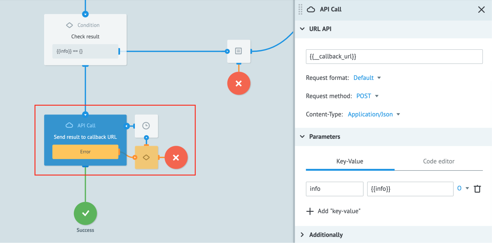

# Sync API

## Использование

Corezoid API работает по _**асинхронной** модели_. Это означает, что при отправке [запроса на создание новой заявки в процессе Corezoid](https://doc.corezoid.com/ru/api/v1/upload-modify.html#сreate), вы получите в ответ лишь идентификатор созданной в процессе заявки, а не результат обработки заявки в процессе:
```
{
    "request_proc": "ok",
    "ops": [
        {
            "id": "",
            "proc": "ok",
            "obj": "task",
            "ref": "ref",
            "obj_id": "5d1b6ee5f6c37653b9904f7d"
        }
    ]
}
```

Для получения результата обработки заявки в процессе, необходимо реализовать механизм _*синхронной*_ отправки ответа.

_**Рассмотрим пример**_:

Допустим, нам необходимо реализовать логику отправки P2P-перевода денежных средств от клиента A к клиенту B через веб-сайт, где:
* веб-сайт - является чистым JS front-end, без бизнес-логики.
* Corezoid - back-end, который управляет всей логикой.

Если мы будем использовать Corezoid API для отправки заявок в процессы Corezoid, то в ответ мы получим `obj_id` (идентификатор заявки), а не результат выполнения процесса.

Для JavaScript front-end такой подход делает невозможным разработку, потому что мы не получаем результат выполнения логики на back-end.

Начиная с версии 4.2 Corezoid поддерживает и синхронную модель обработки запросов с помощью модуля Sync API. Теперь вы можете отправлять запросы через Corezoid Sync API и в ответ получать результат выполнения процесса.

## Особенности использования Sync API

При отправке запроса через **Sync API**, в заявку автоматически добавляется системный параметр `__callback_url`, который содержит ссылку для отправки ответа из Corezoid в сервис, который его вызывает:

`"__callback_url": "https://sync-api.corezoid.com/api/1/plugins/callback/{{request_id}}"`

Для отправки синхронного ответа необходимо:

1. На том шаге процесса, где вы хотите отправить результат обработки заявки обратно в вызывающий сервис, необходимо добавить узел [**API Call**](https://doc.corezoid.com/ru/interface/nodes/api/).
2. В поле URL указать значение `{{__callback_url}}`.
3. Заполнить параметры, которые будут отправлены в вызывающий сервис:



## Формирование запроса к Sync API из внешних сервисов

### URL

`https://sync-api.corezoid.com/api/1/json/{{API_LOGIN}}/{{GMT_UNIXTIME}}/{{SIGNATURE}}`

* {{API_LOGIN}} - [логин авторизации](https://doc.corezoid.com/ru/interface/users_groups.html#api-keys)
* {{GMT_UNIXTIME}} - время запроса, в формате unixtime в секундах (epoch time), по Гринвичу (GMT+0).
* {{SIGNATURE}} - подпись запроса

Подпись запроса рассчитывается согласно стандартному [протоколу Corezoid API](https://doc.corezoid.com/ru/api/v1/spec.html).

Для **API key**, логин и пароль которого используется в запросе, необходимо [предоставить доступ](https://doc.corezoid.com/ru/interface/users_groups.html#предоставление-доступа-к-объекту) на **Task management**.


### Тело запроса

```
{
    "timeout": 30,
    "ops": [{
        "conv_id": {{CONV_ID}},
        "type": "create",
        "obj": "task",
        "data": {
            "param": 1
        }
    }]
}
```

| parameter | accept type | description | required | possible value |
| --- | --- | --- | --- | --- |
| ops| JSON Object | Параметр, в котором передаются JSON объекты с операциями | + | * Количество операций ограничивается лимитами пользователя |
| type | string | Тип для создания заявки | + | create |
| conv_id | number / number as string | Идентификатор процесса, для которого создается заявка | + | Идентификатор существующего процесса |
| obj | string | Тип объекта | + | task |
| data | JSON Object | Объект с парами ключ-значение, описывающими необходимые параметры | + | ** Нет ограничения на количество параметров |
| timeout | number | Максимальное время ожидания ответа | - | Количество секунд, по умолчанию - 60 |


*См. лицензионное соглашение

**Заявка ограничивается только размером, который задается в конфигурационном файле

### Ответ

```
{
    "ops": [
        {
            "proc": "ok",
            "data": {
                "info": {
                    "param_1": "value_1",
                    "param_2": "value_2",
                    "param_3": "value_3"
                }
            }
        }
    ],
    "request_proc": "ok"
}
```

| parameter | value | description |
| --- | --- | --- |
| request_proc | "ok" в случае успешного выполнения, иначе - ошибка |Глобальный статус обработки всего пакета |
| ops | [] |Список операций ответа, соответствующий списку операций запроса |
| ops\[n\].proc | "ok" в случае успешного выполнения, иначе - ошибка |Статус обработки конкретной операции |
| data | Объект в формате ключ-значение, описывающий параметры ответа | Данные, указанные в узле API Call для ответа |


## Типы ошибок

### Не дождались/получили ответ
Если в запросе не используется параметр timeout и не получен ответ за 60 секунд

`504 Gateway Time-out`

### Не получили ответ в установленный лимит времени
Параметр `timeout` позволяет задать время ожидания ответа в секундах. Если в указанный лимит ответ не получен, возникает ошибка:

```
{
    "request_proc": "ok",
    "ops": [
        {
            "proc": "error",
            "description": "Timeout for create task"
        }
    ]
}
```