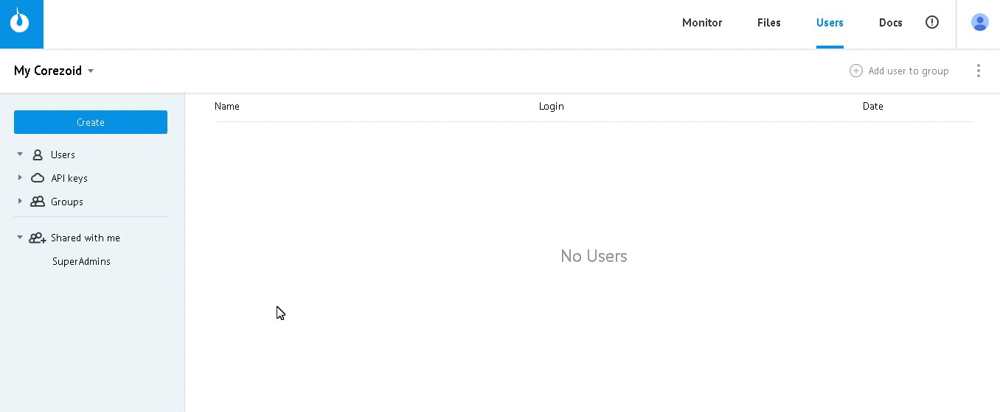

# API v2

*   [Protocol description](#protocol-description)
*   [Создание объектов](#создание-объектов)

## Protocol description


Чтобы сформировать запрос, создайте `API keys` и получите **логин авторизации** и **секретный ключ** для работы с объектами Corezoid через API

`Users -> Create -> API key -> Введите название -> OK`




**URL**

```
https://api.corezoid.com/api/2/json/{API_LOGIN}/{GMT_UNIXTIME}/{SIGNATURE}
```

*   **{API_LOGIN}** - логин авторизации

*   **{GMT_UNIXTIME}** - время запроса, в формате unix time в секундах (epoch time), по Гринвичу (GMT+0).

*   **{SIGNATURE}** - подпись запроса.

Подпись запроса Cчитается по формуле:

`hex( sha1({GMT_UNIXTIME} + {API_SECRET} + {CONTENT} + {API_SECRET}) )`, где


    *   `hex()` - функция, которая приводит бинарные данные к шестнадцатеричному формату
    *   `sha1()` - стандартная хеш-функция SHA-1, должна возвращать бинарные данные
    *   `{GMT_UNIXTIME}` - время запроса, в формате unix time в секундах (epoch time), по Гринвичу (GMT+0)
    *   `+` -  конкатенация текстовой строки
    *   `{API_SECRET}` - секретный ключ который выдается вместе с логином `{API_LOGIN}`
    *   `{CONTENT}` - тело запроса

Весь запрос находится в http-теле (он же `{CONTENT}` в формуле подписи).

Кодировка текста `utf-8`. Это полностью соответствует стандарту, и посылается вместе со следующим http заголовком в json формате:

`Content-type: application/json; charset=utf8`

**Запрос**

Отправляется массив **ops**, который содержит список операций. Например:
```json
{
  "ops": [
    {
      "type": "create",
      "obj": "conv"
    },
    {
      "type": "modify",
      "obj": "node",
      "obj_id": "n1234"
    }
  ]
}
```

**Ответ**

```json
{
  "request_proc": "ok",
  "ops": [
    {
      "obj": "conv",
      "obj_id": "1234",
      "proc": "ok"
    },
    {
      "obj": "node",
      "obj_id": "n1234",
      "proc": "obj_id_not_found"
    }
  ]
}
```

| parameter | value | description |
| -- | -- | -- |
| request_proc | "ok" в случае успешного выполнения, иначе - ошибка | глобальный статус обработки всего пакета |
| ops | [] | список операций, соответствующий списку операций запроса |
| ops[n].proc | "ok" в случае успешного выполнения, иначе - ошибка | статус обработки конкретной операции |


Пример ошибки всего пакета:
```json
{
  "request_proc": "format_error",
  "ops": [

  ]
}
```

В этом случае список операций в ответе пуст поскольку ни одна из операций запроса не была выполнена.

## Создание объектов

**Запрос**
```json
{
  "ops": [
    {
      "title": "{{title}}",
      "description": "{{description}}",
      "folder_id": "{{folder_id}}",
      "company_id": "{{company_id}}",
      "obj": "{{obj}}",
      "type": "create",
      "obj_type": 0,
      "conv_type": "{{conv_type}}",
      "create_mode": "without_nodes",
      "status": "{{status}}"
    }
  ]
}
```

| parameter | accept type | description | required |
| -- | -- | -- | -- |
| `title` | string | Название объекта | `+` |
| `description` | string  / null | Текстовое описание объекта | `+` |
| `folder_id` | string / number | Идентификатор папки, в которой будет создан объект | `-` |
| `company_id` | string  / null | Идентификатор компании, в которой будет создан объект (если нет компании, параметр не передается или имеет значение null) | `-` |
| `obj` | string | Тип объекта. Принимаются значения `conv / folder / dashboard` | `+` |
| `conv_type` | string | Принимаются значения `process` - процесс / `state` - диаграмма состояний | `+` только для "obj": "conv" |
| `status` | string | Статус процесса. Принимает значения `actived / paused / debugged` | `+` |

**Пример запроса**

создания активного процесса с названием "Corezoid" в папке 11456 компании i7856235891

```json
{
  "ops": [
    {
      "title": "Corezoid",
      "description": null,
      "folder_id": 11456,
      "company_id": "i7856235891",
      "obj": "conv",
      "type": "create",
      "obj_type": 0,
      "conv_type": "process",
      "create_mode": "without_nodes",
      "status": "actived"
    }
  ]
}
```

**Ответ**
```json
{
  "request_proc": "ok",
  "ops": [
    {
      "id": "",
      "proc": "ok",
      "obj": "conv",
      "obj_id": 24545,
      "folder_id": 11456,
      "hash": "ce48cf53644b20ee6ce6e936f271a4f893a29298"
    }
  ]
}
```

| parameter | description |
| -- | -- |
| `obj` | Тип созданного объекта `conv / folder / dashboard` |
| `obj_id` | Идентификатор созданного объекта |
| `folder_id` | Идентификатор папки, в которой создан объект |
| `hash` | Ключ объекта для формирования "Direct url for tasks upload" |
