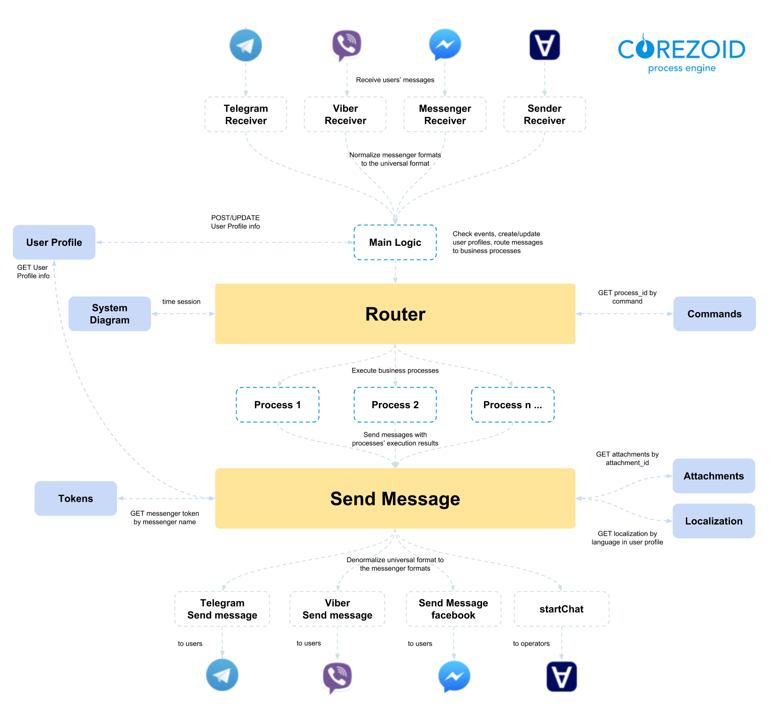

# **Bot Platform 2.0**

  

# Содержание

- [Как создать бота с помощью Bot Platform 2.0](get-started.md)
- [Базовый функционал Bot Platform 2.0](basic-functionality.md)
- [Компоненты Bot Platform 2.0](components.md)
- [Расширение функций бота](add-new-functionality.md)
- [Авторизация пользователей по номеру телефона](authorization.md)

  
  
  

# Что такое Bot Platform

**Bot Platform** — это доступное для всех пользователей Corezoid решение по созданию и управлению ботами в популярных мессенджерах. Corezoid позволяет создать универсальные процессы по управлению бизнес-логикой в мессенджерах, вместо разработки бизнес-логики под каждый мессенджер.

Поддерживаемые мессенджеры:
- Facebook Messenger
- Viber
- Telegram

# Архитектура

---

Следующий раздел: [Как создать бота с помощью Bot Platform 2.0](get-started.md)