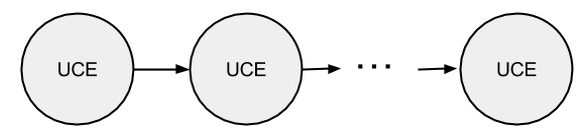

# Глоссарий

**Процесс** - алгоритм или программа, реализованная с помощью последовательности, набора или множества узлов.

[**Узел**](interface/nodes/README.md) - универсальный вычислительный элемент (УВЭ), который описывет состояние объектов.

Узел имеет такие характеристики как очередь, функции, логика, счетчики.

`f` - вызов соответствующей функции узел(i)

`F `- каждому узлу ставится в соответствие функция, которая может быть реализована через человека, API, код, другой узел

`Cт` - счетчик, время T самого старого объекта в очереди

`Cn` - количество объектов в очереди

`{Ci}` - кастомные счетчики

**Очередь** - очередь из объектов в узле.

**Объект** - набор параметров, характеризующих объект.
Согласно определенным правилам в узле производится обработка информации об объекте - применяется функция к объекту.

**Функции** - действия, которые необходимо выполнить над объектом из очереди в узле. Функции могут быть в виде API, программного кода, другого процесса и т.п.

[**Логика**](interface/nodes/README.md) - инструменты управления логикой в узле. Бывают системные и пользовательские логики.
Системная логика T - заданное время, которое может находиться объект в узле.
Системная логика N - заданное количество объектов, которые могут находиться в очереди в узле.

**Счетчики** - показывают только значение без каких-либо действий (в этом отличие от логики). Также бывают системными и пользовательскими.
