# Дашборды (Dashboards)
 
**Дашборд** - это инструмент Corezoid для сбора статистики по процессам и отчетов, представленных в виде набора чартов.
  
Чарт формируется из узлов готовых процессов. Заявки в узлах (счетчики) являются источником данных (метрикой) чарта.
  
* [создание дашборда](#создание-дашборда)
* [настройка чарта](#настройка-чарта)
* [предоставление доступа](#предоставление-доступа)
* [выгрузка дашборда в файл](#выгрузка-дашборда-в-файл)
* [создание дашборда из файла](#создание-дашборда-из-файла)
  
  
## Создание дашборда
  
Чтобы создать дашборд:
  
* нажмите кнопку **Create**;
* выберите **Dashboard**;
* введите его название и описание (необязательно).
  
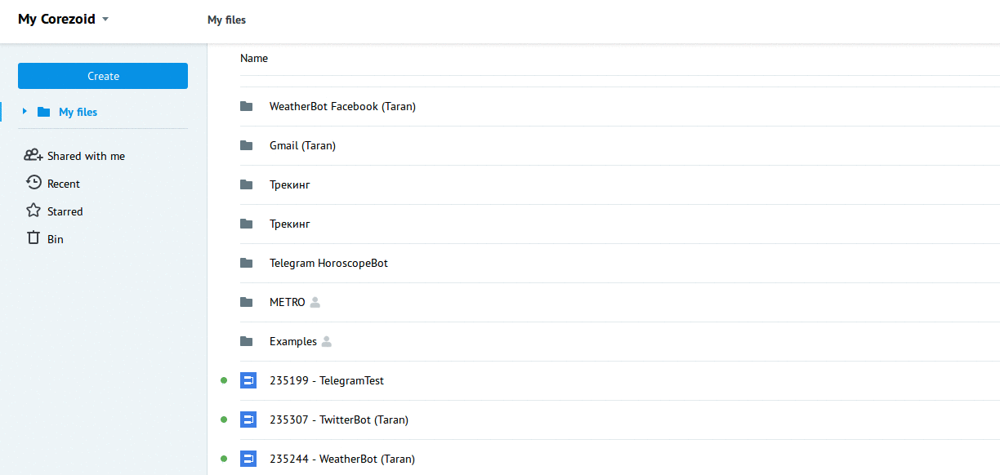
  
На новом дашборде появится пустой чарт, готовый к редактированию.
  
Кнопка **Save** для сохранения изменений на дашборде.
  
Кнопка **Add chart** добавляет на дашборд новый чарт.
  
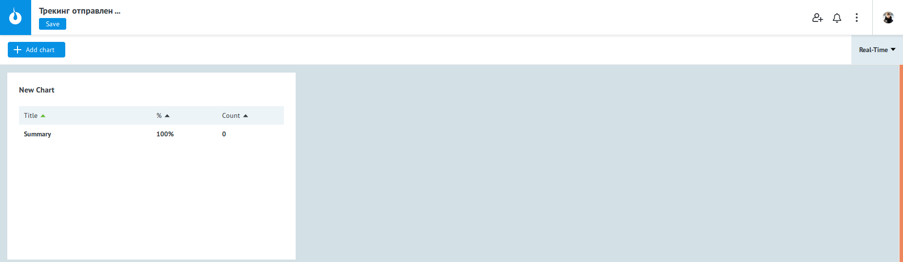

 
## Настройка чарта
  
### Метрики чарта
  
Для выбора данных, которые нужно отобразить в чарте, нажать на **"+"** (**Add Metrics**) в меню **Metrics**:
  
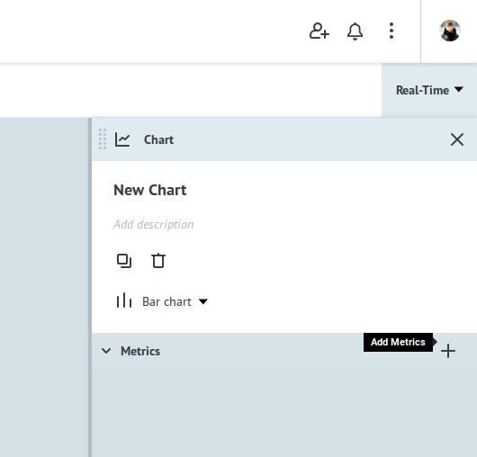

Откроется окно выбора источника данных для построения чарта.
  
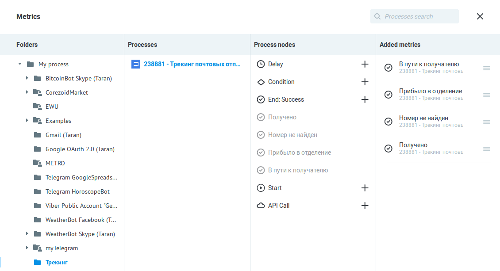
  
**Folders** - выбор папки с процессами;
  
**Processes** - выбор процесса;
  
**Process nodes** - узлы процесса. Добавляются в чарт по нажатию на “+”;
  
**Added metrics** - добавленные узлы.
  
Закрываем окно с метриками - получаем настроенный чарт:
  
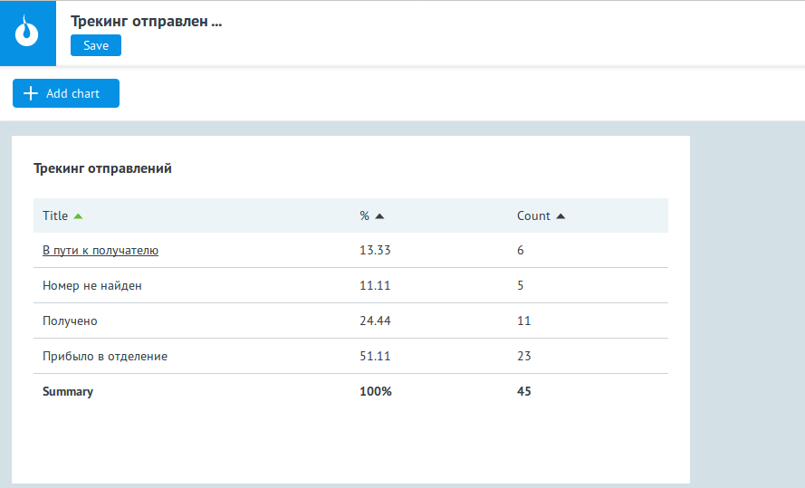
  
Для сохранения необходимо нажать **Save**.
  
Расположение метрик в чарте изменяется перетаскиванием добавленных узлов в меню **Metrics**
  
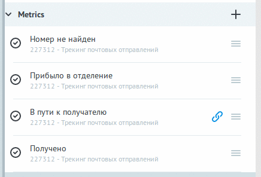
  
  
### Тип чарта
  
В зависимости от вида данных и предназначения чарта можно изменять тип чарта. 
  
Доступные типы:
  
* **Bar chart** - гистограмма;
* **Pie chart** - круговая диаграмма;
* **Funnel chart** - воронка;
* **Table** - таблица.

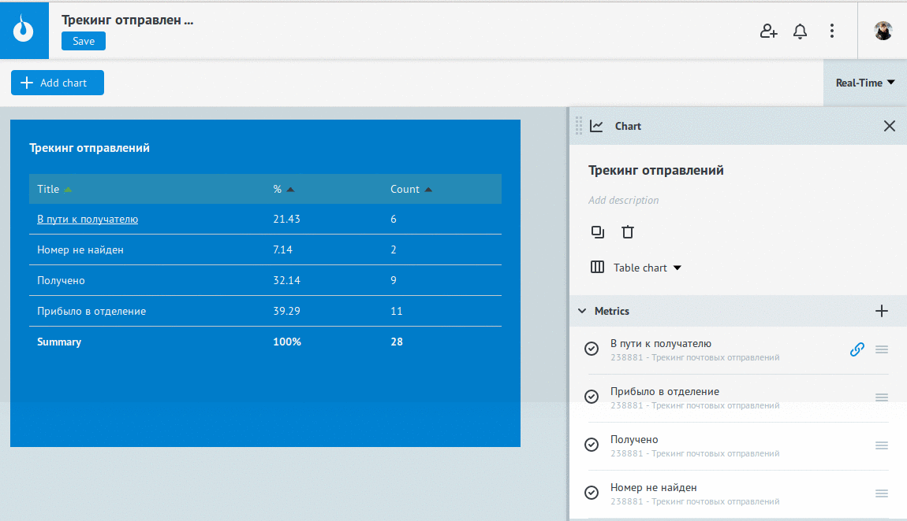
  
  
### Размер чарта
  
Для изменения размера чарта наведите курсор к ее нижнему левому или правому углу и установите нужный размер.
  
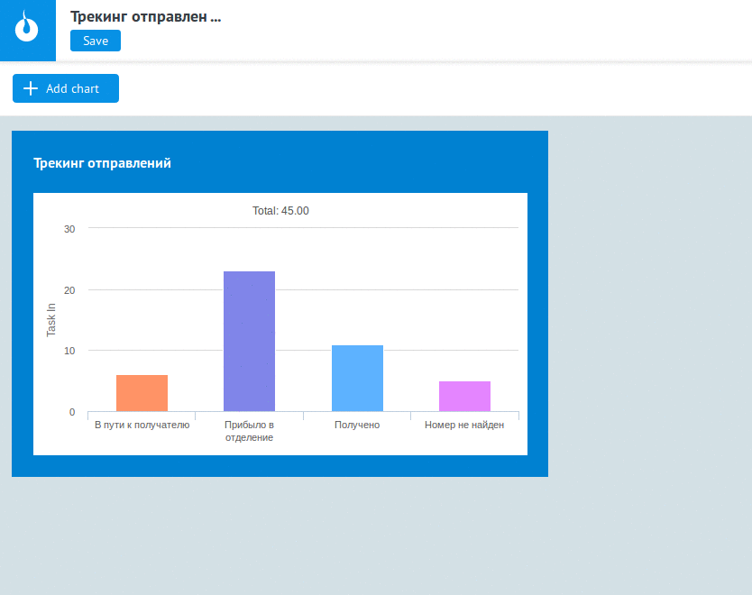

 
### Временной интервал
  
Временной интервал для отображения данных на дашборде применяется ко всем существующим в нем чартам.
  
Обратите внимание, что режим **Real-Time** будет работать корректно только для финальных узлов (**End: Success**, **End: Error**) и для узлов с логиками **Waiting for callback**, **Delay** и **Set state** из диаграммы состояний.
Это объясняется тем, что в узлах с логиками **Waiting for callback**, **Delay**, **Set state заявки** “зависают” на предусмотренное процессом время, а в **End: Success** и **End: Error** - накапливаются.
Узлы со всеми остальными логиками не накапливают заявки. И в случае выбора **Real-Time**, данные чарта будут пустыми. 
  

  
  
### Добавление ссылки на связанный чарт
  
Если данные имеют иерархическую структуру, то есть содержат вложенности, то их можно соответствующим образом детализировать. Для детализации метрики («проваливания») можно добавить ссылку на чарт (график) из другого дашборда.
  
Для этого в настройках **Metrics** необходимо нажать на **“🔗” (Add chart link**).
  
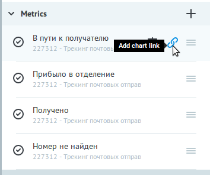

В открывшемся окне необходимо найти любой существующий дашборд и чарт (график) в нем. 
  
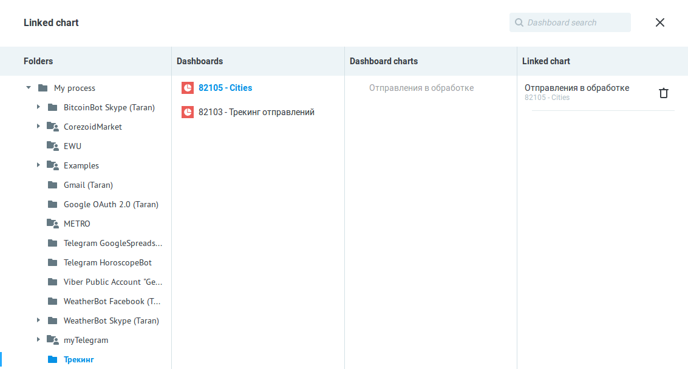
  
Выбранный чарт будет открываться в новой вкладке при нажатии на ссылку.
  
  
## Предоставление доступа
  
Предоставить доступ к дашборду можно двумя способами:
  
1) В режиме редактирования дашборда нажать в правом верхнем углу экрана на кнопку **Share**.
  
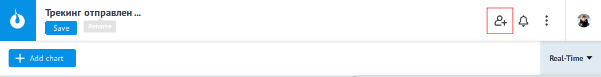
  
Откроется окно **Sharing settings**, где отображаются текущие пользователи и настройки доступа и можно добавить нового.
  
Если пользователь уже добавлен в Ваш список, то его поиск возможен по 3 первым символам имени или email. Выбрать пользователя, проставить настройки доступа и нажать Send invitation.

Если пользователя нет в Вашем списке, то необходимо ввести в поле e-mail, проставить в чек-боксах уровень доступа и нажать Send invitation. 
  
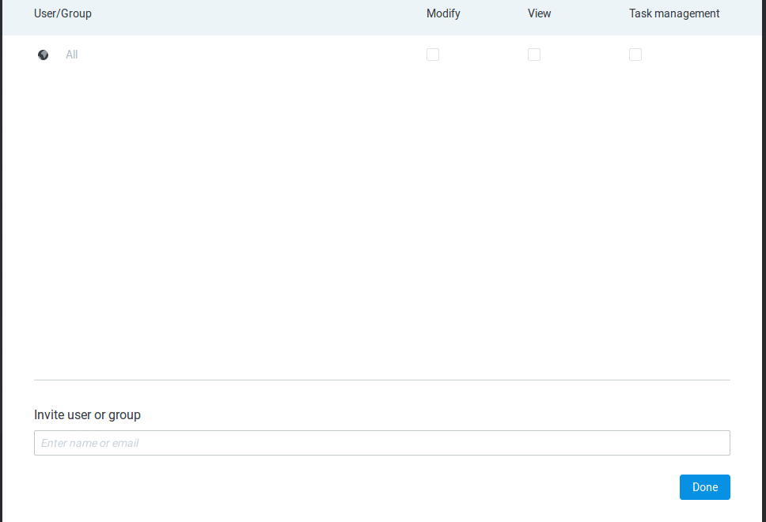
  
Пользователю на e-mail сформируется письмо с уведомлением о предоставлении доступа к дашборду. 
  
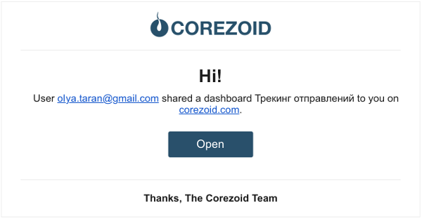
  
В информационном окне он будет помечен "конвертиком" до подтверждения адресатом.
  
2) При просмотре папки с дашбордом выделить в ней дашборд и нажать **Share objects**.
  
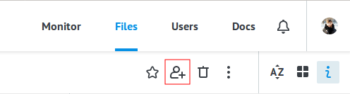
  
Откроется окно **Sharing settings**, где отображаются текущие пользователи и настройки доступа и можно добавить нового и далее все аналогично п.1.
  
  
## Выгрузка дашборда в файл
  
При необходимости дашборд, как и другие объекты Corezoid, можно выгрузить в файл в формате **json**.
  
**ВАЖНО!** Для корректной работы выгруженного дашборда необходимо, чтобы в одной папке был и сам дашборд, и процессы/чарты, на которые он ссылается. Экспортировать необходимо содержащую их папку.
  
Чтобы экспортировать, выберите папку с дашбордом и процессами и нажмите **Download**.
  
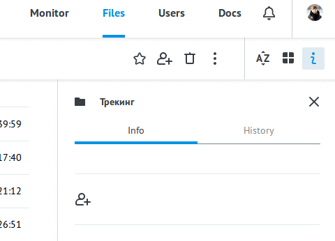
  
В уведомлении об успешной выгрузке нажмите ~to file~ и сохраните файл на компьютере. 
  
  
## Создание дашборда из файла
  
Создать дашборд можно из файла с объектом Corezoid в формате json. Для этого файл должен содержать не только сам дашборд, а всю папку, в котором есть и все объекты, на которые он ссылается. 
Нажимаем **Create -> From file** и выбираем в проводнике файл в формате json.
  
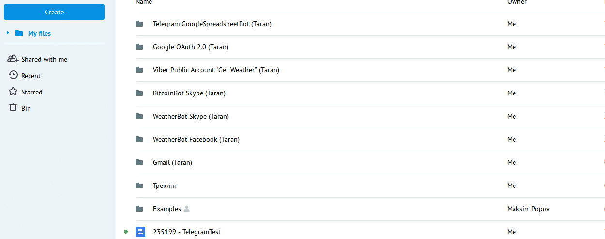
  
Будет создана папка, найти которую Вы сможете в списке своих процессов - в папке **"My files"**.
 
