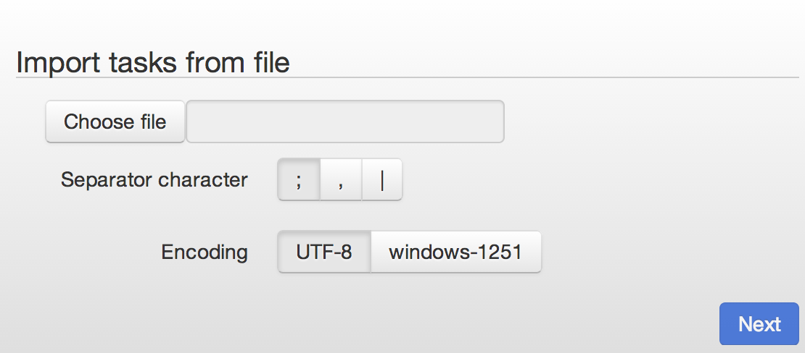
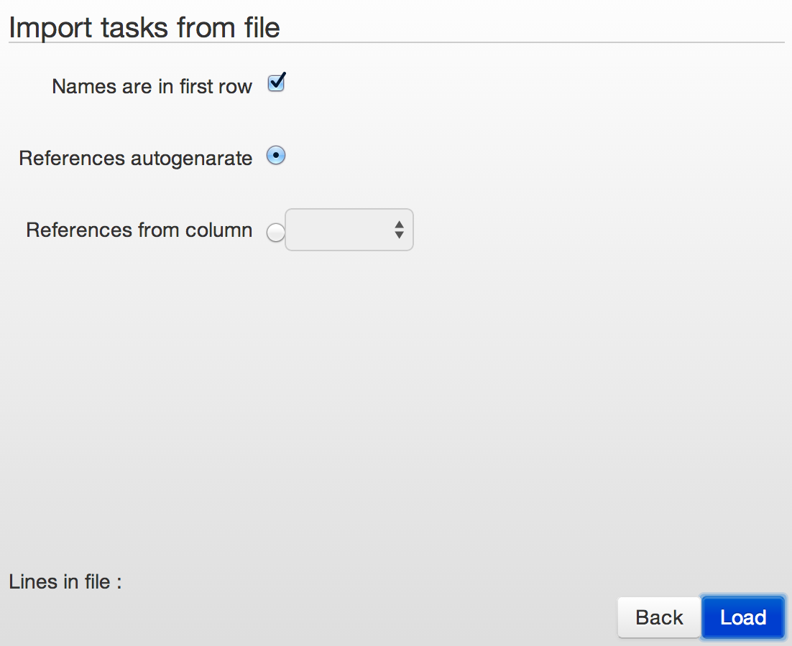
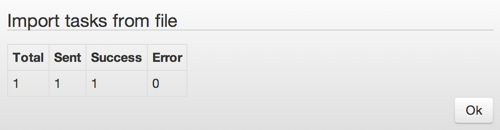

# Загрузка данных из файла

[Загрузка данных через API](../api/v1/upload-modify.md)

----

## Выбор файла для загрузки в процесс
1.  Формат файла - текстовый
2.  Расширение файла - любое
3.  Разделители столбцов `Separator`:
    *   ;
    *   ,
    *   |
4.  Кодировка файла `Encoding`:
    *   UTF-8
    *   windows-1251

## Настройка импорта данных из файла
1.  `Names are in first row` - первая строка файла содержит имена полей? Да/Нет
2.  Референс `References` по каждой записи генерировать:
    *   автоматически `autogenerate`
    *   из столбца `from column` - выбираем из какого столбца
3. `Load` - загрузка файла в процесс
4. **Максимальное количество записей в одном файле - 100 000.**

## Результат загрузки файла

1.  Total - всего записей в файле
2.  Sent - отправлено в процесс
3.  Success - успешно загружено в процесс
4.  Error - не удалось загрузить

