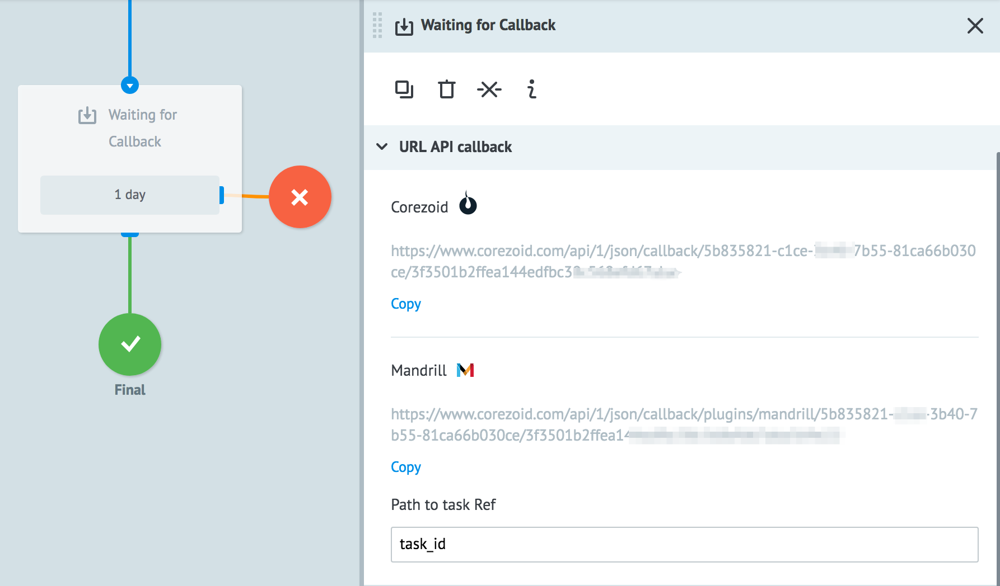
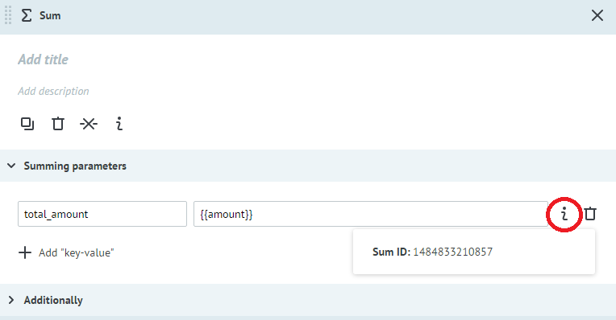
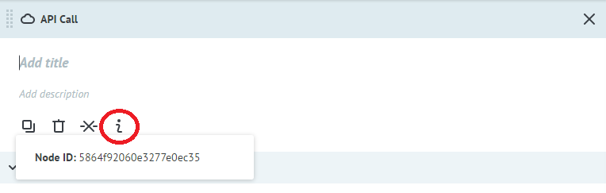

# Чтение параметров узла

##CallbackURL

Динамическое получение CallbackURL узла с Логикой Waiting for Callback.

    // Возвращает CallbackURL узла corezoid или mandrill по {{node_id}}

        {{node[{{node_id}}].public_callback_corezoid}}

        {{node[{{node_id}}].public_callback_mandrill}}

    // Возвращает CallbackURL узла corezoid или mandrill по {{node_id}} из процесса {{conv_id}}

        {{conv[{{conv_id}}].node[{{node_id}}].public_callback_corezoid}}
        
        {{conv[{{conv_id}}].node[{{node_id}}].public_callback_mandrill}}

##Count

В зависимости от количества заявок в узле можно настраивать логику бизнес-процесса.

Возвращает количество заявок по ID узла.

Пример:

    // ID_узла = 561a272782ba961374d44178

        {{node[561a272782ba961374d44178].count}}

    // Возвращает количество заявок в узле, указанном через параметр {{node_id}}

        {{node[{{node_id}}].count}}

    // Возвращает количество заявок в узле, указанном через параметр {{node_id}} из процесса {{conv_id}}

        {{conv[{{conv_id}}].node[{{node_id}}].count}}

##Sum

Возвращает суммированое значение выбранного параметра заявки.

Пример:

    // ID_узла = 561a272782ba961374d44178

        {{node[561a272782ba961374d44178].SumID}}

    // Возвращает сумму по параметру SumID из узла {{node_id}}

        {{node[{{node_id}}].SumID}}

    // Возвращает сумму по параметру SumID из узла {{node_id}} из процесса {{conv_id}}

        {{conv[{{conv_id}}].node[{{node_id}}].SumID}}

##Как получить SumID узла?

##Как получить ID узла?

