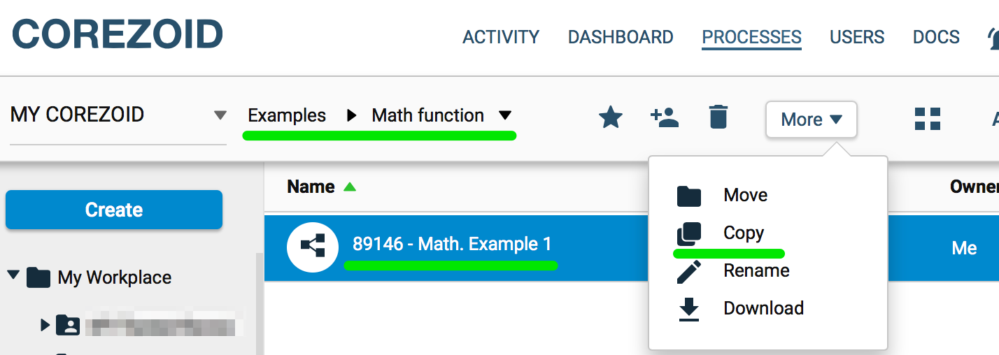
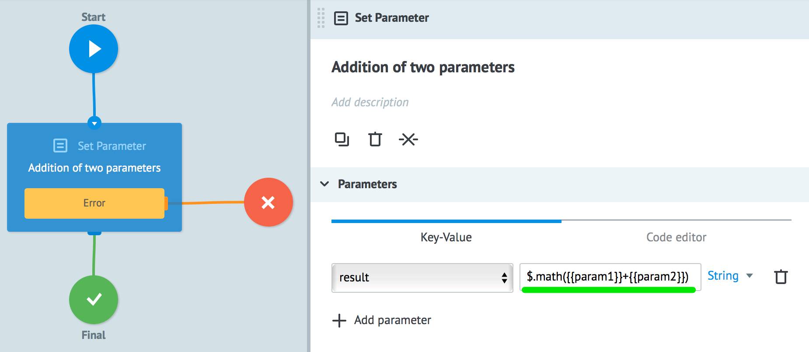
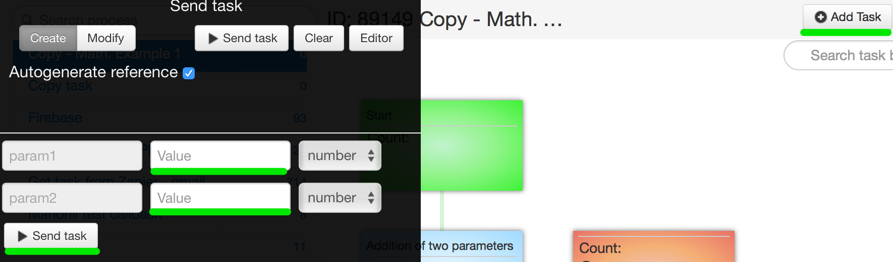
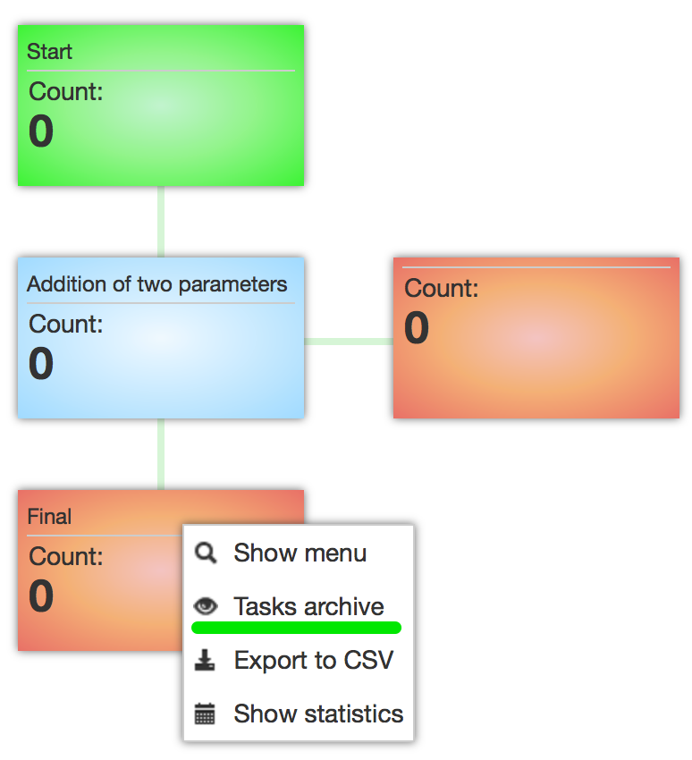
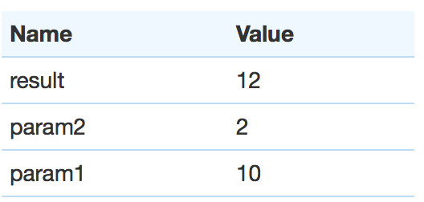

# Математические

##$.math()

Возвращает результат математических действий сложения, вычитания, умножения и деления констант и/или параметров.

Примеры:

    // Возвращает сумму равную 2

        $.math(1+1)

    // Возвращает сумму параметра + 10

        $.math({{имя_параметра}}+10)

    // Возвращает разницу двух параметров

        $.math({{имя_параметра1}}-{{имя_параметра2}})

###Пример: сложение двух параметров из заявки.
Протестировать [пример процесса](https://admin.corezoid.com/editor/55348/89146) можно следующим образом:
1.  Перейдите в папку [Examples/Math function](https://admin.corezoid.com/folder/conv/55348)
2.  Сделайте копию процесса

3.  В узле **Addition of two parameters** указана формула **$.math({{param1}}+{{param2}})** результат которой сохраняется в переменную **result**

4.  Перейдите в режим **View** и нажмите кнопку **Add task** для отправки тестовой заявки.

5.  Выберите финальный узел и пункт **task archive**, чтобы посмотреть результат работы процесса

6.  Результат работы процесса

