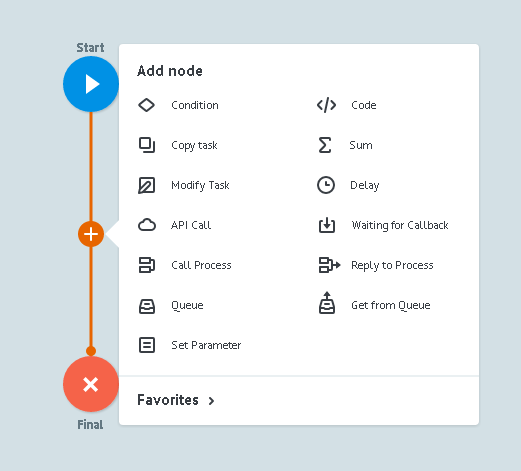

# Узлы и логика

>Наглядная демонстрация и [базовые знания](https://new.corezoid.com/tutorials/basic-tutorial/) в разделе [TUTORIALS](https://new.corezoid.com/tutorials/) на [сайте](https://new.corezoid.com)

Каждый Corezoid процесс состоит из узлов.

Каждый узел содержит свою уникальную логику.

Заявки движутся по процессу от узла к узлу, следуя заданной в них логике.

| Название логики | Описание|
| -- | -- |
|Delay| Временной интервал (задержка), при достижении которого заявка пойдет дальше по процессу указывается и критическое количество заявок в узле - лимит заявок|
|Condition| Переход по условию. Варианты условий =, !=, <, >, regex|
|API Call| Вызов внешнего АПИ с параметрами|
|Waiting for Callback| Ожидание ответа по заявке от внешней системы|
|Code| Возможность реализовать дополнительную логику обработки заявки на одном из языков (JavaScript, Erlang) |
|Copy task| Копирование заявки в другой процесс|
|Modify task| Обновление заявки в другом процессе|
|Call Process| Вызов универсального процесса|
|Reply to Process| Ответ на вызов универсального процесса|
|Sum| Суммирование значения по определенному полю заявки|
|Set Parameter| Установка параметра / изменение значения параметра в заявке|
|Set State| Реализация логики хранения и распределения состояний заявок|
|Queue| Реализация логики очереди|
|Get from Queue| Получение заявки из очереди|
|End: Success| Конечный узел, содержащий успешные заявки процесса
|End: Error| Конечный узел, содержащий заявки с ошибками процесса|

