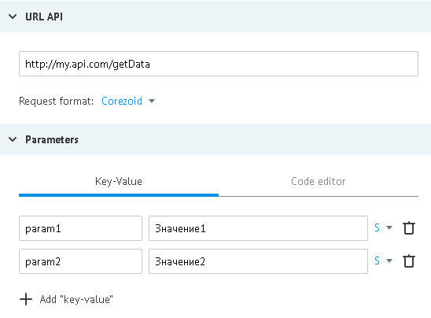

# Формат COREZOID

Данные для примера:

- URL - http://my.api.com/getData
- входящие параметры - `"param1":"Значение1"`, `"param2":"Значение2"`



**Запрос от процесса к API**
*   http://my.api.com/getData?conv_signature={SIGNATURE}&conv_time={GMT_UNIXTIME}&conv_id={CONV_ID}

Параметры `conv_signature`, `conv_time` и `conv_id` автоматически добавляются процессом в URL и могут быть использованы для проверки доступа к вызываемому API.

`conv_signature` формируется по [формуле](../../../api/v1/spec.md), где `API_SECRET` - ключ, который сгенерирован в узле с логикой API.

**Тело запроса**
```json
{
    "ops":[
        {
        "ref":"130605",
        "type":"data",
        "obj_id":"t71001",
        "conv_id":"1234",
        "node_id":"n10221",
        "data":{
            "phone":"380501234561",
            "card":"4134000011112221"
        },
        "extra":{
                "param1":"Значение1",
                "param2":"Значение2"
            }
        }
    ]
}
```

Вызываемое из процесса API должно брать параметры из блока `extra`, переменные в `data` могут отсутствовать.

**Ответ процессу при удачном выполнении операции (HTTP status code = 200):**
```json
{
    "request_proc":"ok",
    "ops":[
        {
            "ref":"130605",
            "obj_id":"t71001",
            "proc":"ok",
            "res_data":{
                "res":"0"
                }
        }
    ]
}
```

**Ответ процессу при неудачном выполнении операции (HTTP status code = 500):**
```json
{
    "request_proc":"ok",
    "ops":[
        {
            "ref":"130605",
            "obj_id":"t71001",
            "proc":"fail",
            "res_data":{
                "error":"Text error"
                }
        }
    ]
}
```

Cодержимое `res_data` автоматически добавляется к заявке в процессе (в объект data), соответственно заявка будет содержать новый параметр `result="0"`
