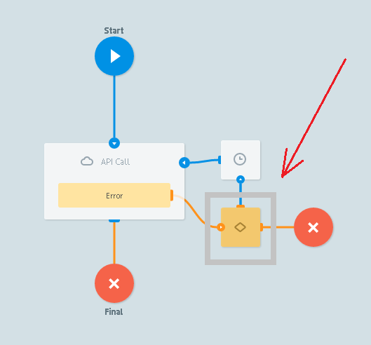

# Коды ошибок

### Успешный вызов API

Если:
- **HTTP code**:
    -   200
    -   201
    -   202
- `Content-type` = `aplication/xml` то ответ будет автоматически преобразован из XML в JSON и добавлен в заявку
- `aplication/json` - объект. Все параметры из ответа будут добавлены в заявку без изменений
- `aplication/json` - массив. Содержимое массива будет добавлено в переменную `__conveyor_api_array__`
- `image`. Содержимое будет преобразовано в base64 и добавлено в переменную `__conveyor_api_image__`

<section id="create_task_error" />

### Обработка ошибок

При возникновении ошибки процесс отправляет заявку в узел с Логикой Condition

и добавляет к заявке следующие параметры:

| Имя параметра | Описание параметра |
| -- | -- |
| `__conveyor_api_return_type_error__` | тип ошибки (hardware/software)|
| `__conveyor_api_return_type_tag__` | код ошибки |
| `__conveyor_api_return_type_description__` | описание ошибки |

<bookmark id="error">

### Типы ошибок

#### Запрос к API провисел долгое время. Использованы все коннекты к API (max_threads) или API долго отвечает.

| Имя параметра | Значение |
| -- | -- |
| `__conveyor_api_return_type_error__` | hardware |
| `__conveyor_api_return_type_tag__` | api_expire_query |
| `__conveyor_api_return_description__` | Expire task to API, please check your api for correct answer, or increase max_threads for connections` |

#### Ошибка добавления параметров в запрос

| Имя параметра | Значение |
| -- | -- |
| `__conveyor_api_return_type_error__` | hardware |
| `__conveyor_api_return_type_tag__` | api_bind_error |
| `__conveyor_api_return_description__` | Error bind params to http query |

#### Внутренняя ошибка процесса

| Имя параметра | Значение |
| -- | -- |
| `__conveyor_api_return_type_error__` | hardware |
| `__conveyor_api_return_type_tag__` | api_fatal_error |
| `__conveyor_api_return_description__` | Error running api |

#### Не дождались/получили ответ от API

Максимальное время выполнения одного запроса к API = 60 сек. По истечению этого времени, заявка переводится в узел **Escalation** и к ней добавляются параметры

| Имя параметра | Значение |
| -- | -- |
| `__conveyor_code_return_type_error__` | software|
| `__conveyor_api_return_type_tag__` | api_bad_answer|
| `__conveyor_api_return_description__` | timeout или failed_connect ...|

#### Пустой URL для вызова API

| Имя параметра | Значение |
| -- | -- |
| `__conveyor_code_return_type_error__` | software|
| `__conveyor_api_return_type_tag__` | api_bad_answer |
| `__conveyor_api_return_description__` | no_scheme |

#### Не валидный JSON

| Имя параметра | Значение |
| -- | -- |
| `__conveyor_api_return_type_error__` | software |
| `__conveyor_api_return_type_tag__` | api_no_valid_json |
| `__conveyor_api_return_description__` | Please check |

#### Не верный `request_proc` у ответа

| Имя параметра | Значение |
| -- | -- |
| `__conveyor_api_return_type_error__` | software |
| `__conveyor_api_return_type_tag__` | api_no_request_proc |
| `__conveyor_api_return_description__` | Bad request_proc tag. Please fill request_proc=ok for your answer. If you want to put error use proc!=ok |

#### Нет блока `ops` у ответа

| Имя параметра | Значение |
| -- | -- |
| `__conveyor_api_return_type_error__` | software |
| `__conveyor_api_return_type_tag__` | api_no_ops |
| `__conveyor_api_return_description__` | No ops. Please check documentation |

#### Ошибка при конвертировании параметров

| Имя параметра | Значение |
| -- | -- |
| `__conveyor_api_return_type_error__` | software |
| `__conveyor_api_return_type_tag__` | api_wrong_convert_param |
| `__conveyor_api_return_description__` | Param: ___, Value: ____, Try convert to: |

#### Не верный res_data у ответа API

| Имя параметра | Значение |
| -- | -- |
| `__conveyor_api_return_type_error__` | software |
| `__conveyor_api_return_type_tag__` | api_bad_res_data |
| `__conveyor_api_return_description__` | Bad res_data: ", Data/binary, ". Please check documentation |

#### Размер ответа от API больше 128кБ

| Имя параметра | Значение |
| -- | -- |
| `__conveyor_api_return_type_error__` | software |
| `__conveyor_api_return_type_tag__` | api_task_size_overflow_limit |
| `__conveyor_api_return_description__` | Your task size: {{size_data}} bytes, Max available task size: 128000 bytes, Try to change your data or try to split your task ... |

