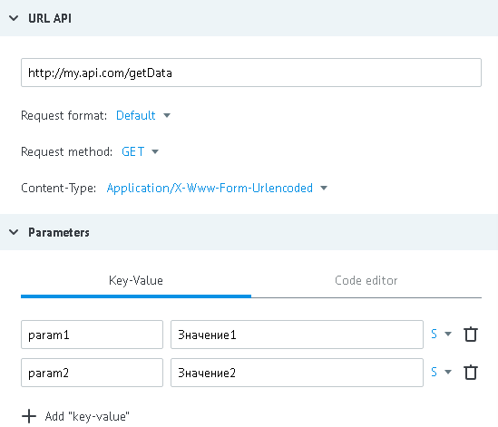

# Метод GET

Данные для примера:

- URL - http://my.api.com/getData
- входящие параметры - `"param1":"Значение1"`, `"param2":"Значение2"`



**GET запрос от процесса к API**

*   http://my.api.com/getData?param1=%D0%97%D0%BD%D0%B0%D1%87%D0%B5%D0%BD%D0%B8%D0%B51&param2=%D0%97%D0%BD%D0%B0%D1%87%D0%B5%D0%BD%D0%B8%D0%B52

или

*   http://my.api.com/getData?param1=%D0%97%D0%BD%D0%B0%D1%87%D0%B5%D0%BD%D0%B8%D0%B51&param2=%D0%97%D0%BD%D0%B0%D1%87%D0%B5%D0%BD%D0%B8%D0%B52&conv_signature={{conv_signature}}&conv_time={{conv_time}}&conv_id={{conv_id}}

Параметры `conv_signature`, `conv_time` и `conv_id` могут быть добавлены в URL и использованы для проверки доступа к вызываемому API.

`conv_signature` формируется по [формуле](../../../api/v1/spec.md), где `API_SECRET` - ключ, который сгенерирован в узле с логикой API.

**Ответ процессу при удачном выполнении операции (HTTP status code = 200):**
```json
{
    "answerParam":"ok"
}
```

**В случае серверной ошибки (HTTP status code = 500), ответ процессу :**
```json
{
    "textError":"Text error",
    "codeError":"Code Error"
}
```

Cодержимое `json` автоматически добавляется к заявке в процессе (в объект data).


