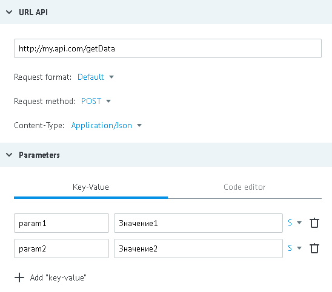
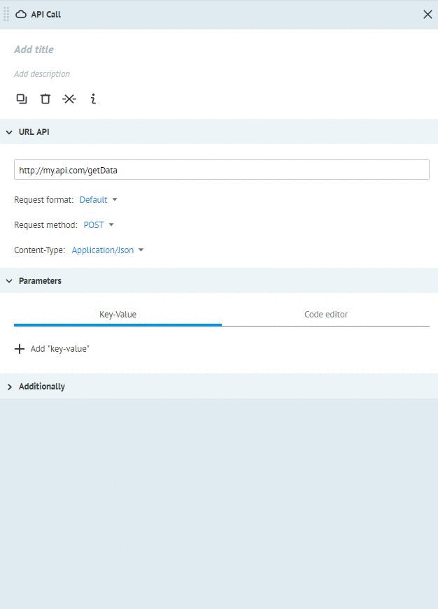
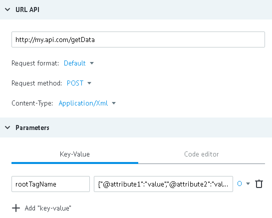
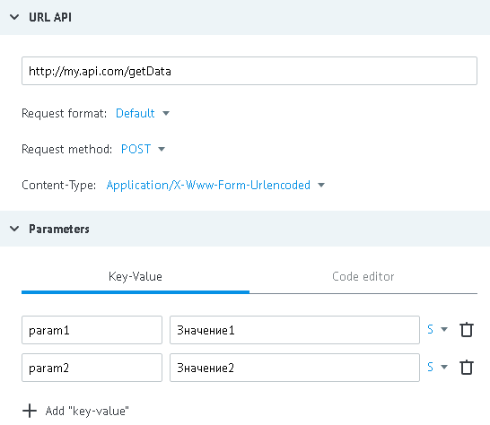

# Метод POST

Метод **POST** используется для запросов к API в форматах:
*   [JSON](#json-post)
*   [XML / SOAP](#xml)
*   [NVP (x-www-form-urlencoded)](#nvp)

## JSON
**Content-type = application/json**

Данные для примера:

- URL - http://my.api.com/getData
- входящие парамеры - `"param1":"Значение1"`, `"param2":"Значение2"`



**POST запрос от процесса к API**

*   http://my.api.com/getData

или

*   http://my.api.com/getData?conv_signature={{conv_signature}}&conv_time={{conv_time}}&conv_id={{conv_id}}

Параметры `conv_signature`, `conv_time` и `conv_id` могут быть добавлены в URL и использованы для проверки доступа к вызываемому API.

`conv_signature` формируется по [формуле](../../../api/v1/spec.md), где `API_SECRET` - ключ, который сгенерирован в узле с логикой API.

**Тело запроса**
```json
{
    "param1":"Значение",
    "param2":"Значение"
}
```
или

```json
{
    "param1":"Значение",
    "param2":"Значение",
    "sys":
    {
        "ref":"130605",
        "obj_id":"53c29d228245aa58be013acf",
        "conv_id":672,
        "node_id":"53c01daa8245aa58be00e889"
    }
}
```

**Ответ процессу при удачном выполнении операции (HTTP status code = 200):**
```json
{
    "answerParam":"ok"
}
```

**В случае серверной ошибки (HTTP status code = 500), ответ процессу :**
```json
{
    "textError":"Text error",
    "codeError":"Code Error"
}
```

Ответ от API автоматически добавляется к заявке в процессе (в объект data).

## XML
Варианты **Content-type** для работы с XML:
*   application/xml
*   text/xml
*   soap/xml

Данные для примера:
- URL - http://my.api.com/getData
- xml запрос:
```xml
<rootTagName attribute1="value" attribute2="value">
    <includedTag inclAttr1="val" inclAttr2="value">
        sometextvalueinTag
    </includedTag>
</rootTagName>
```

В xml запросы всегда передается только один параметр - это корневой тэг xml документа.
Его значение - это его структура в json (объект или массив данных).

Преобразование представленного запроса в json:
```json
{
  "rootTagName": {
    "@attribute1": "value",
    "@attribute2": "value",
    "includedTag": {
      "@inclAttr1": "value",
      "@inclAttr2": "value",
      "#value": "sometextvalueinTag"
    }
  }
}
```

где,

`rootTagName` - корневой тэг xml документа

`@attribute1`, `@attribute2` - атрибуты текущего тэга

`includedTag` - вложенный тэг

`@inclAttr1`, `@inclAttr2` - атрибуты вложенного тэга

`#value` - текстовый контент вложенного тэга

Преобразование `XML` в `JSON` возможно автоматически на стороне Corezoid. Для этого достаточно выбрать из Content-type соответствующий XML `(text/xml ; application/xml; application/soap+xml)` и вставить Ваш `XML` в CodeEditor узла API CALL




> Либо, Вы можете сконвертировать XML в JSON для Corezoid самостоятельно с помощью сервиса [freeformatter](http://www.freeformatter.com/xml-to-json-converter.html). Необходимо только заменить значение в поле `#text property name:` с `#text` на `#value`

Настраиваем Логику API



**POST запрос от процесса к API**

*   http://my.api.com/getData

или

*   http://my.api.com/getData?conv_signature={{conv_signature}}&conv_time={{conv_time}}&conv_id={{conv_id}}

Параметры `conv_signature`, `conv_time` и `conv_id` могут быть добавлены в URL и использованы для проверки доступа к вызываемому API.

`conv_signature` формируется по [формуле](../../../api/v1/spec.md), где `API_SECRET` - ключ, который сгенерирован в узле с логикой API.


**Тело запроса**
```xml
<?xml version="1.0" encoding="UTF-8" ?>
<rootTagName attribute1="value" attribute2="value">
    <includedTag inclAttr1="value" inclAttr2="value">
        sometextvalueinTag
    </includedTag>
</rootTagName>
```

**Ответ процессу при удачном выполнении операции (HTTP status code = 200):**
```json
{
    "answerParam":"ok"
}
```

**В случае серверной ошибки (HTTP status code = 500), ответ процессу :**
```json
{
    "textError":"Text error",
    "codeError":"Code Error"
}
```

Ответ от API в формате XML будет автоматически распознан и преобразован в случае, если **HEADER** будет содержать параметр **Content-type** с одним из значений:
*   application/xml
*   text/xml
*   soap/xml

В противном случае, ответ не будет распознан и заявка уйдет по ветке обработки ошибок.

## NVP
**Content-type = application/x-www-form-urlencoded**

Данные для примера:

- URL - http://my.api.com/getData
- входящие парамеры - `"param1":"Значение1"`, `"param2":"Значение2"`



**POST запрос от процесса к API**

*   http://my.api.com/getData

или

*   http://my.api.com/getData?conv_signature={{conv_signature}}&conv_time={{conv_time}}&conv_id={{conv_id}}

Параметры `conv_signature`, `conv_time` и `conv_id` могут быть добавлены в URL и использованы для проверки доступа к вызываемому API.

`conv_signature` формируется по [формуле](../../../api/v1/spec.md), где `API_SECRET` - ключ, который сгенерирован в узле с логикой API.

**Тело запроса**
```
param2=%D0%97%D0%BD%D0%B0%D1%87%D0%B5%D0%BD%D0%B8%D0%B52&param1=%D0%97%D0%BD%D0%B0%D1%87%D0%B5%D0%BD%D0%B8%D0%B51
```

**Ответ процессу при удачном выполнении операции (HTTP status code = 200):**
```json
{
    "answerParam":"ok"
}
```

**В случае серверной ошибки (HTTP status code = 500), ответ процессу :**
```json
{
    "textError":"Text error",
    "codeError":"Code Error"
}
```

Cодержимое `json` автоматически добавляется к заявке в процессе (в объект data).
