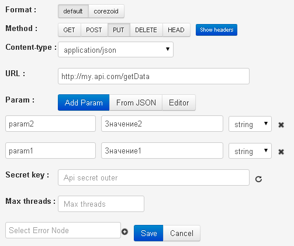

# PUT / DELETE / HEAD / PATCH

Данные для примера:

- URL - http://my.api.com/getData
- входящие парамеры - `"param1":"Значение1"`, `"param2":"Значение2"`



**Запрос от процесса к API**

*   http://my.api.com/getData

или

*   http://my.api.com/getData?conv_signature={{conv_signature}}&conv_time={{conv_time}}&conv_id={{conv_id}}

Параметры `conv_signature`, `conv_time` и `conv_id` могут быть добавлены в URL и использованы для проверки доступа к вызываемому API.

`conv_signature` формируется по [формуле](../../../api/v1/spec.md), где `API_SECRET` - ключ, который сгенерирован в узле с логикой API.

**Тело запроса**
```json
{
    "param1":"Значение",
    "param2":"Значение"
}
```
или

```json
{
    "param1":"Значение",
    "param2":"Значение",
    "sys":
    {
        "ref":"130605",
        "obj_id":"53c29d228245aa58be013acf",
        "conv_id":672,
        "node_id":"53c01daa8245aa58be00e889"
    }
}
```

**Успешным ответом от API** такого формата считается `HTTP status code = 200` + любой валидный `json`. Наличие исходящих параметров не являеся обязательным.

В случае, если валидный `json` с набором параметров был получен, его содержимое автоматически добавляется к заявке в процессе (в объект data).

```json
{
    "answerParam":"ok"
}
```

**В случае серверной ошибки (HTTP status code = 500), ответ процессу :**
```json
{
    "textError":"Text error",
    "codeError":"Code Error"
}
```
