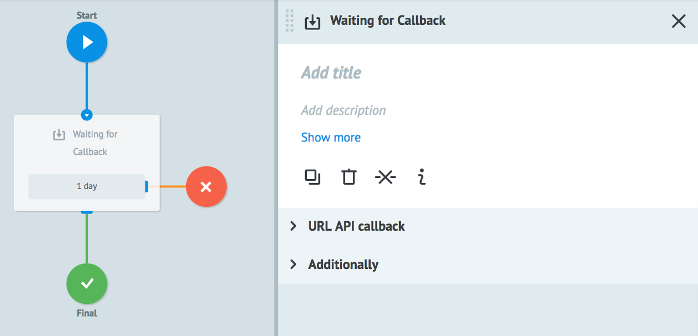
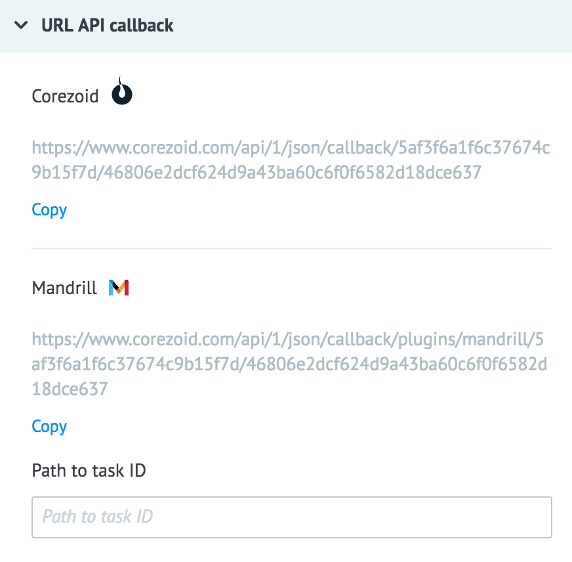
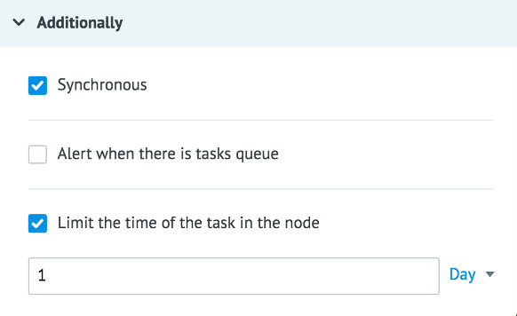
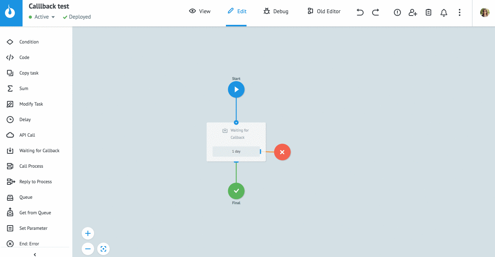
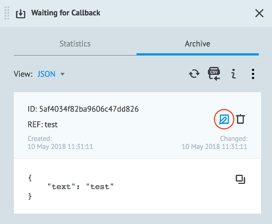
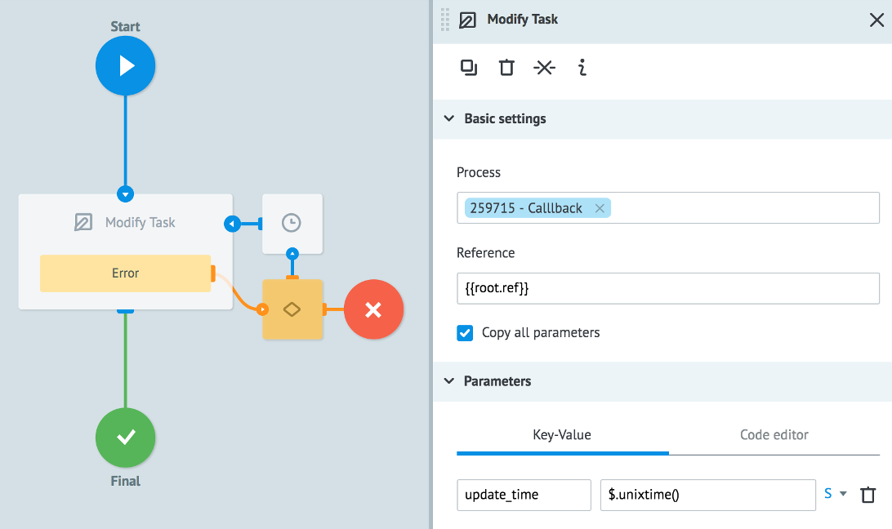
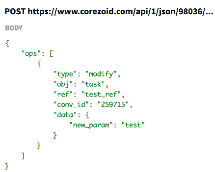
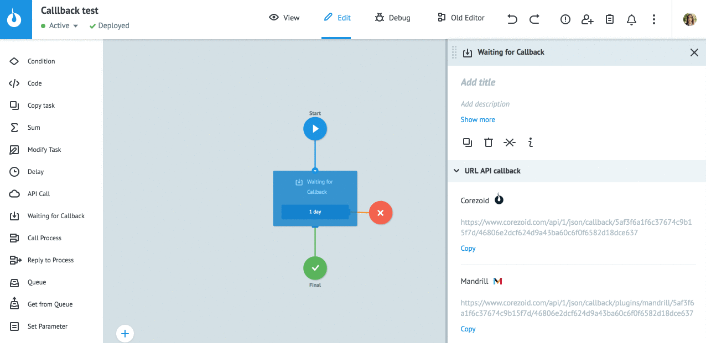

# Логика Waiting for Callback

Логика для ожидания обновления заявки.

Заявка, попадая в узел с логикой `Waiting for Callback` "зависает" и ожидает обновления от внешней системы или другого процесса (с помощью логики `Modify task`).

## URL API callback

**Corezoid (copy)** - URL для получения callback по заявкам в данном узле данного процесса

**Mandrill (copy)** - URL для получения callback по заявкам от [Mandrill](https://mandrillapp.com/login/?referrer=%2Ftemplates) (в данном узле данного процесса)

**Path to task ID** - поле для ввода наименования параметра, который в теле запроса будет содержать task_id изменяемой заявки

Для изменения заявки небходимо сформировать [запрос](callback.md#callback-url) методом POST на скопированный callback URL.

В тело запроса должен быть включен параметр, значением которого является task_id заявки, ожидающей обновления.

## Additionally

#### Synchronous

Наличие данного флага дает возможность обновлять заявки в узле синхронно. По умолчанию этот флаг включен для узла.

При обновлении заявки из внешней системы [запросом на callback URL](callback.md#callback-url) в случае отсутствии заявки в этом узле, вернет ошибку `task_not_in_current_sync_callback_node`.

При снятом флаге **Synchronous**, если заявка будет находиться в другом узле, запрос пройдет успешно.

#### Alert when there is tasks queue

Критическое количество заявок в узле.

Подробное [описание](timer.md) логики работы.

#### Limit the time of the task in the node

Значение временного интервала, при достижении которого заявка пойдет дальше по процессу в том случае, если по ней не поступит Callback (т.е. если она не обновится).

По умолчанию при добавлении узла указан интервал **1 день**.

Это значение нужно устанавливать для того, чтобы заявки не "висели" вечно в узле с логикой `Waiting for Callback`, а переходили в финальный узел.

Подробное [описание](timer.md) логики работы.

## Обновление заявки

Есть 3 варианта обновления данных в заявке:
* Вручную через интерфейс Corezoid
* Из другого процесса с помощью логики [Modify Task](https://doc.corezoid.com/ru/interface/nodes/logika_modify_task.html) или из внешней системы запросом [API Corezoid](https://doc.corezoid.com/ru/api/upload_modify.html) `"type":"modify", "obj":"task"`
* Из внешней системы запросом на callback URL

### Ручной метод

Изменение данных по заявке через интерфейс Corezoid.

Для этого:

* Переведите процесс в режим **View**.
* Нажмите кнопку **+ New task**.
* Выберите режим добавления заявки **Modify**, укажите реферес изменяемой заявки и введите необходимые параметры заявки для добавления/изменения.
* Нажмите **Add task**.

Для быстрого изменения заявки из архива заявок есть специальная кнопка **Modify**. При клике на эту кнопку открывается панель **New task** с текущими параметрами заявки.

### Логика Modify Task

Изменение данных по заявке из другого процесса.

Необходимо добавить узел с логикой [Modify Task](logika_modify_task.md), указать процесс и референс заявки.

### Использование API Corezoid

Изменение данных по заявке из внешней системы, сформировав запрос на [изменение заявки](https://doc.corezoid.com/ru/api/upload_modify.html)

Если внешнему API известо значение "task_id", то параметр "ref" можно заменить на него.

### Callback URL

Изменение данных заявки из внешней системы запросом на Callback URL узла.

Пример выполнения запроса с помощью **Postman**:

