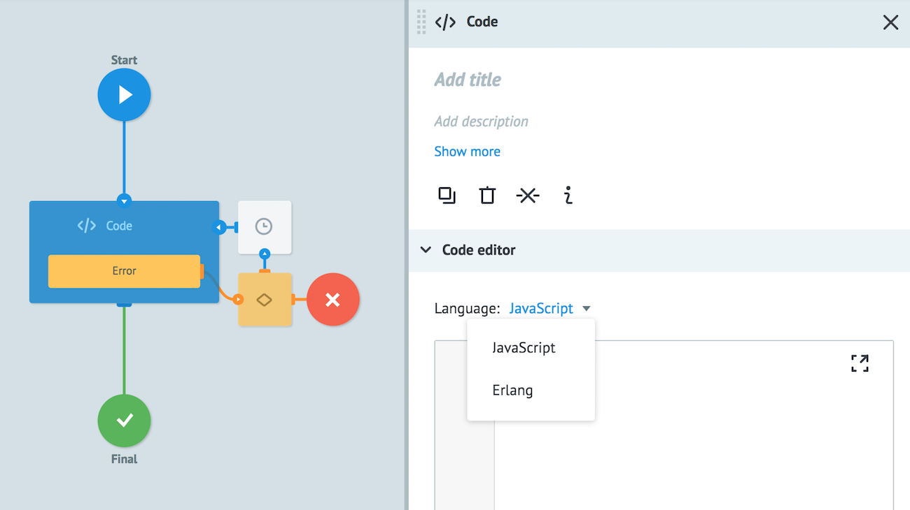
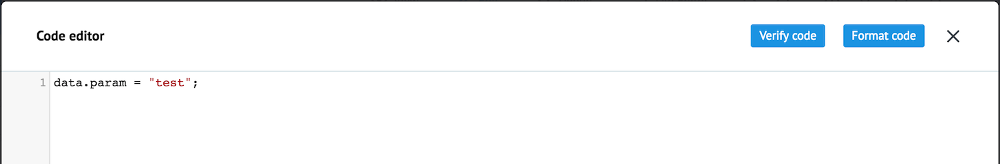
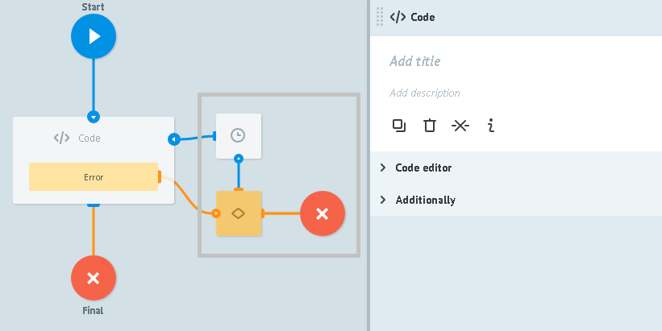

# Логика Code

Возможность реализовать дополнительную логику обработки заявки на одном из языков программирования (JavaScript, Erlang).

## Code editor

В блоке **Code editor** выбирается язык программирования и вводится код.



### Language

Выбор языка программирования:

* **JavaScript**

[Доступные библиотеки JavaScript](function_code.md).

Используется Google V8 ver. 4.x

**Параметры заявки в JavaScript коде** обозначаются через "data." - `data.имя_переменной`.

Например, `data.phone = '+1xxx';` создаст или изменит в заявке поле `phone` на значение `+1xxx`

* **Erlang**

**Параметры заявки в Erlang коде** создаются или заменются при помощи указания модуля с любым названием и экспортом одной функции `main`.

Например, следующий код добавит в заявку параметр `param`
```
-module(node).
-export([main/1]).
main(Data) -> [{<<"param">>, <<"Hello World!!!">>} | Data].
```

Для удобства работы с кодом редактор кода можно развернуть:



Кнопка **Verify code** - проверка кода на наличие синтаксических ошибок.

Кнопка **Format code** - форматирование добавленного кода согласно стандартам оформления выбранного языка программирования.


## Additionally


### Alert when there is tasks queue

Критическое количество заявок в узле.

Подробное [описание](timer.md#tasks-limit) логики работы.

### Limit the time of the task in the node

Значение временного интервала, при достижении которого заявка пойдет дальше по процессу в том случае, если Логика API Code не отвечает.

Подробное [описание](timer.md#timer) логики работы.


## Обработка ошибок



Узлы, которые на рисунке обведены серым квадратом, добавляются автоматически для обработки ошибок, возникающих в работе логики **Code**.

При возникновении ошибки процесс отправляет заявку в узел с логикой Condition и добавляет к ней следующие параметры:


  1.  `__conveyor_code_return_type_error__` - тип ошибки
    -  **hardware** - ошибка выполнения внутри процесса
    -  **software** - ошибка, возникающая при вызове API
  2.  `__conveyor_code_return_type_tag__` - код ошибки
  3.  `__conveyor_code_return_type_description__` - описание ошибки

Максимальное время выполнения одного экземпляра кода **5 сек**, по истечению этого времени пользователю будет возвращена ошибка в формате, описанном в п.1 со значением **hardware**.

### Типы ошибок

#### Timeout выполнения пользовательского кода

| Имя параметра | Значение |
| --- | --- |
| __conveyor_code_return_type_error | hardware |
| __conveyor_code_return_type_tag__ | code_timeout |
| __conveyor_code_return_description__ | timeout for executing code |

#### Ошибка выполнения пользовательского кода

| Имя параметра | Значение |
| --- | --- |
| __conveyor_code_return_type_error | software |
| __conveyor_code_return_type_tag__ | code_executing_error |
| __conveyor_code_return_description__ | текст ошибки |

#### Не верный формат ответа от пользовательского кода

| Имя параметра | Значение |
| --- | --- |
| __conveyor_code_return_type_error | software |
| __conveyor_code_return_type_tag__ | code_return_format_error |
| __conveyor_code_return_description__ | текст ошибки |

