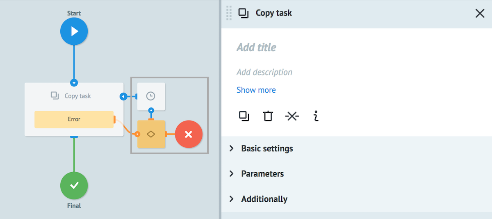

# Логика Copy task

Позволяет скопировать всю/часть заявки в другой доступный процесс.

Узлы, которые на рисунке обведены серым квадратом, добавляются автоматически для обработки ошибок, возникающих при копировании.

## Basic settings

**Process** - выбор процесса для копирования одним из способов:
* выбор из "дерева процессов"
* поиск его по имени
* параметр заявки (например, `{{conv_id}}`), который содержит значение = идентификатору процесса

**Reference** - референс новой заявки, которая создается в другом процессе.

Референсом новой заявки может быть:
* любой [системный параметр](https://doc.corezoid.com/ru/interface/tasks/task_archive.html#system-parameters). Например, `{{root.ref}}` или `{{root.task_id}}`
* любой другой параметр заявки `{{имя_параметра}}`
* константа. Например, config, ref и т.д.

или оставлен пустым.

**Copy all parameters** - наличие данного флага дает возможность скопировать все параметры текущей заявки.

## Parameters

**+ Add "key-value"** - кнопка добавления нового параметра

`Key` - имя нового параметра

`Value` может содержать:
- константу
- `{{имя_параметра}}` из заявки, значение которого будет вставлено
- любой [системный параметр](https://doc.corezoid.com/ru/interface/tasks/task_archive.html#system-parameters) текущего процесса. Например, `{{root.create_time}}` или `{{root.conv_id}}`

При взведенном флаге **Copy all parameters** добавление новых параметров в создаваемую заявку не обязательно.

В противном случае обязательно добавление хотя бы одного передаваемого параметра.

## Additionally

#### Alert when there is tasks queue

Критическое количество заявок в узле.

Подробное [описание](timer.md) логики работы.

#### Limit the time of the task in the node

Значение временного интервала, при достижении которого заявка пойдет дальше по процессу в том случае, если Логика Copy task не отвечает.

Подробное [описание](timer.md) логики работы.

## Типы ошибок

### Внутренние ошибки системы при копировании

| Имя параметра | Значение |
| --- | --- |
| __conveyor_copy_task_return_type_error__ | hardware |
| __conveyor_copy_task_return_type_tag__ | copy_task_fatal_error |
| __conveyor_copy_task_return_description__ | Error running copy task |

| Имя параметра | Значение |
| --- | --- |
| __conveyor_copy_task_return_type_error__ | hardware |
| __conveyor_copy_task_return_type_tag__ | crash_api |
| __conveyor_copy_task_return_description__ | Error copy_task request |

| Имя параметра | Значение |
| --- | --- |
| __conveyor_copy_task_return_type_error__ | hardware |
| __conveyor_copy_task_return_type_tag__ | copy_task_timeout |
| __conveyor_copy_task_return_description__ | timeout for executing copy_task request |

### Не уникальный референс при копировании

| Имя параметра | Значение |
| --- | --- |
| __conveyor_copy_task_return_type_error__ | software |
| __conveyor_copy_task_return_type_tag__ | not_unical_ref |
| __conveyor_copy_task_return_description__ | not unical reference |

### Некорректные параметры

| Имя параметра | Значение |
| --- | --- |
| __conveyor_copy_task_return_type_error__ | software |
| __conveyor_copy_task_return_type_tag__ | wrong_validate_params |
| __conveyor_copy_task_return_description__ | Param: <name>, Error: <error> |

> Один из указанных параметров для копирования заявки не прошел валидацию

### Ошибка при конвертировании параметров

| Имя параметра | Значение |
| --- | --- |
| __conveyor_copy_task_return_type_error__ | software |
| __conveyor_copy_task_return_type_tag__ | copy_task_wrong_convert_param |
| __conveyor_copy_task_return_description__ | Param: <name>, Value: <value>, Try convert to: <type> |

> Например, указан тип Number, а параметр содержит текст или отсутствует в заявке.

### Процесс неактивен

| Имя параметра | Значение |
| --- | --- |
| __conveyor_copy_task_return_type_error__ | software |
| __conveyor_copy_task_return_type_tag__ | conveyor_is_not_active |
| __conveyor_copy_task_return_description__ | conveyor is not active |

> Для копирования/изменения заявок статус процесса должен быть **Active**

### Нет доступа к процессу

| Имя параметра | Значение |
| --- | --- |
| __conveyor_copy_task_return_type_error__ | software |
| __conveyor_copy_task_return_type_tag__ | access_denied |
| __conveyor_copy_task_return_description__ | user: <user_id>, conv_id: <proc_id> |

> Для копирования заявок у пользователя должен [доступ](https://doc.corezoid.com/ru/interface/users_groups.html) на **Task management**.

### Превышен максимальный размер заявки

| Имя параметра | Значение |
| --- | --- |
| __conveyor_copy_task_return_type_error__ | software |
| __conveyor_copy_task_return_type_tag__ | copy_task_size_overflow_limit |
| __conveyor_copy_task_return_description__ | Your task size: <size> bytes, Max available task size: <max_size> bytes, Try to change your data or try to split your task |

> Максимальный размер заявки - **128 Кб**.