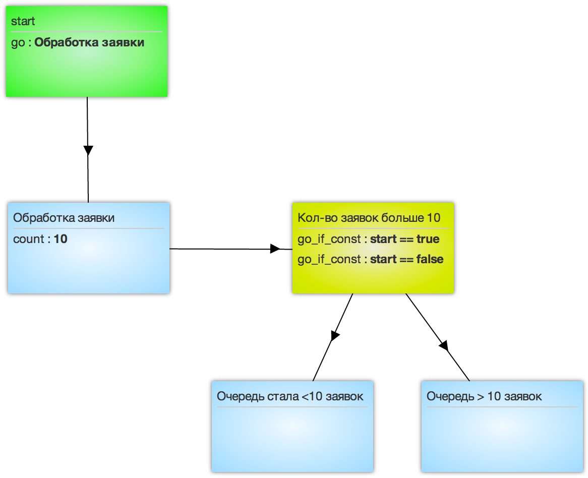

## Логика COUNTER

Логика работы:

 - при достижении или превышении указанного в поле `Value Semafor`значения “Критическое количество заявок в узле в узел эскалации посылается сигнал `start=true`, что сигнализирует об открытии эскалации
 -   когда количество заявок в узле снижается ниже критического значения, в узле эскалации автоматически посылается сигнал `start=false` для закрытия эскалации

