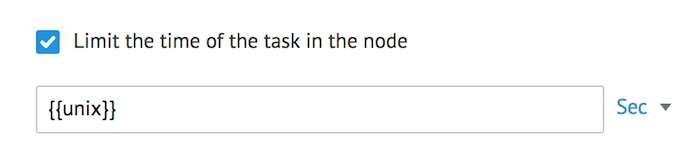
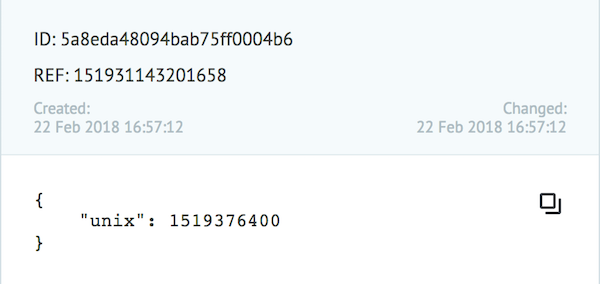
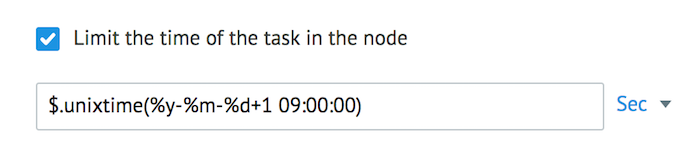

# Логика Delay

Позволяет задержать заявку в узле на определенное время.

В поле **Limit the time of the task in the node** указывается значение временного интервала (задержка), при достижении которого заявка пойдет дальше по процессу.

Это значение можно указать:

* конкретным числом и выбрать единицу измерения - секунды (минимум 30), минуты, часы, дни.

* параметром заявки:

В этом случае указанная переменная должна содержать дату/время **в формате unixtime**, при наступлении которого заявка перейдет далее по процессу.

* функцией `$.unixtime()` для расчета даты/времени в формате **unixtime**

Рекомендуемое значение в логике **Delay** для высоконагруженных процессов - **60 сек**.

## Пример динамического таймера для каждой заявки

Посмотрите [пример процесса](https://admin.corezoid.com/editor/102672/156747), где:
*   переменная `date` преобразовывается в формат **unixtime** для дальнейшего указания в логике **Delay** (формат `DD.MM.YYYY hh:mm:ss`)
*   переменная `offset_GMT` используется для корректировки времени относительно GMT-0 на сервере Corezoid.

