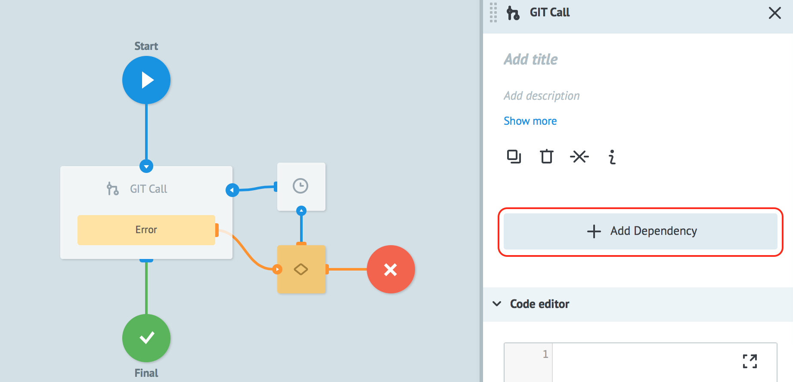
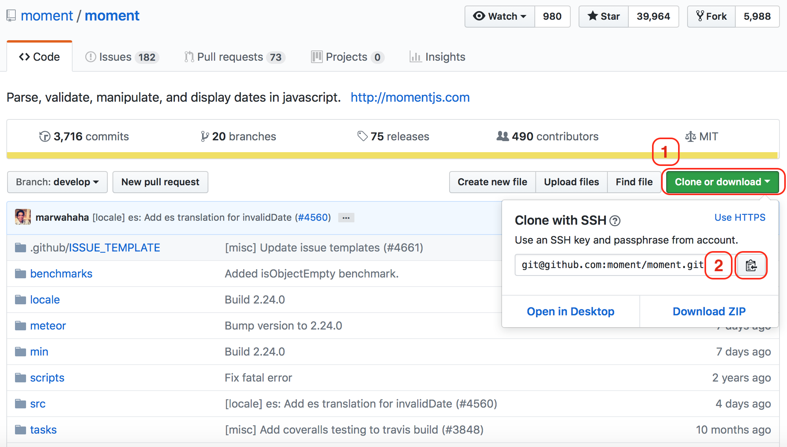
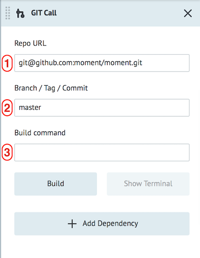
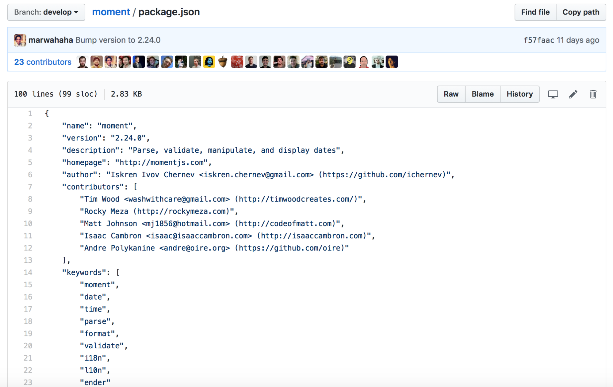
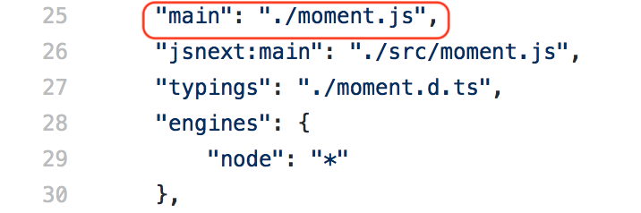
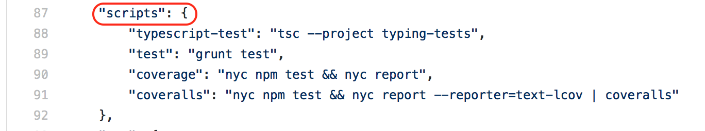
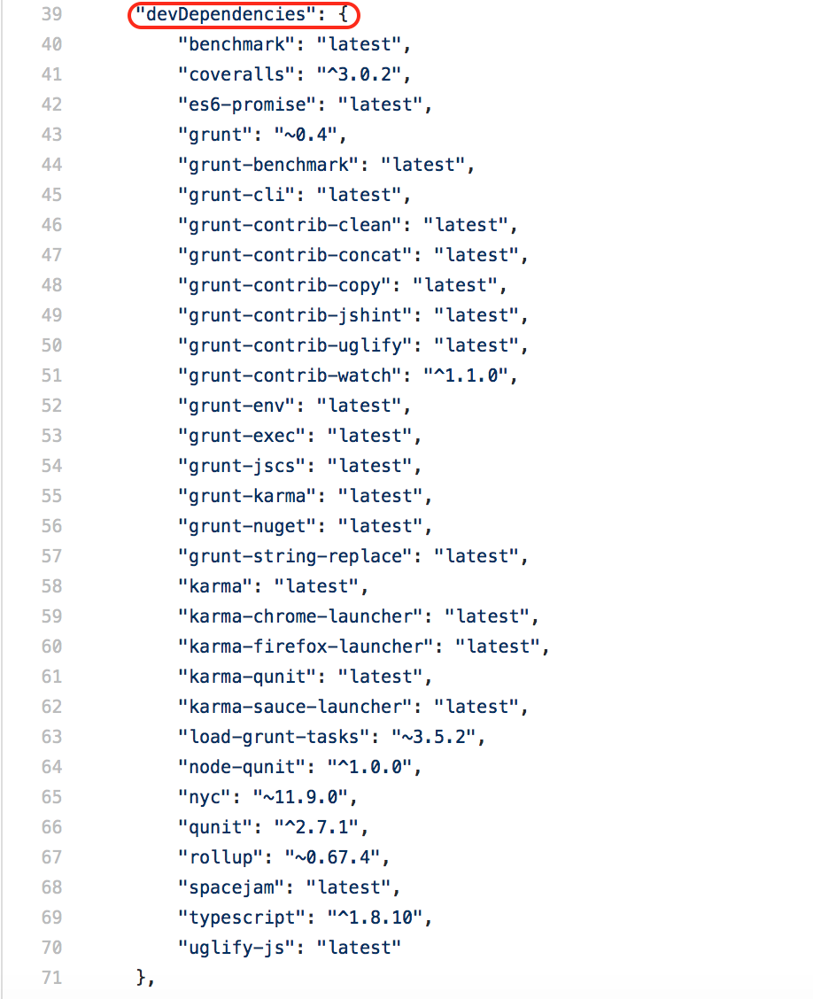
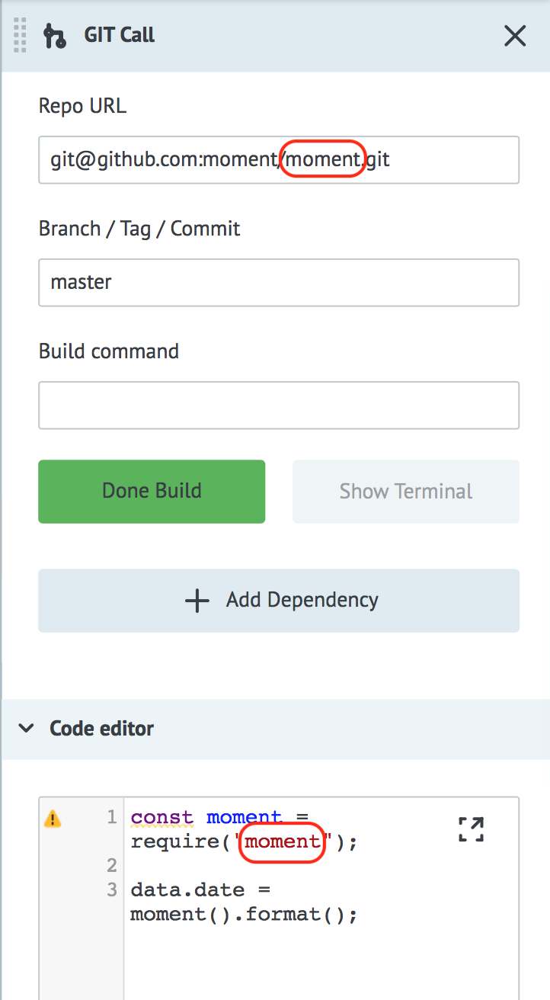
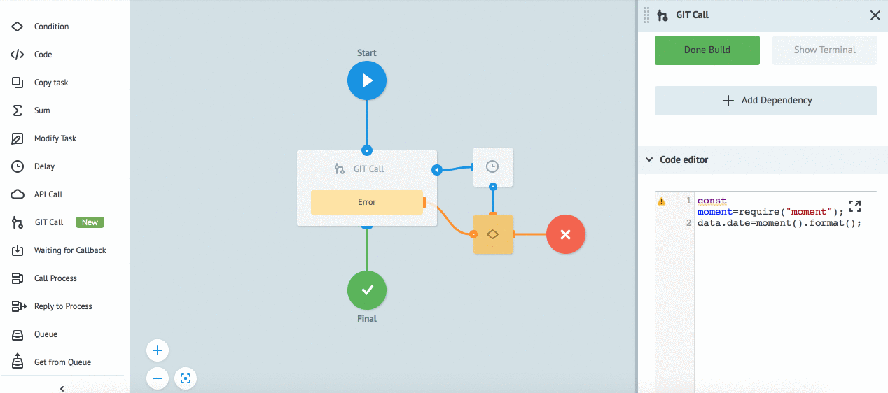

# GIT Call

**Используйте и управляйте программным кодом всего мира на любом языке программирования с помощью узла GIT Call.**


Узел **GIT Call** позволяет подключать и исполнять код из Git-репозиториев как часть бизнес-процесса.


Поддерживаемые языки программирования: **JavaScript**.


**Узел GIT Call состоит из 2 частей:**

1. [Подключение кода с GIT](#подключение-кода-с-git)

2. [Исполнение подключенного из GIT кода](#исполнение-подключенного-из-git-кода)


### Подключение кода с GIT

**Пример подключения библиотеки [MomentJS](https://github.com/moment/moment) с GitHub для работы с датами.**

Перейдите в библиотеку и изучите файл [README.md](https://github.com/moment/moment/blob/develop/README.md). Он содержит описание логики работы библиотеки и примеры использования.


Создайте процесс и добавьте в него узел с логикой **GIT Call.**



Нажмите кнопку **"+ Add Dependency"**.


Скопируйте ссылку на [библиотеку MomentJS](https://github.com/moment/moment), как показано ниже:

1. Нажмите кнопку **Clone or download**
2. В появившемся окне скопируйте ссылку на библиотеку



**Заполните поля Dependency:**



1. вставьте скопированную ссылку в поле **Repo URL**

2. укажите **Branch / Tag / Commit**

По умолчанию - master. Если требуется подключить конкретную версию кода - укажите тег (например, v2.24.0). О том, что такое бранч, Вы можете прочитать [здесь](https://git-scm.com/book/en/v1/Git-Branching-What-a-Branch-Is).

3. **Build command** - команда для сборки

После добавления репозитория в процесс, его необходимо собрать. Для этого нажмите кнопку **Build**. До окончания процесса сборки библиотеки в вашем процессе будет отображаться ошибка *"Dependency not Build"*.

В консоли отобразится сообщение о завершении сборки.


**Особенности Build command**

В файле **package.json** изучим зависимости (`dependencies`) и скрипты (`scripts`), которые используются в библиотеке. Отдельного описания команды `build` в этой библиотеке нет, поэтому оставьте поле пустым. Подробнее о структуру файла **package.json** Вы можете прочитать [здесь](https://docs.npmjs.com/files/package.json).

Для подключения модуля используется функция `require("name of repository")`.

Код по умолчанию обращается в файл [package.json](https://github.com/moment/moment/blob/develop/package.json), который расположен в корне библиотеки.



Отправная точка будет описана в файле **package.json** с ключом `main`. Если его нет - по умолчанию код вызовет файл **index.js**.


В данном примере объект `main` описан и для сборки никакие дополнительные команды использовать не надо.



Если файла **index.js** в корне нет, то возможно dependencies необходимо предварительно собрать. Для этого изучите объекты `dependencies`, `devDependencies`, `scripts`.

В объекте `scripts` описаны только тестовые скрипты, которые на сборку не влияют.




В объекте `devDependencies` указан список зависимостей, которые использует данная библиотека.



Для того чтобы собрать зависимости, которые необходимы для корректной работы библиотеки, впишите в поле **Build command** команду **yarn**.


Если в объекте `scripts` есть команда `build, то необходимо добавить ее в строку **Build command** через “&&”.

*Например:* `yarn && yarn build`.


### Исполнение подключенного из GIT кода

За исполнение кода отвечает [Node.js](https://nodejs.org/en/) (11.2.0).

Теперь давайте попробуем использовать/запустить подключенную библиотеку в нашем процессе. Для этого введите пользовательский код для работы с функциями библиотеки по примеру ниже:

```
const moment = require("moment");
```

эта переменная описывает инициализацию библиотеки moment в переменную`

```
data.datetime = moment().format();
```
вызов функции из библиотеки


Подробнее о работе с библиотекой MomentJS и формат описания данных можно [прочитать тут](http://momentjs.com).

Обратите внимание, что при вызове функции `require() необходимо указывать имя репозитория, с которым вы работаете и оно должно совпадать с именем из ссылки на репозиторий:

git@github.com:moment/**moment**.git



Сделайте **Deploy** процесса и протестируйте его работу.

Перейдите в режим **View** и создайте пустую заявку в процесс. Вы получите текущую дату и время по UTC.

Пример:

```
{
"datetime": "2019-01-23T17:11:21+00:00"
}
```



Вы можете напрямую работать с методами Node.JS, путем вызова методов и модулей через объявление переменной с помощью конструкции `const { } = require(" ")`.

Ознакомиться с доступными модулями и методами Node.JS вы можете в [документации Node.js](https://nodejs.org/api/assert.html).


> **Обратите внимание!** Ограничена работа с такими разделами: C++, DNS, OS, Net, FS.