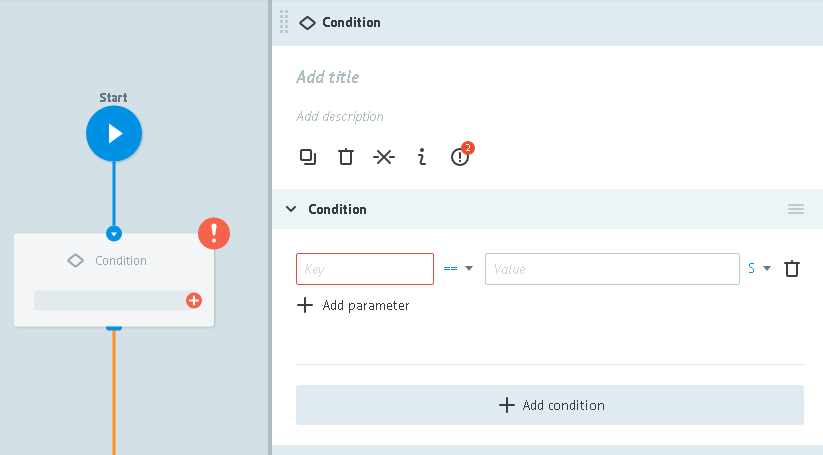
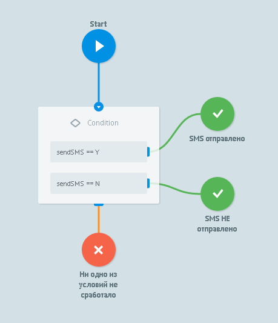

#Логика Condition

Переход по условию.




**`Key`** должен содержать имя переменной.

Возможный формат:
* имя_параметра
* `{{obj.имя_параметра}}` если нужно сравнить со вложенным параметром.
Например:
    *  `{{temp}}` - получить значение переменной temp из заявки
    *  `{{main.temp}}` - получить значение переменной temp из объекта main
    *  `{{result.SUPPDOCUMENT\.CODE}}` - получить значение переменной "SUPPDOCUMENT.CODE" из объекта result

**`Const`** может содержать:
*   значение с которым необходимо провести сравнение
*   {{имя_переменной}} с которой необходимо провести сравнение

**`+ Add parameter`** - кнопка добавления дополнительного условия в текущее (через **"И"**)

**`+ Add condition`** - кнопка добавления нового условия

Несколько условий в одном узле выполняются как:
```
IF условие и условие  и условие -> переход
 OR
IF условие -> переход
 OR
IF условие и условие -> переход
```


> **Основные причины, из-за которых не срабатывает переход по Логике IF:**
>
> - неправильно указан регистр или имя параметра. Пример: в заявке параметр называет “Phone”, в Логике IF указан как “phone”.
> - Неправильно указан тип поля в заявке. Пример: в заявке “Count”:10(Int), в блоке Go If Count=10(String)
> - Попытка сравнения содержания двух полей. Например: условие “amount”==”limit” не будет выполняться, потому что limit будет восприниматься системой как константа, а не название поля



