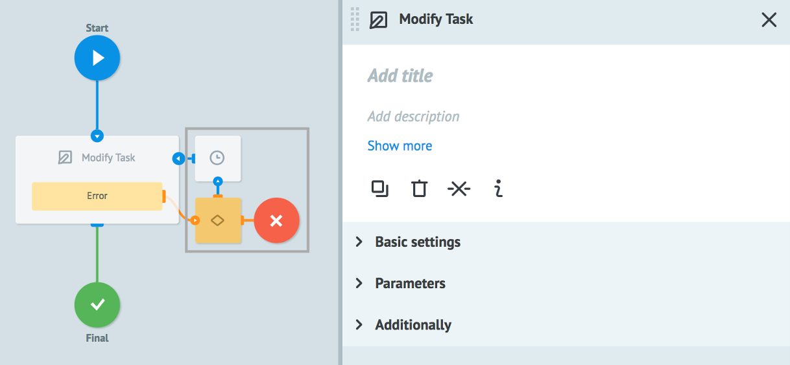
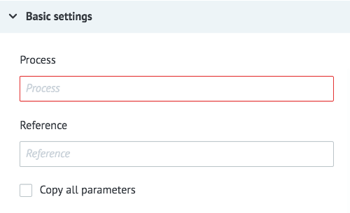
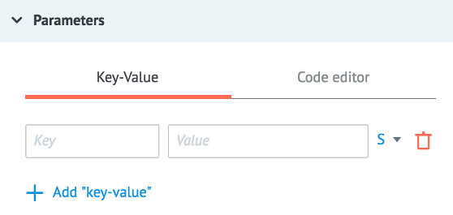
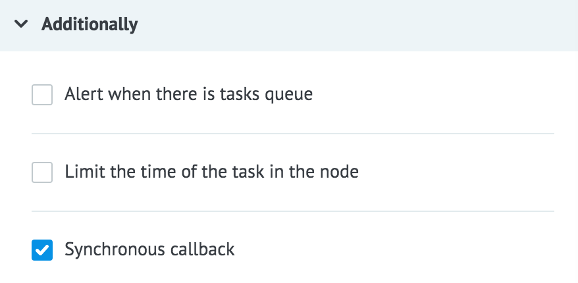

# Логика Modify Task

Позволяет модифицировать (обновить, изменить) заявку в другом доступном процессе.

Модификация заявки в другом процессе через логику `Modify Task` возможна только в том случае, если выполнены 2 условия:

* заявка ожидает обновления в узле с логикой [Waiting for Callback](callback.md) или в [Set State ](setstate.md) в диаграмме состояний.
* корректно указан референс заявки обновляемой заявки в логике `Modify Task`

Референсом заявки может быть:
* любой системный параметр текущего процесса. Например, `{{root.ref}}` или `{{root.task_id}}`
* любой другой параметр текущей заявки `{{имя_параметра}}`
* константа. Например, config, ref и т.д.

Узлы, которые на рисунке обведены серым квадратом, добавляются автоматически для обработки ошибок, возникающих при копировании.

## Basic settings

**Process** - выбор процесса для копирования один из способов:
* выбор из "дерева процессов"
* поиск его по имени
* параметр заявки (например, `{{conv_id}}`), который содержит значение = идентификатору процесса

**Reference** - референс заявки, которая ждет обновления.

**Copy all parameters** - наличие данного флага дает возможность скопировать все параметры текущей заявки.

> **Обратите внимание!**

> Если в обеих заявках есть параметр с одинаковым именем, то новым значением такого параметра будет то, что передано логикой `Modify Task` (т.е. обновленное значение).

> Параметры, которых не было в обновляемой заявке - добавятся в нее.

## Parameters

**+ Add "key-value"** - кнопка добавления нового параметра

`Key` - имя параметра

`Value` может содержать:
- константу
- `{{имя_параметра}}` из заявки, значение которого будет вставлено
- любой системный параметр текущего процесса. Например, `{{root.ref}}` или `{{root.task_id}}`

При взведенном флаге **Copy all parameters** добавление новых параметров в создаваемую заявку не обязательно.

В противном случае обязательно добавление хотя бы одного передаваемого параметра.

## Additionally

#### Alert when there is tasks queue

Критическое количество заявок в узле.

Подробное [описание](timer.md) логики работы.

#### Limit the time of the task in the node

Значение временного интервала, при достижении которого заявка пойдет дальше по процессу в том случае, если Логика Modify task не отвечает.

Подробное [описание](timer.md) логики работы.

#### Synchronous callback

**Synchronous callback** - наличие данного флага дает возможность обновлять заявки синхронно.

Т.е., заявки, которые ожидают обновления, будут обновляться последовательно - строго друг за другом (по очереди).

> **Обратите внимание!** Если одновременно будет производиться изменение одной заявки, возникнет ошибка [`duplicate_callback`](logika_modify_task.md#одновременное-изменение-заявки).

## Типы ошибок

### Внутренние ошибки системы при копировании

| Имя параметра | Значение |
| --- | --- |
| __conveyor_copy_task_return_type_error__ | hardware |
| __conveyor_copy_task_return_type_tag__ | copy_task_fatal_error |
| __conveyor_copy_task_return_description__ | Error running copy task |

| Имя параметра | Значение |
| --- | --- |
| __conveyor_copy_task_return_type_error__ | hardware |
| __conveyor_copy_task_return_type_tag__ | crash_api |
| __conveyor_copy_task_return_description__ | Error copy_task request |

| Имя параметра | Значение |
| --- | --- |
| __conveyor_copy_task_return_type_error__ | hardware |
| __conveyor_copy_task_return_type_tag__ | copy_task_timeout |
| __conveyor_copy_task_return_description__ | timeout for executing copy_task request |

### Заявка не найдена

| Имя параметра | Значение |
| --- | --- |
| __conveyor_copy_task_return_type_error__ | software |
| __conveyor_copy_task_return_type_tag__ | not_found_task |
| __conveyor_copy_task_return_description__ | not found task |

> В процессе нет заявки с указанным референсом.

### Некорректные параметры

| Имя параметра | Значение |
| --- | --- |
| __conveyor_copy_task_return_type_error__ | software |
| __conveyor_copy_task_return_type_tag__ | wrong_validate_params |
| __conveyor_copy_task_return_description__ | Param: <name>, Error: <error> |

> Один из указанных параметров для изменения заявки не прошел валидацию

### Ошибка при конвертировании параметров

| Имя параметра | Значение |
| --- | --- |
| __conveyor_copy_task_return_type_error__ | software |
| __conveyor_copy_task_return_type_tag__ | copy_task_wrong_convert_param |
| __conveyor_copy_task_return_description__ | Param: <name>, Value: <value>, Try convert to: <type> |

> Например, указан тип Number, а параметр содержит текст или отсутствует в заявке.

### Процесс неактивен

| Имя параметра | Значение |
| --- | --- |
| __conveyor_copy_task_return_type_error__ | software |
| __conveyor_copy_task_return_type_tag__ | conveyor_is_not_active |
| __conveyor_copy_task_return_description__ | conveyor is not active |

> Для копирования/изменения заявок статус процесса должен быть **Active**

### Нет доступа к процессу

| Имя параметра | Значение |
| --- | --- |
| __conveyor_copy_task_return_type_error__ | software |
| __conveyor_copy_task_return_type_tag__ | access_denied |
| __conveyor_copy_task_return_description__ | user: <user_id>, conv_id: <proc_id> |

> Для копирования заявок у пользователя должен [доступ](https://doc.corezoid.com/ru/interface/users_groups.html) на **Task management**.

### Превышен максимальный размер заявки

| Имя параметра | Значение |
| --- | --- |
| __conveyor_copy_task_return_type_error__ | software |
| __conveyor_copy_task_return_type_tag__ | copy_task_size_overflow_limit |
| __conveyor_copy_task_return_description__ | Your task size: <size> bytes, Max available task size: <max_size> bytes, Try to change your data or try to split your task |

> Максимальный размер заявки - **128 Кб**.

### Одновременное изменение заявки

| Имя параметра | Значение |
| --- | --- |
| __conveyor_copy_task_return_type_error__ | software |
| __conveyor_copy_task_return_type_tag__ | duplicate_callback |
| __conveyor_copy_task_return_description__ | The last one callback is still running. You should wait |

> Возникает только при включенном флаге **Synchronous callback**. Новое изменение заявки не отработает, пока не завершится предыдущее.

> Стандартно при возникновении такой ошибки заявка переходит в узел с логикой Delay для повторной попытки через 30 секунд.

### Заявка находится не в узле ожидания callback

| Имя параметра | Значение |
| --- | --- |
| __conveyor_copy_task_return_type_error__ | software |
| __conveyor_copy_task_return_type_tag__ | no_api_callback_in_node_with_task |
| __conveyor_copy_task_return_description__ | no api callback logic in node with task |

> Данная ошибка возникает при включенном флаге **Synchronous callback**.

> При снятом флаге возвращает результат `__conveyor_copy_task_result__": "ok".`