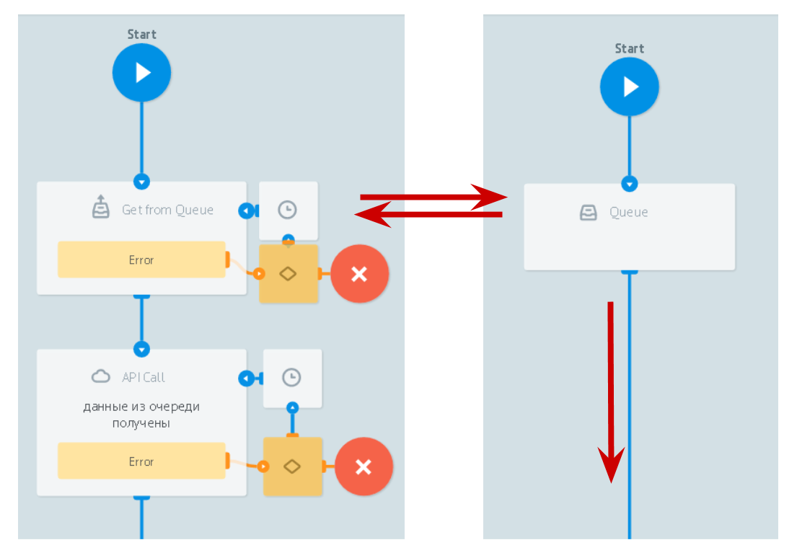

# Работа с очередью заявок

* [`Логика Queue`](queue.md) - очередь заявок в узле
* [`Логика Get from Queue`](get_task.md) - получение заявок из процесса и узла, в котором добавлена Логика Queue

[Пример](../../../plugins/example_queue_get_task/README.md) использования в обработке заказов такси.
