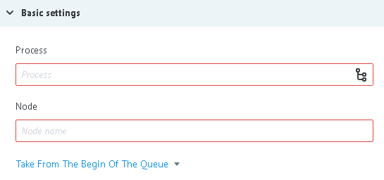

# Логика Get from Queue

Получение заявок из процесса и узла, в котором добавлена [`Логика Queue`](queue.md).

**Логика Get from Queue** добавляет в текущую заявку:
* `__queue_task_id__` - ID заявки из Queue узла
* `__queue_task_data__` - json объект параметров заявки из узла с [Логикой Queue](queue.md)

##Basic settings

**Process** - выбор процесса с [`Логикой Queue`](queue.md) из "каталога", по его имени или его ID.

**Node** - выбор узла с Queue из выпадающего списка узлов выбранного ранее процесса.

**Take From The Begin Of The Queue** получать заявки из очереди начиная с первой (самой "старой" по времени)

**Take From The End Of The Queue** - получать заявки из очереди начиная с первой (самой "свежей" по времени)

В **Process** и **Node** возможно использовать динамические значения параметров заявки. Например: {{conv_id}} - id процесса, {{node_id}} - id узла.

##Additionally

####Alert when there is tasks queue

Критическое количество заявок в узле.

Подробное [описание](timer.md#tasks-limit) логики работы.

####Limit the time of the task in the node

Значение временного интервала, при достижении которого заявка пойдет дальше по процессу в том случае, если `Логика Get from Queue` не отвечает.

####Обработка ошибок

При возникновении ошибки процесс отправляет заявку в узел с Логикой Condition

и добавляет к заявке параметры, соответсвующие ошибке:

**В узле с Логикой API queue нет заявок**

| Имя параметра | Значение |
| -- | -- |
| `__conveyor_get_task_return_type_error__` | software |
| `__conveyor_get_task_return_type_tag__` | get_task_executing_error |
| `__conveyor_get_task_return_description__` | not_found_task |

**У пользователя нет доступа к процессу  с Логикой API queue**

| Имя параметра | Значение |
| -- | -- |
| `__conveyor_get_task_return_type_error__` | software |
| `__conveyor_get_task_return_type_tag__` | get_task_executing_error |
| `__conveyor_get_task_return_description__` | access_denied |

**Указаны процесс или узел, где нет Логики API queue**

| Имя параметра | Значение |
| -- | -- |
| `__conveyor_queue_return_type_error__` | software |
| `__conveyor_queue_return_type_tag__` | queue_wrong_logic |
| `__conveyor_queue_return_description__` | No queue logic in conv_id:  |

**Неверно переданы id процесса или или id узла при динамическом использовании**

| Имя параметра | Значение |
| -- | -- |
| `__conveyor_get_task_return_type_error__` | software|
| `__conveyor_get_task_return_type_tag__` | get_task_wrong_convert_param|

**Ошибка ядра**

| Имя параметра | Значение |
| -- | -- |
| `__conveyor_get_task_return_type_error__` | hardware |
| `__conveyor_get_task_return_type_tag__` | get_task_fatal_error |
| `__conveyor_get_task_return_description__` | Error running get task |
