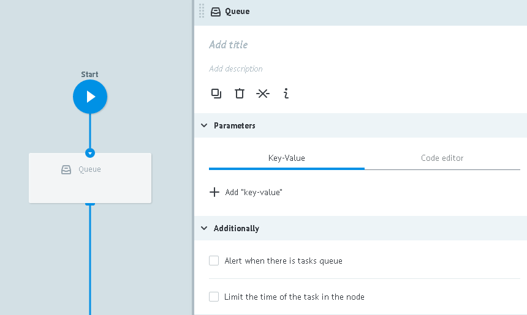

# Логика Queue

Создает очередь из заявок в том узле, в который добавлена.

Заявки могут храниться в очереди до наступления двух событий:
* до момента запроса на их получение из очереди через [Логику Get from Queue](get_task.md)
* до сработки таймера, если он был задан в поле `Additionally -> Limit the time of the task in the node`

**При выдаче из очереди:**

**1)** заявка перемещается в следующей узел и следует дальше по процессу

**2)** вызывающая заявка дополнится параметрами:

* `__queue_task_id__` - ID заявки из узла с Логикой Queue
* `__queue_task_data__` - json объект параметров заявки из узла с Логикой Queue

##Parameters

**+ Add "key-value"** - добавляет в объект `__queue_task_data__` новые параметры, которых нет в заявке из узла с `Логикой Queue`.

##Additionally

####Alert when there is tasks queue

Критическое количество заявок в узле.

Подробное [описание](timer.md#tasks-limit) логики работы.

####Limit the time of the task in the node

Значение временного интервала, при достижении которого заявка пойдет дальше по процессу в том случае, если `Логика Call Process` не отвечает.

