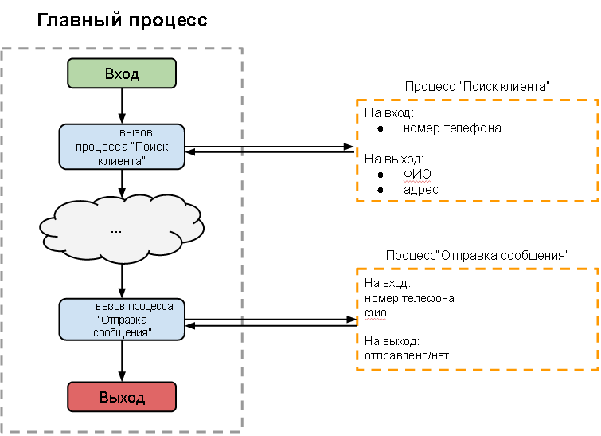

# Вызов универсального процесса

Все повторяющиеся процессы (такие как, отправка SMS, рачсет времени доставки товара и др.) можно выносить в отдельные (универсальные) процессы.

Для взаимодействия с универсальными процессами нужно использовать:
*   [Call Process](logic_rpc.md) - вызов универсального процесса
*   [Reply to Process](logic_rpc_reply.md) - ответ на вызов универсального процесса

Примеры процессов с RPC:
*   [Главный процесс](http://www.corezoid.com/admin/edit_conv/3432)
*   [Подчиненный процесс](http://www.corezoid.com/admin/edit_conv/3433)
