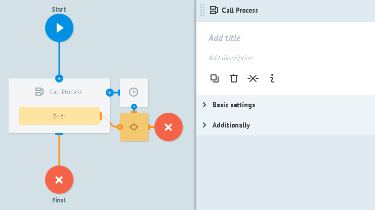
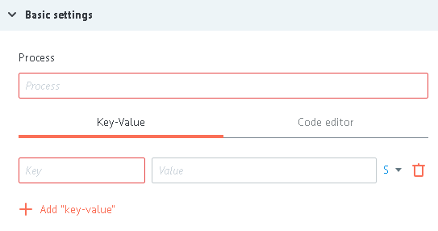
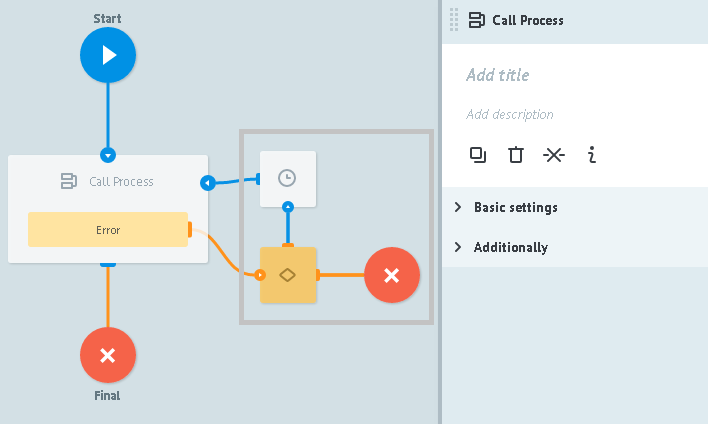

# Логика Call Process

Вызов универсального процесса.

>Особенность `Логики Call Process` -

>заявка "зависает" в узле до того момента пока не будет получен ответ от вызываемого (универсального) процесса.

Во избежание "зависания" заявок нужно настраивать процессы следуя одной из рекомендаций:

* в вызываемом процессе перед каждым конечным узлом (успехи, ошибки и т.д.) должен быть настроен возврат ответа вызывающему процессу  - [Логика Reply to Process](logic_rpc_reply.md)
* указать максимальное время ожидания ответа от вызывамого процесса (`Additionally -> Limit the time of the task in the node`), по истечении которого заявка пойдет дальше по процессу по предусмотрнной для этого случая логике.

##Basic settings

**Process** - выбор процесса из "каталога процессов", по его имени или его ID.

**+ Add "key-value"** - кнопка добавления параметров, необходимых для успешного вызова универсального процесса.

>Если в универсальном процессе нужные входящие в него параметры описаны, то при выборе такого процесса в `Логике Call Process` эти параметры добавятся автоматически.

`Key` - имя входящего в универсальный процесс параметра

`Value` значение входящего в универсальный процесс параметра. Может содержать:
- константу
- `{{имя_параметра}}` из заявки, значение которого будет вставлено
- любой системный параметр текущего процесса. Например, `{{root.ref}}` или `{{root.task_id}}`

##Additionally

####Alert when there is tasks queue

Критическое количество заявок в узле.

Подробное [описание](../timer.md#tasks-limit) логики работы.

####Limit the time of the task in the node

Значение временного интервала, при достижении которого заявка пойдет дальше по процессу в том случае, если `Логика Call Process` не отвечает.

##Обработка ошибок:

При возникновении ошибки процесс отправляет заявку в узел с Логикой Condition

и добавляет к заявке следующие параметры:

| Имя параметра | Значение | Описание |
| -- | -- | -- |
| `__conveyor_copy_task_result__` | crash_api | Ошибка отправки заявки в RPC процесс |
| `__conveyor_copy_task_result__` | access_denied | Нет доступа к указанному процессу |
| `__conveyor_rpc_return_type_tag__` | rpc_task_fatal_error | Ошибка отправки заявки в RPC процесс |
| `__conveyor_rpc_return_type_tag__` | rpc_task_size_overflow | Размер возвращаемых данных превышает 128kB |
| `__conveyor_rpc_return_type_tag__` | rpc_task_wrong_convert_param | Невозможно преобразовать переменные в указанные типы |
