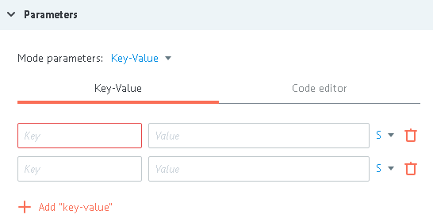

# Логика Reply to Process

Ответ на вызов универсального процесса.

>В универсальном (вызываемом) процессе Логика Reply to Process должна быть добавлена перед каждым конечным узлом (успехи, ошибки и т.д.) во избежание "зависания" заявок в вызывающем процессе.

##Parameters

**+ Add "key-value"** - кнопка добавления параметров, которые будут переданы в ответ на вызов.

##Additionally

####Throw exception

Налиие данного флага возвращает ответ вызывающему процессу в узел обработки ошибок [Логики Call Process](logic_rpc.md).

Текст ошибки, введенный в поле `Error message`, возвращает в параметре `__conveyor_rpc_reply_return_description__`

####Alert when there is tasks queue

Критическое количество заявок в узле.

Подробное [описание](../timer.md#tasks-limit) логики работы.

####Limit the time of the task in the node

Значение временного интервала, при достижении которого заявка пойдет дальше по процессу в том случае, если `Логика Call Process` не отвечает.
