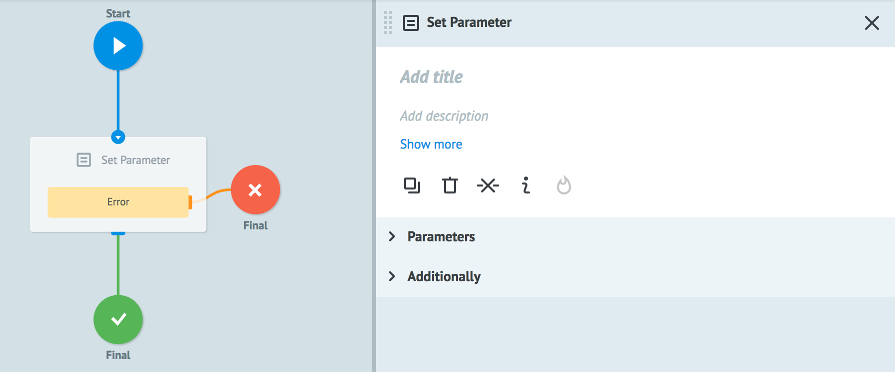
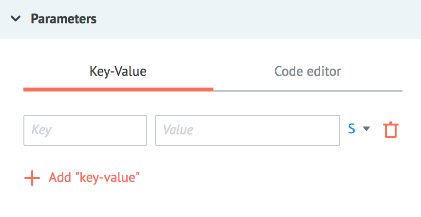
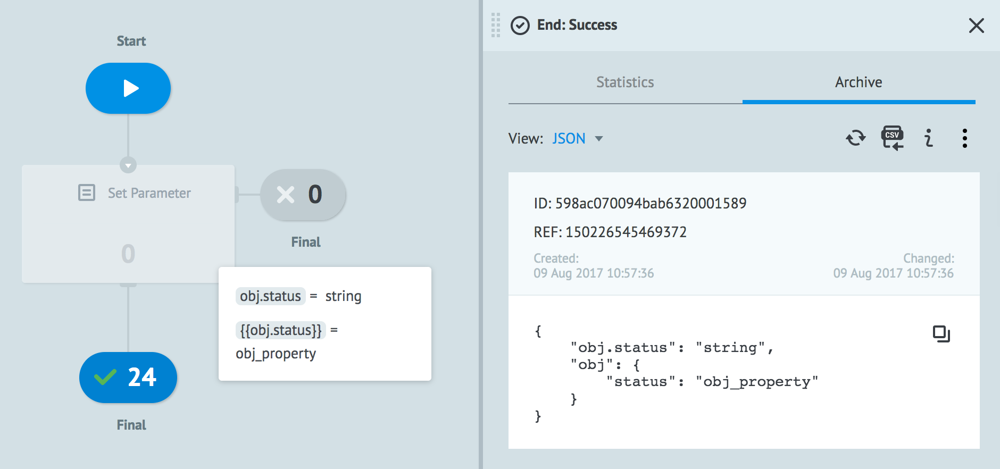
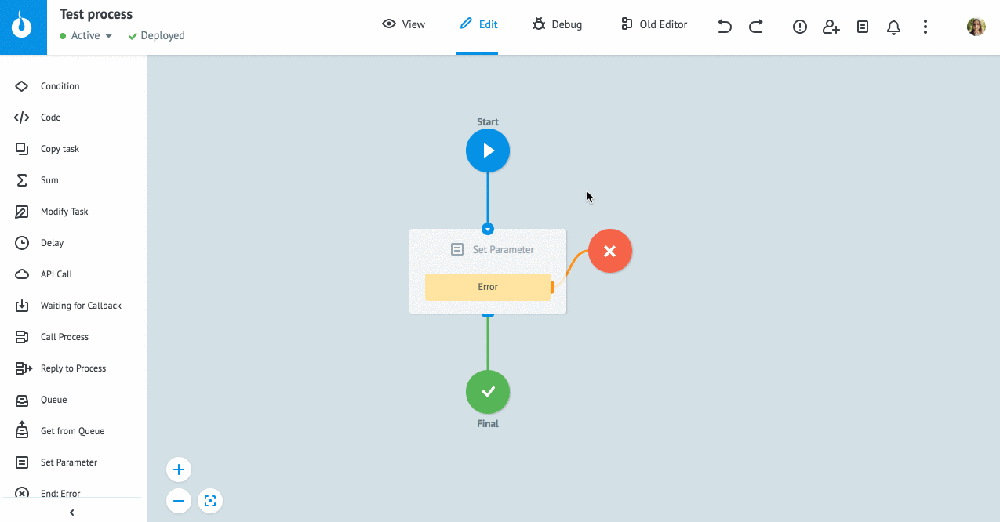
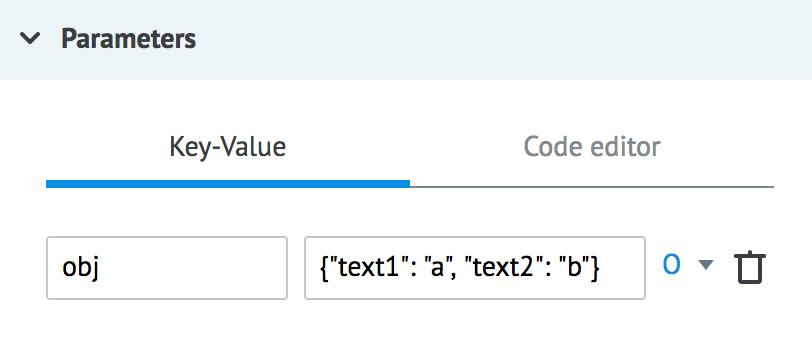
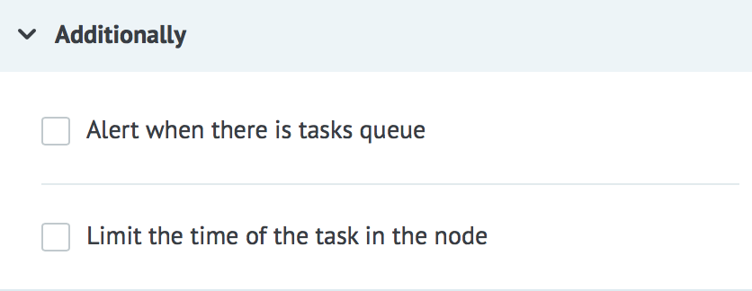

# Логика Set Parameter

Позволяет:
* добавлять в заявку новые параметры и устанавливать их значения
* изменять значения существующих параметров в заявке

В выпадающем списке логики `Set Parameter`, кроме системных параметров, доступны только [описанные параметры](../process_and_state/parametrs.md).

## Parameters

**Add "key-value"** - кнопка добавления нового параметра

**Key** - имя нового параметра или [динамически заданный ключ](#динамический-ключ-параметра) параметра

**Value** - значение параметра, может содержать:
- константу
- `{{имя_параметра}}` из заявки, значение которого будет вставлено
- любой системный параметр текущего процесса. Например, `{{root.ref}}` или `{{root.task_id}}`
- любую доступную [функцию](../functions/README.md):
  * [чтение параметров узла](../functions/getParamFromCount.md)
  * [получение значений параметров заявки](../functions/getParamFromApp.md)
  * [время и дата](../functions/unixtime.md)
  * [математические](../functions/math.md)

## Динамический ключ параметра

Поле **Key** может содержать конструкцию для создания вложенного объекта.

Конструкция задается в двойных фигурных скобках.

> **Обратите внимание!** Без фигурных скобок указанное значение будет наименованием параметра (включая специальные символы):

#### Динамическое наименование параметра
`{{status_{{env}}_{{id}}}}` - создание параметра с именем, которое содержит строку и значения параметров заявки:

Можно использовать несколько вложенных параметров, каждый заключается в двойные фигурные скобки.

#### Массивы

`{{array[i]}}` - присвоение/изменение `i`-го элемента в массиве `array`

`{{array[{{index}}]}}` - присвоение/изменение элемента в массиве `array`, индекс которого задан параметром заявки `index`

Индекс массива должен быть задан числом.

Максимальное значение индекса - 100.

Если логика `Set Parameter` задает значение в новом/пустом массиве элементу с индексом > 0, всем предшествующим элементам будет присвоено значение `null`.

#### Объекты

`{{obj.key}}` - добавление/изменение свойства `key` объекта `obj`

`{{obj.{{key}}}}` - добавление/изменение свойства объекта `obj`, имя которого задано параметром заявки `key`

`{{array[{{index}}].key}}` - добавление/изменение свойства `key` объекта, который является элементом массива `array` (индекс из параметра заявки `index`)

> **Обратите внимание!** Если в логике `Set Parameter` задается значение для уже существующего свойства объекта - его значение изменяется, для нового - свойство добавляется в объект.

В узле с логикой Set Parameter можно работать с параметром только в одной строке.

Для задания нескольких свойств одного объекта, укажите все новые значения в формате `{"ключ":"значение"}`:

#### Функции

**Key** может быть задан одной из доступных [функций](../functions/README.md):

`$.date(%d%m%y)`  - создание параметра с именем "09082017" (текущая дата в формате ddmmyyyy)

Функцию `$.math()` можно использовать для вычисления индекса при работе с массивом:

`{{array[$.math({{index}}+1)].key}}` - $.math() вычисляет индекс элемента = сумме параметра заявки и константы

## Additionally

#### Alert when there is tasks queue

Критическое количество заявок в узле.

Подробное [описание](timer.md#tasks-limit) логики работы.

#### Limit the time of the task in the node

Значение временного интервала, при достижении которого заявка пойдет дальше по процессу в том случае, если `Логика Set Parameter` не отвечает.

Подробное [описание](timer.md#timer) логики работы.
