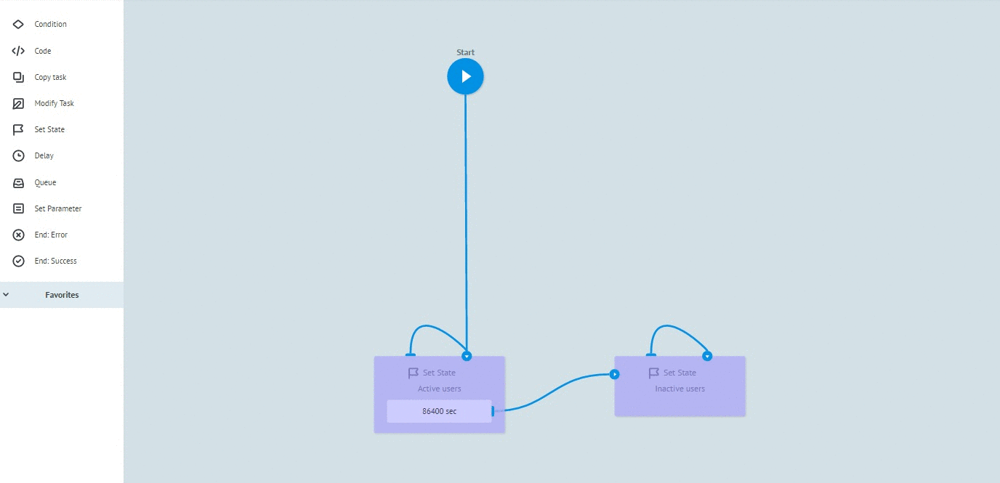

# Логика Set State

Добавление логики возможно лишь в рамках процесса с типом **[Диаграмма состояний](../process_and_state/state_diagramm.md)**

Позволяет:
* Распределять входящий поток данных по состояниям
* Хранить состояния заявок
* Принимать изменений состояний, через modify заявки используя логику **[modify](logika_modify_task.md)**
* Обращаться процессам  к диаграмме состояний для получения данных хранимых в рамках узла Set State 

Дополнительная логика доступная в рамках логики SetState:
* [Condition](if.md) - позволяет анализировать входящие параметры заявки и перераспределять в нужное состояние
* [Alert when there is tasks queue](timer.md#tasks-limit) - позволяет уведомлять процесс при достижении критического кол-ва состояний (заявок) в узле 
* [Limit the time of the task in the node](timer.md#timer) - позволяет по определённому значению времени переводить заявку в следующее состояние

