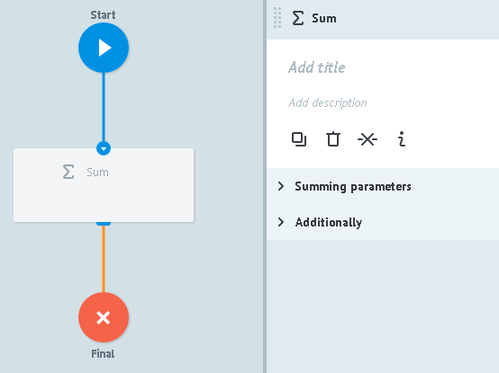
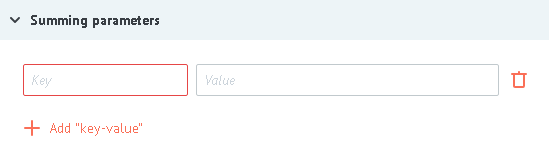
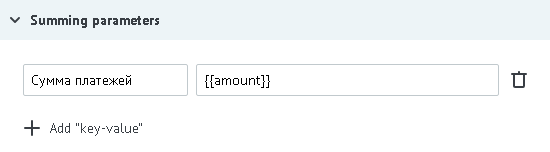

# Логика Sum

Позволяет суммировать значения по определенному полю заявки.

## Summing parameters

* **Key** - здесь задается имя параметра, который будет содержать сумму значений.
* **Value** - `{{имя_параметра}}` из заявки, значение которого нужно суммировать или константа (постоянное значение)

Например,

##Additionally

####Alert when there is tasks queue

Критическое количество заявок в узле.

Подробное [описание](timer.md#tasks-limit) логики работы.

####Limit the time of the task in the node

Значение временного интервала, при достижении которого заявка пойдет дальше по процессу в том случае, если Логика Sum не отвечает.

Подробное [описание](timer.md#timer) логики работы.

>Значение Логики Sum возможно выводить на dashboard и получать динамически через [конструкцию](../functions/getParamFromCount.md) `{{node[ID_узла].SumID}}`.
