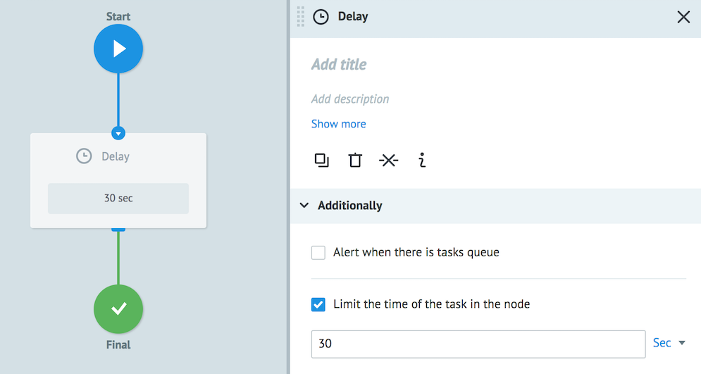
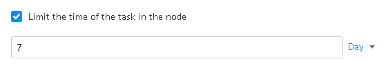
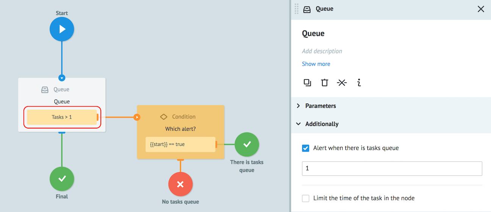
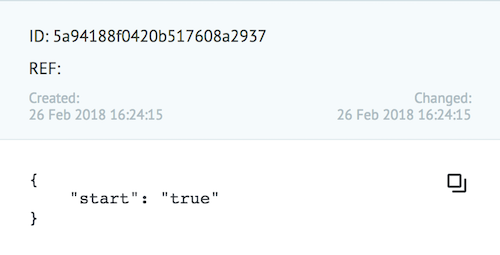
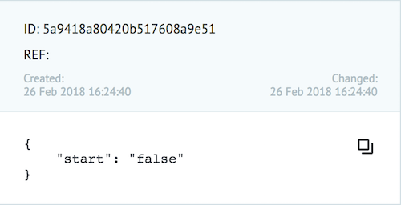

# Настройки Additionally

## Limit the time of the task in the node

Ограничение времени пребывания заявки в узле.

Указывается значение временного интервала, при достижении которого заявка перейдет в указанный узел.

В поле можно указать:
* число и выбрать единицы измерения: секунды (минимум 30), минуты, часы, дни.
* параметр заявки (например, `{{unixtime}}`), содержащий дату/время в формате **unixtime**
* функцию `$.unixtime()` (например, `$.unixtime(%y-%m-%d+1 09:00:00)`) для расчета даты/времени в формате **unixtime**

По умолчанию узел с логикой **Waiting for Callback** создается с таймером 1 день.
Заявка в случае отсутствия изменений спустя 1 день переходит в конечный узел.

## Alert when there is tasks queue

В **Alert when there is tasks queue** указывается критическое количество заявок в узле - лимит заявок.

При достижении указанного значения в связанный узел передается сигнал (новая специальная заявка) с параметром `"start" : "true"`.

Когда количество заявок в узле снижается ниже критического значения, в связанный узел передается сигнал с параметром заявки `"start" : "false"`.

