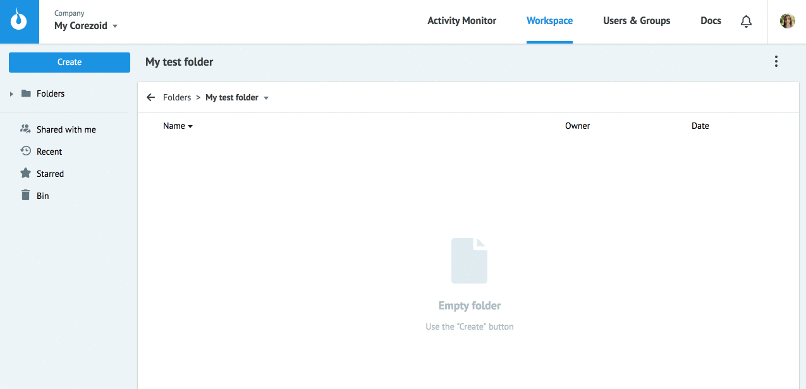
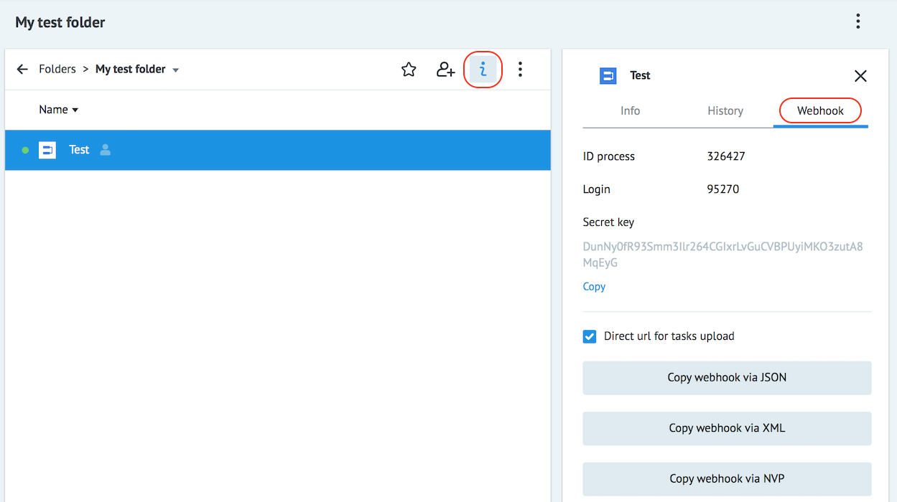
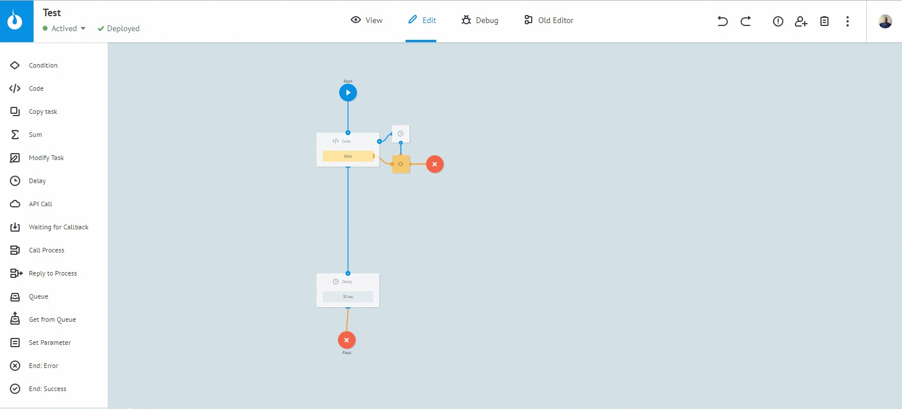
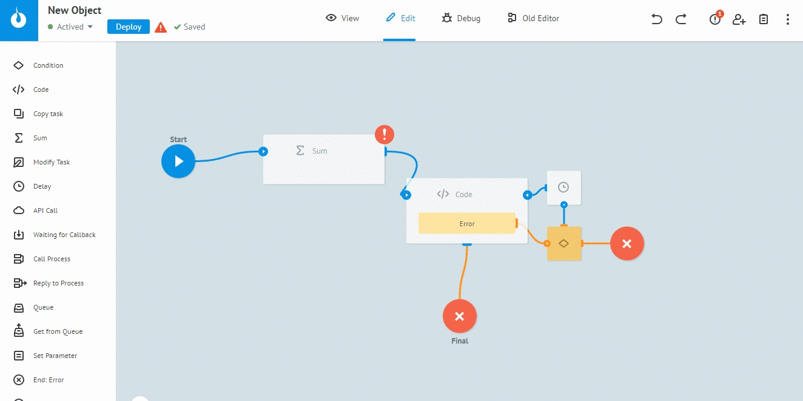
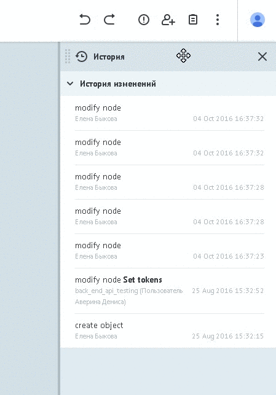
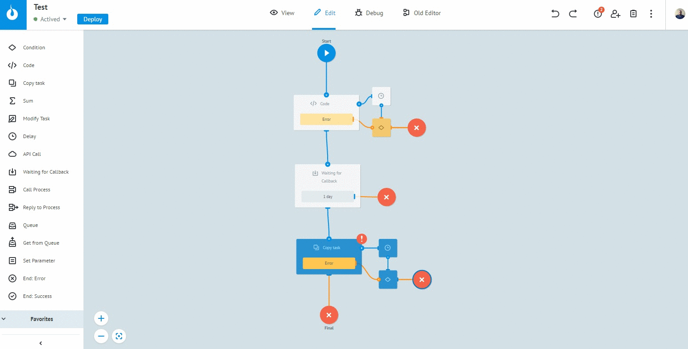

## Создание процесса

В отличие от [диаграммы состояний](state_diagramm.md), процесс:
-   имеет доступ к **[полному набору логик в узлах](../nodes/README.md)**
-   имеет ограничение на максимальное количество заявок в одном процессе - 100 000 заявок (конечные узлы не в счет).

Чтобы создать процесс:
* Выбрать **Create** → **Process**
* Задать наименование процесса, описание (опционально) и нажать "ОК"

В созданном процессе по умолчанию всегда 2 узла - стартовый и финальный.

При нажатии на стартовый узел отображается панель с параметрами для загрузки данных в процесс.

Нажмите кнопку **Generate connection data** для формирования логина и секретного ключа.

`ID Process`, `Login`, `Secret key` используются для исключительно безопасного подключения описанного в разделе ["Create - новая заявка"](../../api/upload_modify.md)

Кнопки `Copy webhook via JSON`, `Copy webhook via XML`, `Copy webhook via NVP` копируют в буфер обмена прямые ссылки для загрузки данных в процесс в разных форматах.

Все эти данные также доступны при просмотре процесса в папке.
Необходимо выделить процесс, нажать **View details** → вкладка **Webhook**:

## Редактирование процесса

* Изменения по процессу фиксируются только после нажатия на кнопку `Deploy`
* Промежуточные изменения автоматически сохраняются каждые 10 секунд
* К 20 последним изменениям применимы **Undo/Redo**

* Изменения можно отменить до версии, к которой применялся `Deploy`

* При одновременном редактировании процесса несколькими пользователями выводится соответсвующее сообщение о наличии еще одной версии процесса
* Просмотр истории изменения процесса

* Процесс не сохраняется, если в нем есть ошибки (незаполненные поля, отсутствие связей и т.д.). `Process Errors` выводит их список.
По клику фокус переходит на узел с ошибкой и открывается панель редактирования.

