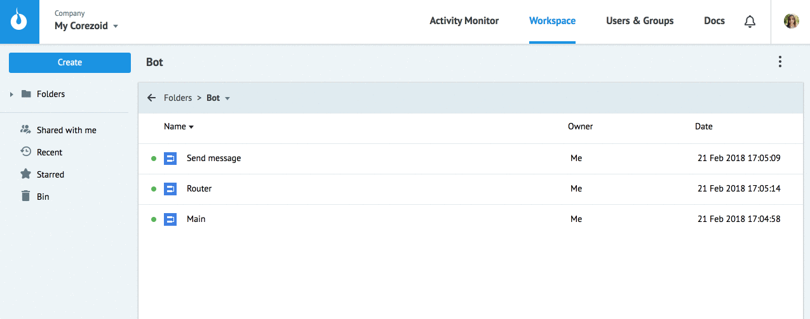
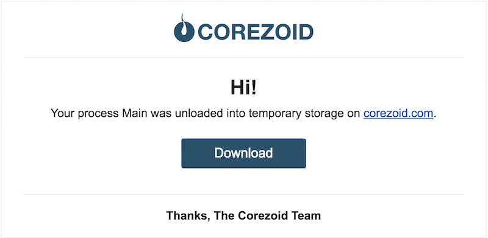
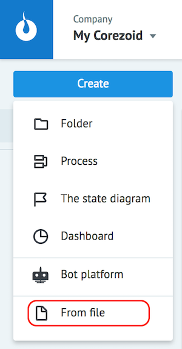

# Экспорт / Импорт объектов

## Экспорт

Объекты Corezoid экспортируются в файл в формате **json**.

Чтобы экспортировать объект из Corezoid:

1. Выделите его и нажмите **Download**
2. В уведомлении об успешной выгрузке нажмите **to file**
3. Выберите папку и сохраните файл

На Вашем компютере в указанной папке появится файл формата с наименованием:
`object_111111_1519247559.json`,

где
* `object` - тип выгруженного объекта, возможны значения **folder** (папка), **conv** (процесс), **dashboard** (дашборд)
* `111111` - id выгруженного объекта
* `1519247559` - время выгрузки в Unix time

Пользователь также получает уведомление об успешном экспорте на электронную почту, скачать файл **json** можно нажав кнопку **Download**:

> Если процесс имеет связи с другими процессами, для корректной работы необходимо экспортировать содержащую их папку.

## Импорт

Чтобы импортировать объект в Corezoid нажмите **Create → From file**

Далее выберите на компьютере файл формата **json** с объектом Corezoid.

В результате в текущей папке будет создан объект.

