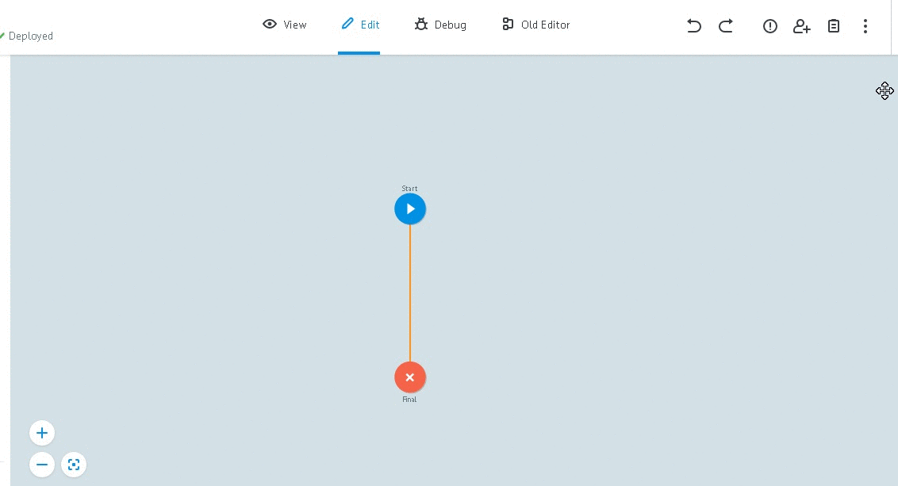
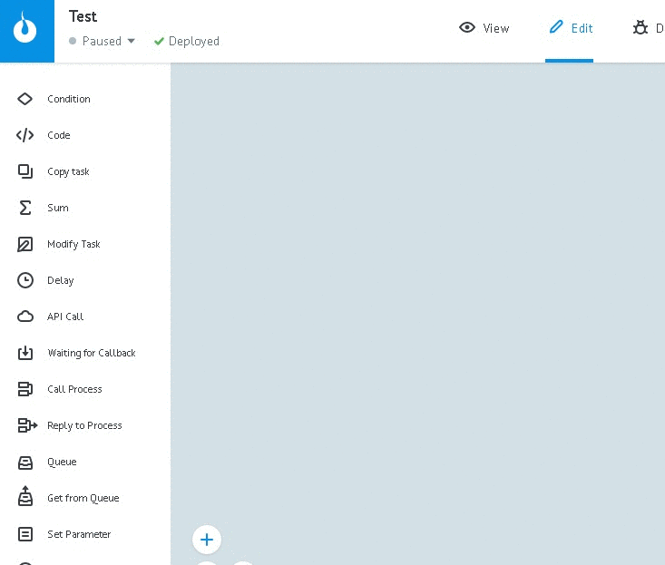

# Параметры заявки

Чтобы добавить описание параметров заявки:

* нажмите "Task parameters" -> "+ Add parameter"
* в поле "Name" добавьте имя параметра
* в поле "Description" введите его краткое описание
* выберите тип
* обозначьте параметр:
   * Input - входящий
   * Output - исходящий
   * Required - обязательный
   * Auto-clear - авто-удаление. Скроет значение параметра при попадании заявки в конечный узел и представит в виде "***"
* нажмите "Add"

**Зачем описывать параметры заявки?**

Параметры отмеченные, как "Input" **автоматически подставляются в ручную заявку**, а также при добавлении [Логики Call Process](https://doc.corezoid.com/ru/interface/nodes/rpc/logic_rpc.html) и [Логики Copy Task](https://doc.corezoid.com/ru/interface/nodes/copy.html).
Параметры, отмеченные, как "Оutput" - в [Логику Reply to Process](https://doc.corezoid.com/ru/interface/nodes/rpc/logic_rpc_reply.html).

Также, описанные параметры **можно выбирать во всех логиках** из выпадающего списка. Выпадающий список вызывается двойным щелчком по полю для ввода переменной.

Например, в [Логике Condition](https://doc.corezoid.com/ru/interface/nodes/if.html):

описанные параметры выделяются серым фоновым цветом в заявке

