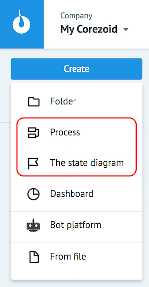

# Процессы и состояния

Для реализации концепции "Состояния порождают процессы, процессы порождают состояния" в Corezoid были созданы два типа объектов:

*   **Process** - [Процесс](create_process.md)
*   **The state diagram** - [Диаграмма состояний](state_diagramm.md)

где каждый имеет свой набор возможностей и ограничений.

