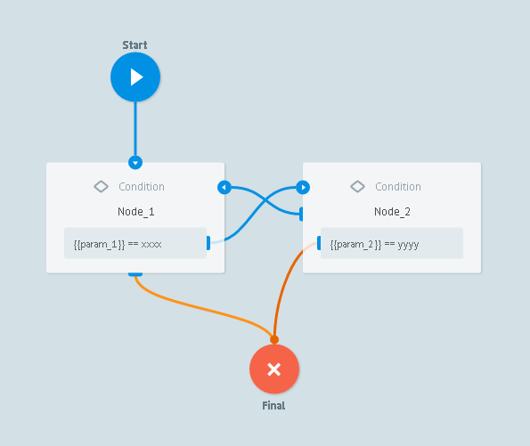
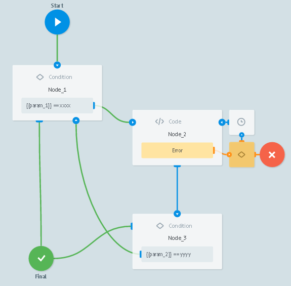

# Правила остановки обработки заявок

Обработка будет остановлена, если заявка зациклится и пройдет более 50 раз по процессу, который содержит одну из следующих двух логик:

```
Node_1 -> Node_2
Node_2 -> Nodes_1
```


```
Node_1 -> Node_2
Node_2 (CODE) -> Node_3
Node_3 -> Node_1
```

