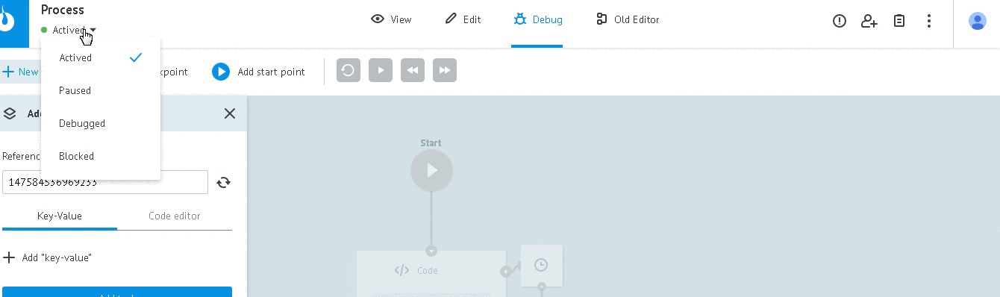
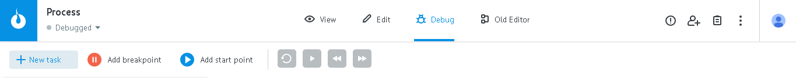
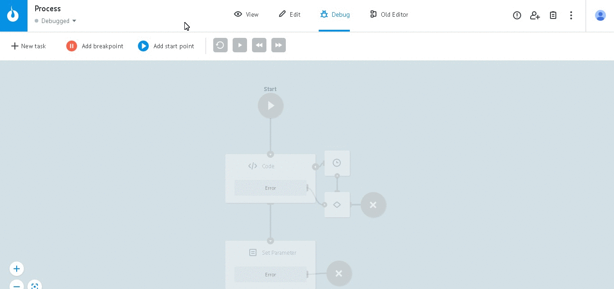
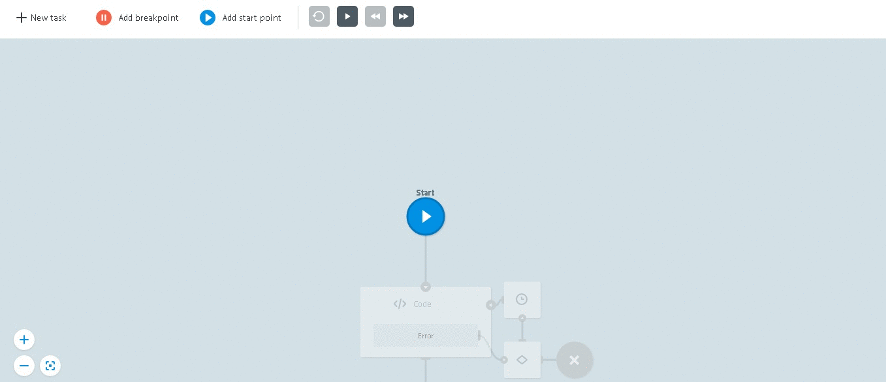
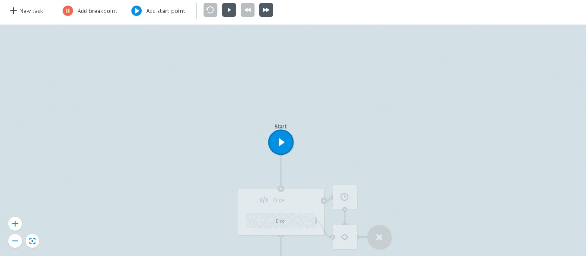
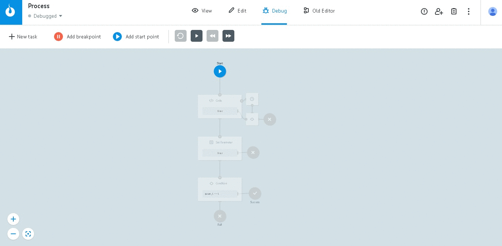
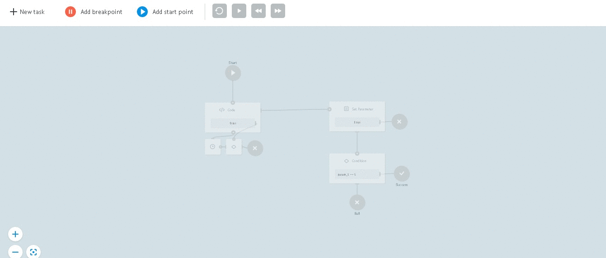
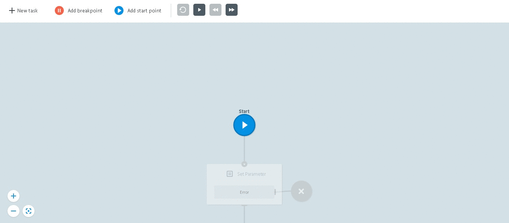

# Отладка процесса

Для отладки процесса перейдите в режим `Debug` и переключите его статус на `Debugged`

##Debug инструменты

* `+ New task` - добавление параметров и запуск тестовой заявки
* `Add breakpoint` - добавление паузы во время отладки
* `Add start point` - добавление точки старта отладки
* `Кнопки управления процессом отладки` - Повтор, Старт/Стоп, Шаг назад, Шаг вперед

####New task

Чтобы добавить параметры и отправить тестовую заявку:

* нажмите `+ New task`
* нажмите `+ Add "key-value"`
* добавьте нужные параметры
* в случае необходимости, задайте референс завки в поле `Reference`
* нажмите `Add task`

При помощи `кнопок управления процессом отладки` Вы можете управлять им: пошагово двигаться по процессу, повторить отладку, запустить отладку

Параметры заявки можно редактировать непосредственно в процессе отладки

####Breakpoint -

это точка, где режим отладки будет поставлен на паузу.

Чтобы **добавить breakpoint**, возьмите его с панели и установите в нужном месте.

Чтобы **удалить breakpoint**, выделите его и нажмите кнопку Delete на клавиатуре Вашего устройства.

####Start point -

это новая точка старта отладки.

`Start point` может быть добавлен только в одном экземпляре.

Чтобы **добавить Start point**, возьмите его с панели и установите в нужном месте.

Чтобы **удалить Start point**, выделите его и нажмите кнопку Delete на клавиатуре Вашего устройства.

##Отладка с Delay

Если в логике есть дополнительные условия ([Логика Delay](https://doc.corezoid.com/ru/interface/nodes/timer.html)),
то на соответвующем этапе отладки предлагается выбрать путь текущей заявки.

