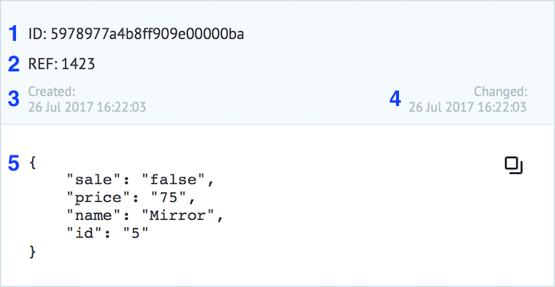

# Заявки 

**Заявка** - это набор данных, описанных в формате JSON ("ключ":"значение").

Максимальный размер заявки - 128 Кб.

Пример заявки в процессе:
  

  
1 - ID заявки (уникальное значение в рамках всей системы)

2 - референс заявки (уникальное значение в рамках одного процесса)

3 - дата и время создания заявки

4 - дата и время изменения заявки

5 - JSON объект, содержащий параметры текущей заявки
  
-----
  
* [Параметры заявки](task_parameters.md)
* [Добавление заявок в процесс](adding_tasks.md)
* [Архив заявок](task_archive.md)
* [Экспорт заявок](export_to_csv.md)
* [Функции](ru/interface/functions/README.md)
