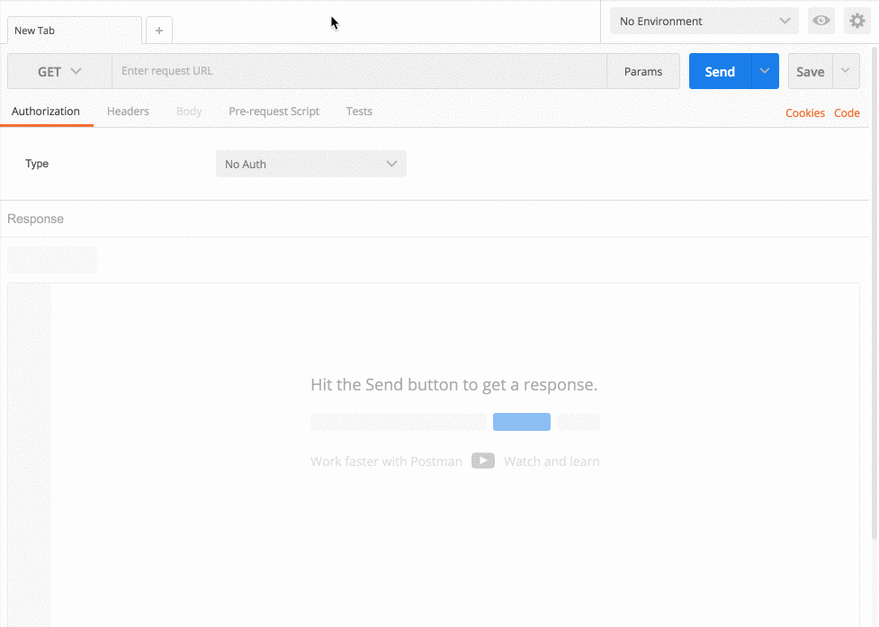

# Загрузка данных на Direct url процесса
  
**Direct url** - прямая ссылка для загрузки в процесс данных (JSON, NVP, XML).
  
Чтобы получить **Direct url** процесса:

1. Выберите узел `Start`
2. Из блока “Connection data” скопируйте **Direct url** в нужном формате
  

  
Как это работает можно проверить через **Postman**.

Пример запроса:
* Тип - **POST**
* URL - **Direct url** из буфера обмена
* Body - тело запроса, например `{"text":"Hello!"}`
* тип Body - **raw**
* Content/type - **application/json**
  

  
В [ответе на запрос](https://doc.corezoid.com/ru/api/spec.html) будет получен `id` созданной заявки - (параметр `“obj_id”` в объекте `“ops”`).

  
