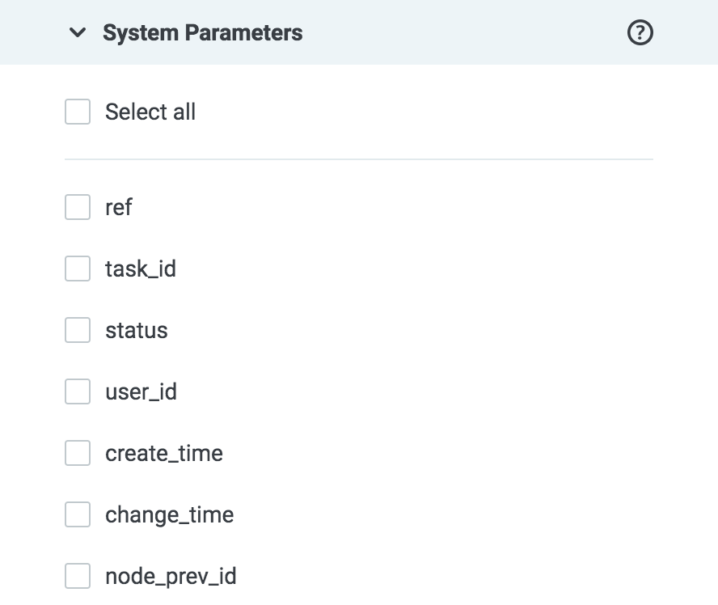
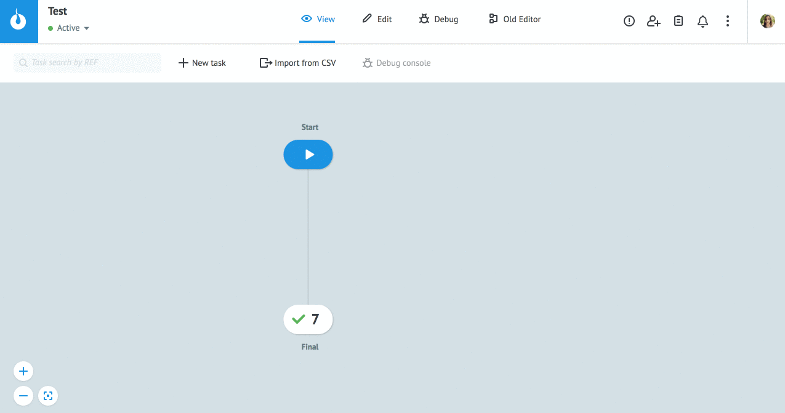

# Экспорт заявок в файл

Перейдите в режим View и выберите узел.
  
В **Task archive** нажмите **Export to CSV**.

В блокe **Basic settings** в полях **Custom range** укажите диапазон заявок для экспорта или выберите один из предложенных временных интервалов.

Диапазон разовой выгрузки заявок не может превышать **50 000**.

В блоке **System Parameters** выберите необходимые [системные параметры](https://doc.corezoid.com/ru/interface/tasks/task_archive.html#system-parameters) для выгрузки.

**Select all** - выбор всех параметров, можно отметить отдельные параметры.

> **Обратите внимание!** Параметры `create_time` и `change_time` выгружаются в формате unix time.

Нажмите **Export**.
В уведомлении об успешной выгрузке **"File download success to file"** нажмите на ссылку и сохраните файл.

  
В выгруженном файле:
* первая строка - имена параметров заявки в соответствующем порядке.
* одна строка = одна заявка процесса
* параметры заявок разделены **"|"**.
  
> **Обратите внимание!** Заявки [Процесса](https://doc.corezoid.com/ru/interface/process_and_state/create_process.html) в узлах `End: Error` и `End: Success` возможно выгрузить за короткий период (до момента их очищения). 
Для длительного хранения и получения данных из заявок предназначена [Диаграмма состояний](https://doc.corezoid.com/ru/interface/process_and_state/state_diagramm.html).

