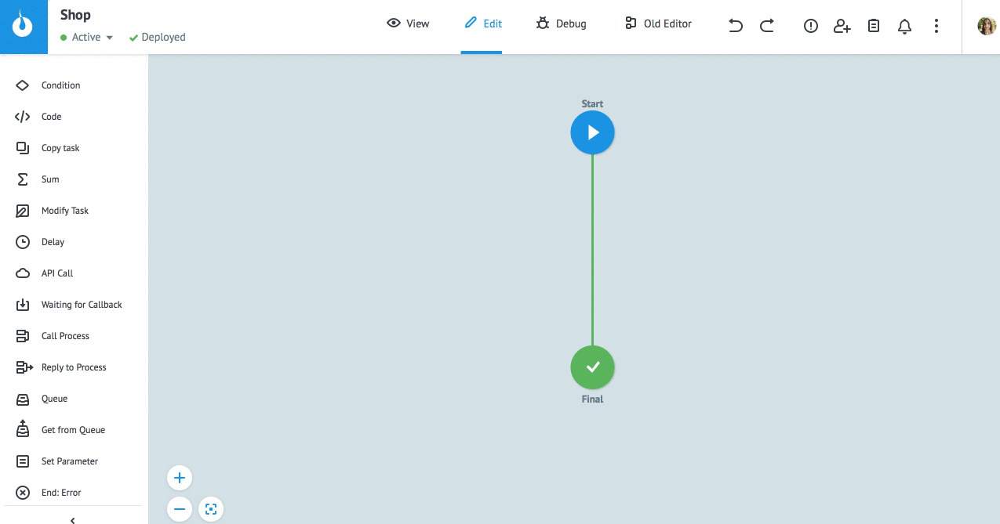
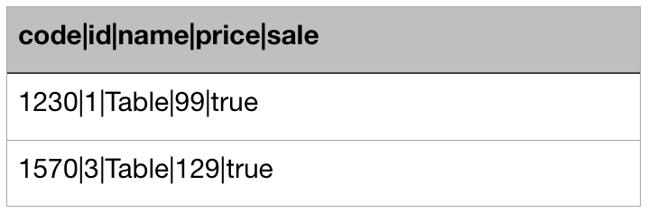
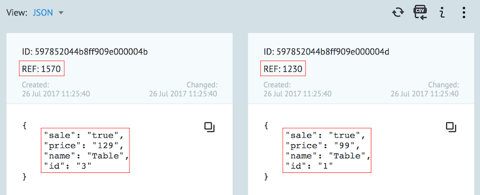

# Импорт заявок из файла

В режиме `View` нажмите **Import from CSV**.

Далее **Select a file** и выберите файл в формате CSV. 

Укажите:
* **Divider** - разделители столбцов
* **Encoding** - кодировку файла

Нажмите **Next**.

> **Обратите внимание!** Если на предыдущем шаге был выбран неверный разделитель, содержимое таблицы не будет разбито на столбцы. 
Для исправления нажмите **Back** и выберите нужный тип разделителя.

Если первая строка файла - имена параметров заявки, возведите флаг "Parameters names are in first row". 
В случае отсутствия данного флага, в процесс будут добавлены заявки с именами параметров "key1", "key2", ...
  
Чтобы задать референс заявок:
  
* заранее предусмотрите в файле соответствующее поле
* сделайте клик на имени нужного параметра 
* замените его на `Reference`
* нажмите **Import**
  

  
Во время загрузки файла можно отменить ее нажатием кнопки **"Stop"**.
Записи, которые не загружены, в виде файла csv будут отправлены на e-mail.

Сообщение о результате выполнения загрузки файла содержит количество заявок:
  
**Success** - загруженных в процесс

**Error** - не загруженных в процесс

**from** - всего в файле

В случае возникновения ошибок при загрузке файла некорректные записи будут пропущены.
Пользователю на e-mail отправляется отчет об ошибках.
Данный отчет - файл формата CSV, содержащие не загруженные записи и столбец с описанием ошибки.
Необходимо устранить данные ошибки и загрузить файл повторно.

---
### Требования к файлу
  
Формат файла - **CSV** (текстовый формат для представления табличных данных).
Допустимые разделители:
  
* ,
* ;
* |
  

Первая строка файла - имена параметров.
  
Столбцы под именами параметров - их значения.
  
1 строка в файле (за исключением первой) = 1 заявка в процессе.
  
Максимальное количество строк в одном файле - **100 000**.
  
Имена параметров не могут содержать пробелы.
  
**Пример CSV файла** с тремя строками:

* первая строка - имена параметров
* вторая и третья - 2 будущие заявки в процессе с референсом, равным значению параметра `code`
  

  

Заявки в процессе после загрузки файла:
  

