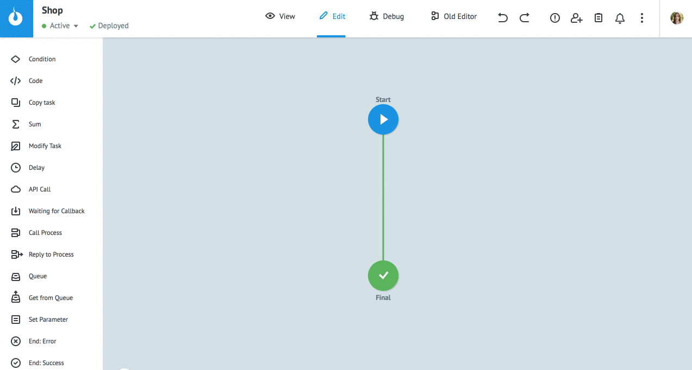
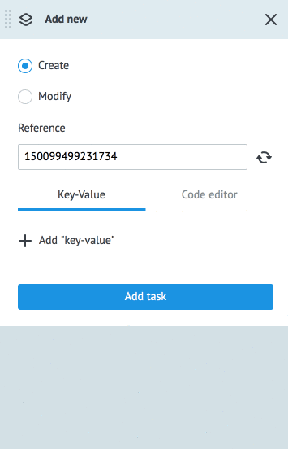

# Ручное добавление заявок в процесс
  
Чтобы добавить заявку:
1. Перейдите в режим `View`.
2. Нажмите `New task`.
3. В случае необходимости укажите `Reference` (если не задан, будет сформирован системой).
4. Добавьте параметры заявки и их значения. Если [описать входящие параметры](task_parameters.md), то они будут подставлены в новую заявку автоматически.
5. Нажмите Add task.

> **Обратите внимание!** Референс заявки является уникальным значением в рамках одного процесса. 
Если референс новой заявки будет неуникальным, система ответит ошибкой “not unical reference”.

  
При добавлении новой заявки отображаются значения параметров предыдущей заявки.
Очистить знечения можно нажатием кнопки **Clear "values"**.

Используйте `Code editor`, чтобы добавить параметры заявки из JSON объекта.

