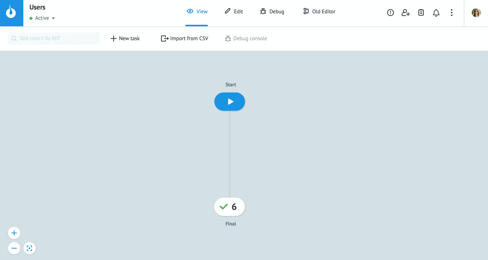
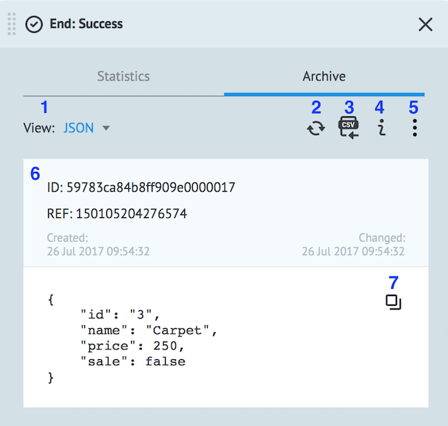
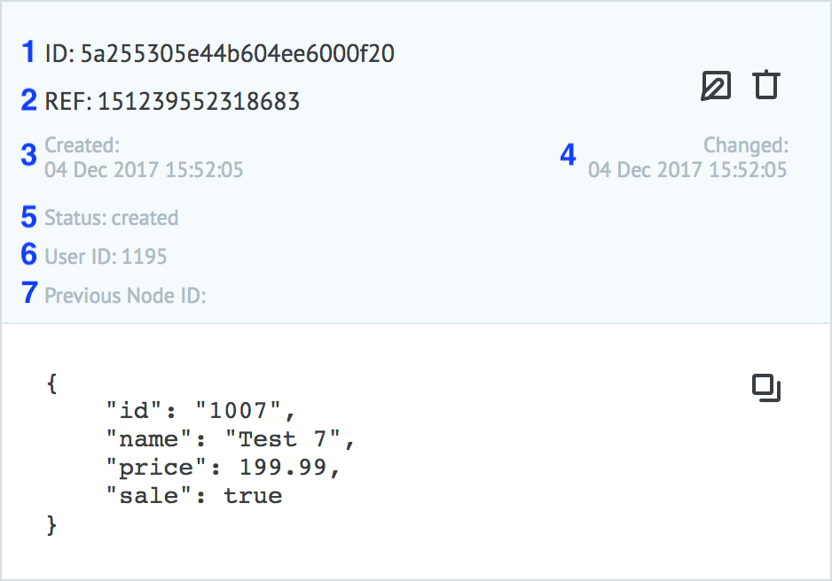
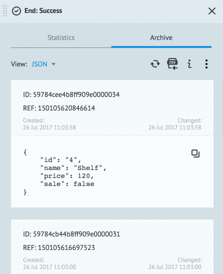

# Архив заявок
  
Чтобы открыть архив заявок, перейдите в режим `View` и выберите нужный узел.

  
  
## Режим Archive
  

1 - **View** - выбор формата демонстрации данных (JSON, Table)

2 - **Refresh** - обновление архива заявок

3 - **Export to CSV** - экспорт заявок узла в CSV файл

4 - **Show node info** - вывод названия узла и его ID 

5 - **More actions** - дополнительные возможности:

* **Set scroll** - переключение режима прокрутки архива заявки (↕ - вертикальная, ↔ - горизонтальная)
* **System Parameters** - включение отображения в заявке системных параметров
* **Delete tasks** - удаление заявок из узла (кроме `End: Success` и `End: Error`).

6 - содержимое заявки

7 - **Copy to buffer** - копирование заявки в JSON формате
  
В узлах [Процесса](https://doc.corezoid.com/ru/interface/process_and_state/create_process.html) данные заявок хранятся не длительный период времени (примерно сутки). При этом счетчики узлов сохраняются и накапливаются .
  
Для длительного хранения и получения данных из заявок предназначена [Диаграмма состояний](https://doc.corezoid.com/ru/interface/process_and_state/state_diagramm.html).

### System Parameters

Если включено отображение системных параметров, то отображается расширенная информация о заявке:

1 - ID заявки (уникальное значение в рамках всей системы)

2 - референс заявки (уникальное значение в рамках одного процесса)

3 - дата и время создания заявки

4 - дата и время изменения заявки

5 - статус заявки (created или processed)

6 - ID пользователя, который последний изменял заявку

7 - ID предыдущего узла, в котором была заявка

## Режим Statistics
  
Показывает статистику прохождения заявок через узел (или попадания в узел) за выбранный период или в режиме реального времени.
  
