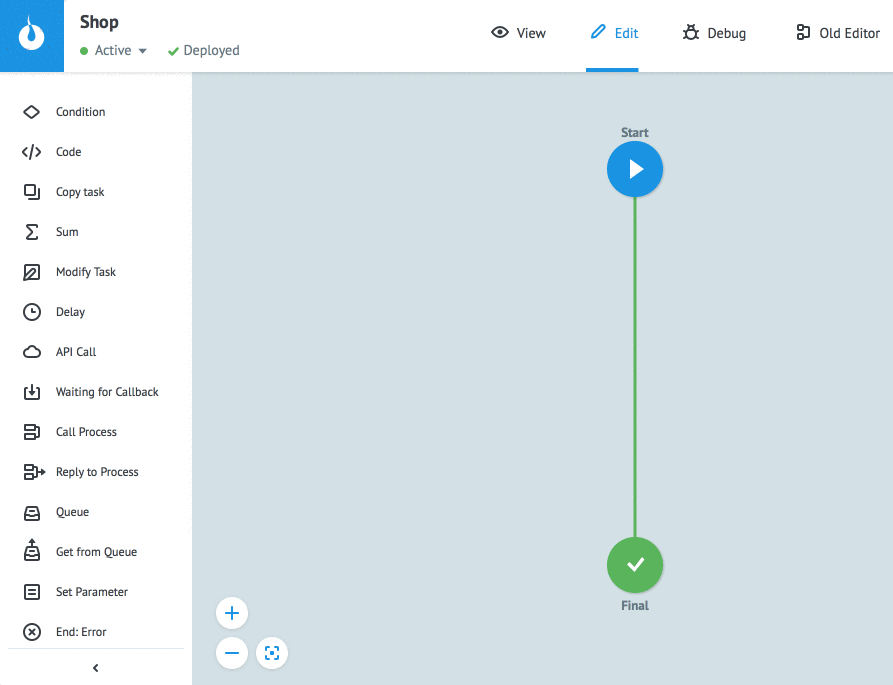

# Параметры заявки
  
* **Input** - параметры заявки, поступающей в стартовый узел процесса
* **Local** - внутренние часто используемые параметры для быстрого и удобного использования в логиках
* **Output** - параметры заявки, которые являются результатом выполнения процесса

Меню **Task parameters** предназначено для работы с параметрами заявки в процессе:


Функционал окна **Task parameters**:


1 - **+ Add parameter** - добавление пустых полей для описания параметра

2 - **Copy** - копирование всех параметров из открытой вкладки

3 - **Paste** - вставить параметры (кнопка неактивна до появления в буфере обмена параметров для вставки)

4 - копирование параметра

5 - удаление параметра

6 - **Cancel** - закрытие окна без сохранения изменений

7 - **Save** - закрытие окна с сохранением изменений.

Вызвать меню **Task parameters** возможно и на этапе добавления параметра в логику.

По умолчанию добавление в **Local**:


В архиве заявок описанные параметры помечены выделением (режим просмотра - **Table**).
Для описания новых кликните **"+"** возле параметра. Параметр добавляется во вкладку **Local**, поля **Name** и **Description** заполнены, тип данных определяется автоматически. При необходимости отредактируйте описание и нажмите кнопку **Save**.


## Описание параметров

Чтобы добавить описание параметров заявки:

* откройте окно **Task parameters**
* выберите вкладку согласно назначению параметра (**Input/Local/Output**)
* нажмите кнопку **+ Add parameter**
* в поле **Name** добавьте имя параметра
* в поле **Description** (необязательное) введите его краткое описание
* выберите тип
* обозначьте параметр:
    * **Auto-clear** - авто-удаление. Скроет значение параметра в **Task archive** (представит в виде "***")
    * **Required** - обязательный (для **Input** и **Output** параметров)
    * [**RegExp**](task_parameters.md#regexp) - проверка валидности параметра с помощью регулярного выражения (только для **Input** параметров)
* нажмите **Save**


Добавленные параметры проходят валидацию.

Возможные **ошибки**:

***Parameter `"<name>"` is already exist*** - дубликат параметра в одной из вкладок

***Name is empty*** - не заполнено поле наименования параметра (обязательное)

***Invalid parameter name*** - некорректное наименование параметра (содержит недопустимые символы).


### Name (наименование параметра)

Наименование параметра должно быть уникальным для всех вкладок.

Наименование может содержать:
* большие и маленькие латинские буквы
* цифры
* символы  `"_", "#", "@", "$", "\", "[", "]", "."`

> **Экранирование специальных символов**

> Если наименование параметра содержит  `"."`, `"["` или `"]"`, необходимо экранировать символ с помощью `"\"`.

> Например:

> `phone[0]` - элемент в массиве `"phone"`

> `phone\[0\]` - параметр с именем `"phone[0]"`

Примеры корректных наименований параметров:


### Type (тип параметра)

**String** - строка:
```
{
"name": "John"
}
```

**Number** - число (целое, дробное):
```
{
"card_number": 123456789,
"bonus": 10.50
}
```

> **Обратите внимание!**

> **Максимальное значение** параметра типа **Number** - 2ˆ53 = 9 007 199 254 740 992. Для больших значений необходимо использовать тип **String**.

**Boolean** - логические значения `true` (истина) и `false` (ложь):
```
{
"send_notifications": false,
"unsubscribed": true
}
```

**Array** - массив:
```
{
"phones": [
        "+380991234567",
        "+380661234567"
    ]
}
```

**Object** - объект (данные в формате "key":"value"):
```
{
"address": {
        "city": "Odessa",
        "zip_code": 65000
    }
}
```


### Зачем описывать параметры заявки?

**Input** параметры автоматически подставляются в ручную заявку:



При добавлении в процесс логик [`Call Process`](https://doc.corezoid.com/ru/interface/nodes/rpc/logic_rpc.html), [`Copy Task`](https://doc.corezoid.com/ru/interface/nodes/copy.html), [`Modify Task`](https://doc.corezoid.com/ru/interface/nodes/logika_modify_task.html) автоматически подставляются параметры **Input** выбранного процесса.


**Оutput** параметры используются в настройке логики [`Reply to Process`](https://doc.corezoid.com/ru/interface/nodes/rpc/logic_rpc_reply.html):


  
Также, описанные параметры можно выбирать во всех логиках из выпадающего списка. Выпадающий список вызывается кликом по полю для ввода переменной.

Например, в логике [`Condition`](https://doc.corezoid.com/ru/interface/nodes/if.html):


### RegExp
  
С помощью [регулярных выражений](https://ru.wikipedia.org/wiki/%D0%A0%D0%B5%D0%B3%D1%83%D0%BB%D1%8F%D1%80%D0%BD%D1%8B%D0%B5_%D0%B2%D1%8B%D1%80%D0%B0%D0%B6%D0%B5%D0%BD%D0%B8%D1%8F) выполняется проверка значений параметров, поступающих в процесс с заявкой. 

Это может быть проверка:
* номера телефона
* даты
* пароля

и др.

Добавляя описание параметра, выберите **RegExp**.
Введите:
* **Regex for validation of value** - регулярное выражение
* **Text of the response in case of error regexp** - текст ошибки, если валидация не пройдена

Нажмите **Save**.
  

  
На входе в процесс параметр валидируется добавленным регулярным выражением. В случае несоответствия возникает ошибка, указанная в **Text of the response in case of error regexp**.

### Маскирование значений

Значения параметров и референсы заявок, которые состоят из набора цифр, по формату похожего на:
- номер банковского счета/карты
- CVV-код

в архиве заявок маскируются (представлены в виде `"***"`).

Для того, чтобы отменить маскирование **значений**, необходимо описать эти параметры в процессе.

Для того, чтобы отменить маскирование **референса**, необходимо в параметрах процесса отключить опцию **Mask REF** (включена по умолчанию):

